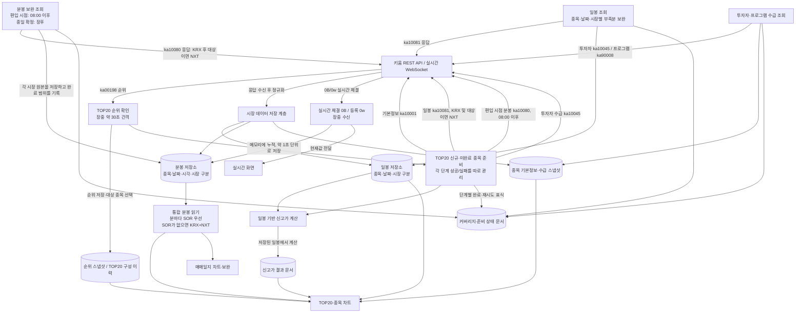

# 시장 데이터 흐름 관계도

이 문서는 함수 이름보다 **언제 키움에 요청하고 → 응답을 어디에 저장하고 → 어떤 화면·기능이 읽는지**를 설명한다. 아래는 현재 워크트리 코드에서 확인한 흐름이며, 운영 NAS에 배포된 소스와 같은지는 `/health`의 `server_build` 및 `source_release`로 별도 확인해야 한다.

## 전체 흐름



## 요청 시점과 데이터의 쓰임

| 데이터 | 키움 요청·발생 시점 | 저장 위치와 구분 | 다시 읽는 곳 |
|---|---|---|---|
| TOP20 순위 | 장중 순위 갱신 주기(현재 서버 코드 약 30초), 주 순위는 `ka00198`의 `qry_tp=5` | `ranking` 데이터셋 스냅샷과 TOP20 membership 이력. 순위와 구성 이력은 목적이 달라 별도 저장 경계 | TOP20 화면, 순위·구성 변화 복구, 신규 편입 종목 준비 시작점 |
| 종목 기본정보 | 종목 준비 단계에서 해당 날짜의 기본정보가 없거나 오래된 경우 `ka10001` | `stock_fundamentals` 최신 문서와 날짜별 `stock_fundamentals` 데이터셋 스냅샷 | 종목 표의 기본정보 표시와 준비 단계 판정 |
| 장중 분봉 | TOP20 진입 종목은 편입 시점 분봉을 08:00 이후 보완할 수 있음. 키움 `ka10080`을 KRX로 요청하고, 대상 종목은 NXT도 별도 요청 | `central_minute_bars`에 종목·날짜·분·시장(KRX/NXT) 단위로 저장. 편입 시점까지 확보한 근거는 `market_data_coverage_intraday`에 따로 기록 | 장중 차트, TOP20 준비 상태. 기존 당일 완료 표식이 있으면 재요청을 건너뜀 |
| 실시간 체결과 분봉 | 장중 WebSocket `0B` 체결을 받고, 일부 등록은 `0w` 사용. 추가 상세 등록 여력이 없을 때 통합시장 표기 `_AL`이 들어올 수 있음 | 체결은 메모리 누적 후 약 1초 단위로 저장. `central_minute_bars`의 시장값은 KRX/NXT/SOR로 원본을 구분. 초봉과 최신값은 별도 저장 경로 | 실시간 화면, 당일 분봉. 0B는 우선 진행 중 값이며 과거 분봉 조회의 최종 근거와 구분 |
| 일봉 | TOP20 대상의 필요한 날짜·시장에 저장된 봉이나 완료 근거가 부족할 때 `ka10081`. KRX와 NXT를 각각 조회할 수 있음 | `central_daily_bars`에 종목·거래일·시장별 저장. `market_data_coverage_daily` 및 준비 상태 문서에 조회 범위와 완료 근거 저장 | 신고가 계산, 종목·일봉 차트, TOP20 준비 상태 |
| 투자자 수급 | 종목 준비/장후 보완 시 `ka10045`. 코드에서 SOR 표기를 먼저 요청하고 실패 시 기본 종목 코드로 대체하는 경로가 있음 | `investor_flow` 데이터셋 스냅샷과 1일 준비·최종화 문서 | 종목 상세·TOP20 후보 데이터와 관련 분석 |
| 프로그램 수급 | 장후 후보 보완에서 `ka90008`. 빈 응답도 해당 날짜에 정상적으로 자료가 없을 수 있어 무조건 실패로 보지 않음 | `program_flow` 데이터셋 스냅샷과 최종화 문서 | 종목 상세·수급 분석 |
| 신고가 | TOP20 준비 과정에서는 확보된 일봉을 사용해 계산. 별도 신규고가 응답은 `ka10016` 경로로도 수집 가능 | 계산된 `historical_highs` 문서와 `new_high` 데이터셋은 의미가 달라 구분 | 종목 표의 5·20·250일 및 역사적 신고가 표시 |

## 분봉에서 KRX·NXT·SOR가 만나는 방식

```text
키움 응답 원본
  ├─ KRX ka10080 ─┐
  ├─ NXT ka10080 ─┼─> 같은 분봉 테이블, market 값으로 출처 구분
  └─ SOR 실시간 0B ┘

화면/매매일지의 통합 읽기(저장값은 변경하지 않음)
  같은 날짜·시각에 SOR가 있으면 → SOR 한 벌 표시
  SOR가 없으면                → KRX와 NXT를 결합해 표시
```

- 장후 보완은 KRX와 대상 종목의 NXT를 조회해 각각 저장한다. 현재 구현은 이 결과로 SOR 행을 덮어쓰지 않는다.
- `COMBINED`는 저장 시장이 아니라 **읽을 때 계산하는 선택 결과**다. 실제 저장된 KRX/NXT/SOR 원본은 각각 유지된다.
- 통합 조회의 현재 규칙은 SOR 행의 수집 완전성 여부를 따로 판정하지 않고, 같은 분에 SOR가 있으면 우선한다. 따라서 실시간 수신 누락이 있던 분도 SOR가 존재하면 KRX/NXT 합산값 대신 SOR가 선택될 수 있다. 이는 현재 코드 동작에 대한 주의점이지, 그 선택이 항상 원하는 데이터 품질이라는 뜻은 아니다.
- KRX만 지정한 연구·검증은 SOR를 섞지 않는다. SOR의 추정 거래대금과 KRX/NXT 조회 거래대금 차이는 별도 비교 문서에 기록한다.

## 화면별 읽기 경로

| 화면·기능 | 기본 데이터 경로 | 키움에 다시 요청하는 경우 |
|---|---|---|
| 메인 TOP20/종목 화면 | TOP20 membership·순위와 중앙에 저장된 기본정보, 일봉, 신고가를 읽음. 분봉은 통합 조회 규칙 적용 | 중앙 저장값이나 준비·coverage 상태가 필요한 범위를 충족하지 못하면 서버 준비/보완 흐름이 요청. 메인 차트 호출 자체가 매번 키움 TR을 뜻하지는 않음 |
| 장중 실시간 화면 | WebSocket 수신값을 실시간 전달하고 저장된 당일 분봉을 보조적으로 읽음 | 신규 구독 및 서버의 명시적 보완 단계에서 발생 |
| 매매일지 차트 | 선택 종목·날짜의 중앙 저장 분봉을 우선 사용. NAS 통합 조회에서는 SOR 우선, 없으면 KRX+NXT | 중앙 저장 기능이 없는 직접 연결에서는 `ka10080`으로 KRX/NXT 조회. 과거 날짜 보완 작업은 선택 날짜별로 실행 |
| 신고가 표시 | 저장된 일봉을 바탕으로 계산한 신고가 문서 | 일봉이 없거나 기준·완료 근거가 부족하면 일봉 수집 경로가 먼저 필요 |

## 완료·재시도 표식은 데이터와 별개

봉이나 기본정보가 저장됐다는 것과 **요청 범위가 전부 확보됐다고 확인된 것**은 다르다. 그래서 코드에는 다음처럼 목적별 표식이 있다.

- `market_data_coverage_intraday`: TOP20 편입 시점까지 분봉을 확보했는지
- `market_data_coverage`: 거래일 전체 분봉 보완이 끝났는지
- `market_data_coverage_daily`: 지정 날짜·시장 범위의 일봉 확보 근거
- 준비 단계 상태: 기본정보, 편입 분봉, 일봉, 수급, 신고가의 성공·실패와 재시도 상태

편입 시점 분봉 완료는 종일 분봉 완료를 대신하지 않는다. 장후 전체 보완은 종일 범위를 별도로 검사하며, 완료 표식과 저장된 실제 봉을 함께 확인한다.

## 읽을 때 주의할 용어

- 여기서 “분봉”은 날짜·분 단위 OHLCV 행이다. 실시간 시세 화면의 “1분 값” 중 일부는 1초마다 갱신되는 현재 분 값일 수 있으며, 별도의 과거 1분봉 TR 결과와 같은 데이터가 아니다.
- TOP20 순위는 그 시점의 순위 응답이다. 체결 이력이나 매매 거래 내역을 뜻하지 않는다.
- `ka10080`, `ka10081` 등은 내부 호출 경로를 추적하기 위한 키움 API ID다. 실제 의미는 각각 분봉 조회, 일봉 조회다.
- 저장소 이름은 PostgreSQL 기준이다. PC 단독 모드에는 로컬 저장소/캐시 경로가 함께 있으므로 실행 환경에 따라 저장 위치가 달라질 수 있다.

## 확인 범위와 남은 확인

이 관계도는 워크트리의 TOP20 서비스, 시장 데이터 ingest, 실시간 수집기, 분봉 저장소, 메인 화면 및 매매일지 reader 경로를 대조해 작성했다. 운영 NAS의 현재 release가 이 소스와 일치하는지, 모든 종목이 실제로 0B 상세 또는 `_AL` 등록 중 무엇을 받았는지는 이 문서만으로 보장하지 않는다. 배포 확인에는 NAS `/health`의 build/release 식별과 해당 시각의 구독·coverage 상태가 필요하다.
