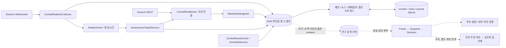

> **과거 기록** · 원래 경로: `reports/RESEARCH_ENGINE_ARCHITECTURE_AUDIT.md` · [현재 문서](../../../README.md) · 당시 미구현·다음 단계는 현재 상태가 아니다. 원문 바이트는 아카이브 ZIP에 보존했다.

# 후보 감지·연구·매매일지·실행 구조 감사

기준: 2026-09-12, `0e93780` / `v2.0.0`  
상태: **정적 코드 감사 완료, 구현·운영 검증 미실행**  
구현 인계: [RESEARCH_ENGINE_IMPLEMENTATION_PLAN.md](RESEARCH_ENGINE_IMPLEMENTATION_PLAN.md)

## 1. 결론과 이번 작업 범위

기존 Python/PySide6 앱, 세 개의 Windows 프로세스, NAS FastAPI와 SQLite/PostgreSQL 경계를 유지한다. 새 엔진 묶음을 먼저 만드는 대신 **관측값의 변경 이력 → 작은 기록 재생 → 후보 하나 → 알림·모의 결과**를 연결하는 것이 최소 경로다. 그 뒤 뉴스·테마·시장 판단을 선택 가능한 입력으로 확장하고, 매매일지 자동보완과 모의 주문을 각각 연결한다.

기존 코드에는 수집·저장·보완·분석의 상당 부분이 있다. 부족한 핵심은 일반적인 Service 계층이 아니라, **당시에 실제로 사용한 값의 불변 이력, 판단 기록, 연구 실행 원장, 주문 수명과 계좌 대조**다. 현재 데이터가 모두 엄격한 시점 재현을 지원한다고 가정하면 안 된다.

사용자의 이번 요청은 감사와 구현 계획 작성이다. 첨부 MD의 “구현하라”, “항상 제외”, “첫 작업”은 제안 자료로 읽었다. 코드·설정·DB·NAS·계좌·예약 작업을 변경하거나, Sol 작업을 자동 시작하는 권한으로 해석하지 않았다. 이 작업에서 추가한 것은 감사/계획 Markdown 두 파일뿐이다.

기존 `docs/archive/2026-09-22/root/AGENTS.before-cleanup.md`, `DEVELOPMENT_GUARDRAILS.md`, `docs/archive/2026-09-22/root/MODULE_MAP.md`, `docs/archive/2026-09-22/root/FUTURE_DEVELOPMENT_ROADMAP.md`, `docs/archive/2026-09-22/root/REFACTORING_CLOSEOUT_PLAN.md`를 확인했다. 리팩터링은 종료됐으므로 재개할 이유가 없다. NAS 장시간 수집 연속성과 다른 PC 동시 사용은 기존 후속 운영 항목으로 남긴다.

### 사용자 확인 데이터 범위 (2026-09-12)

- NAS가 평일 08:00~20:00에 30초마다 저장하는 `top20_membership`과 기존 편입·1분봉·일봉은 그대로 사용한다.
- 새로 먼저 확보할 자료는 현재 실시간조회순위 구독 종목의 **체결 발생 초 단위 OHLC·거래량·거래대금·체결 건수**와 구독/연결/저장 공백 이력이다. TOP20 진입 전 초 단위 자료는 첫 범위에서 요구하지 않는다.
- 원시 틱과 실제 호가의 **전 종목·전 시간 전수 저장**은 저장량·연산량 때문에 제외한다. 기존 `LOCKED/BROKEN/RELOCKED`는 가격 기준 `TOUCHED`까지만 지원한다. 2026-09-14 NXT 정적 VI 도입에 따라, 실제 호가 FID 확인 후 VI 발생 추적 종목의 2분 단일가 구간만 1초 호가 snapshot으로 제한 수집하는 후속 범위를 추가한다.
- 1초 집계는 기본 보존기간 없이 NAS에 저장한다. 향후 용량 설정을 만들 때 보호된 실제 매매·후보·연구 참조 구간을 제외하고 오래된 거래일부터 정리한다.
- 5분 이상 봉은 기존 1분봉에서 계산하고, 기존 확정 일봉 저장·장후 보완은 유지한다.

## 2. 입력 문서 식별

| 약칭 | 원문 | 버전 / SHA-256 |
|---|---|---|
| N | `C:/Users/pc-1/Desktop/NAS_News_Engine_Design.md` | 버전 없음 / `4188F4B8489B237974FA688E5310F3B3CBBF331F2CABAEC55C053D4DF59C8137` |
| S | `C:/Users/pc-1/Desktop/SCALPING_ENGINE_DEVELOPMENT_REFERENCE.md` | 0.1 / `BDDF5FBF4FA4C18EFE0233DDC642D1F1C88CD7C9203DEC8F3570AB7AA8B1043A` |
| A | `C:/Users/pc-1/Desktop/stock_trading_extensible_research_architecture.md` | 1.2 / `FB4F06331CFAC5B7F477F2295ADB4EB095C8B9CEBC7926ED67ABD2590A78CC6B` |

N/S 해시는 A에 적힌 대조 대상과 일치한다. 세 원문 전체를 확인했다. N의 호출량·처리량 추정, S의 매매 가설·수치 예시, A의 API 안내 인용은 이번 감사에서 실측하거나 최신 공식 명세로 재확인한 사실이 아니다. 구현 단계에서 필요한 공급자 계약만 다시 검증한다.

## 3. 현재 구조와 최소 확장 위치

실선은 현재 흐름, 점선은 계획이다. 연구 계산은 UI 상태를 입력으로 읽지 않는다. 초기 오프라인 연구는 Windows 별도 실행 프로세스로 충분하다. NAS 후보 감지는 현재 서버 수명 안의 제한된 작업으로 추가하며, 미리 별도 서버·메시지 브로커를 만들지 않는다.

## 4. 코드 근거가 있는 감사 항목

아래 경로는 저장소 루트 기준이다. 줄 번호는 기준 커밋에서 확인한 위치이며 Sol은 수정 시 심볼을 다시 찾아야 한다.

`application/`, `domain/`, `central_server/`, `presentation/`, `infrastructure/`는 `src/kiwoom_monitor/` 아래다. 약칭 `persistence/`와 `kiwoom_rest/`는 각각 `src/kiwoom_monitor/infrastructure/persistence/`, `src/kiwoom_monitor/infrastructure/kiwoom_rest/`를 뜻한다.

| ID | 확인된 구현 / 근거 | 새 기능에서의 의미 | 판정 |
|---|---|---|---|
| E01 | `central_server/rest_broker.py:26` `READ_ONLY_ENDPOINTS`, `:44` `REQUEST_PRIORITIES`; 순위 10, 백필 70~95 | NAS 조회 큐·병합·캐시 재사용. 주문을 이 목록에 추가하면 안 됨 | 유지 |
| E02 | `central_server/autonomous_top20.py:87` `refresh_ranking_once`; `ka00198`, `qry_tp=5`, 원본 항목·편입 이력 저장 | TOP20은 **실시간 종목조회 인기순위**. 거래대금 상위20·시장 전체가 아님 | 이번 단계 입력 |
| E03 | `domain/market_data_contract.py:77` `MarketDataMetadata`, `:100` `was_available_by`; `application/market_data_coverage.py:58` | 기준·가용시각, 품질·단위·출처 계약은 이미 존재. 새 RawEvent로 전면 교체하지 않음 | 재사용 |
| E04 | `central_server/database.py:172,221,252,703`; 봉·스냅샷·메타데이터가 같은 관측키에서 upsert | 시각 필드가 있어도 이전 값/revision이 사라질 수 있음. 최신 봉에 최초 available_at만 고정하면 미래 누수 | 이번 단계 이력 보완 |
| E05 | `central_server/database.py:269` 최신 N개 조회(상한 5000); `central_server/app.py:311,382` coverage/스냅샷 API | coverage는 메타데이터 진단이며 불변 데이터 export API가 아님. 장기간 추출은 범위·고정 watermark·cursor 필요 | 이번 단계 조회 추가 |
| E06 | `central_server/realtime_collector.py:166,210`; `central_server/database.py:146` 최신 실시간 upsert | 0B 수신과 분봉 저장은 있으나 최신 체결은 덮어써져 종목별 1초 이력이 남지 않음 | 기존 스트림에서 1초 집계 추가 |
| E07 | `application/top20_trade_value_collector.py:89,109` `prepare/advance` | 시각·값 공급자 주입 경계가 이미 있음. 다만 전체 지수 재생에는 호출 순서·provider 값·초기 상태도 필요 | 좁게 재사용 |
| E08 | `application/market_session_schedule.py:8,50`; `autonomous_top20.py:378,403` | 현 시간표는 시각/요일 중심. 휴장·특별개장·기업행동까지 검증된 역사 달력은 아님 | 연구 입력에 명시 |
| E09 | `infrastructure/central_theme_sync.py`, `central_content_sync.py`; `database.py:331` `replace_documents` | 현재 테마 프로필은 보존·동기화되지만 과거 소속/삭제/정정 이력은 아님 | 기록부터 추가 |
| E10 | `central_server/news_service.py` `search/refresh_once`; `app.py:74,109` 서비스 조립·수명 | NAS는 이미 등록된 종목 watchlist를 주기 수집하고 자동 AI 수행. 뉴스창을 열 때만 실행된다는 N §1 전제는 오래됨 | 기존 수집 확장 |
| E11 | `central_server/ai_service.py` `_prepare_events`; `infrastructure/article_text.py` | NAS가 원문을 직접 가져오는 경계도 이미 있음. 다만 본문을 장기 불변 증거로 보관하는 것과는 다름 | 기존 fetch 재사용 |
| E12 | `application/news_grouping.py` `group_similar_news/is_market_reaction_article` | URL·48시간 사건 묶음·금액/상대기업/진행 단계 고려가 이미 있음. REACTION 휴리스틱은 대표기사 선택용이며 AI 제외 정책과 같지 않음 | 함수 재사용, 정책 추가 |
| E13 | `central_server/news_service.py`, `persistence/stock_news_repository.py`, `central_content_sync.py` | 중앙 기사/AI는 최신 문서 upsert. 로컬 first_seen_at은 NAS 최초 수신 증거가 아니고 동기화로 바뀔 수 있음. 로컬 기사 유지 제한도 있음 | 별도 이력 필요 |
| E14 | `central_server/news_service.py` `refresh_once` | 종목별 수집 뒤 AI를 기다리는 흐름이라 시장 범위 확장 시 뒤 수집이 지연될 수 있음 | 뉴스 확장 시 분리 |
| E15 | `journal_process.py`, `application/trade_history_service.py`, `trade_cost_service.py`, `persistence/journal_*` | 체결·비용·분봉 자동보완 및 선택 시 일봉·뉴스·시장 보완이 이미 있음. 창 수명·선택 이벤트를 벗어난 영속 작업 원장은 없음 | 재작성 대신 작업화 |
| E16 | `domain/snapshot_provenance.py`, `domain/trade_snapshot_observations.py`, `persistence/journal_snapshot_service.py` | 체결 당시 관측과 장후 보완을 구분하는 기존 판정 재사용. 사후 뉴스로 진입 당시 근거를 재작성하면 안 됨 | 반드시 유지 |
| E17 | `persistence/journal_schema.py:51,67`; `application/trade_history_service.py`의 `TradeFill`, `infrastructure/kiwoom_rest/realtime.py:27`의 `OrderExecution` | 현재 일지 체결 키에 계좌·환경 구분이 없고 변환 과정에 체결 식별 제약이 있음 | mock/paper를 기존 체결 표에 합치지 않음 |
| E18 | `application/generic_strategy_evaluator.py`, `trade_setup_classification.py`, `trade_episode_analysis_service.py` | 실제 매매 복기·분류용 계산. 과거 데이터를 시간순으로 흘리는 전략 실행기·포트폴리오 시뮬레이터와 다름 | 계산별 검토 후 재사용 |
| E19 | `infrastructure/kiwoom_rest/validation_client.py:39,60` 및 `:118` `RealtimeValidationRecorder` | REST 재조회 비교와 실시간 짝짓기 기록은 있음. 완전한 틱 무누락/지연 검증이나 독립 시세 검증은 아님 | 데이터 대조 보완 |
| E20 | `kiwoom_rest/failover_client.py:26`; `validation_client.py:39`; `client.py:159` | 조회 장애전환·동일 요청 병행·통신 재시도는 주문 전송에 부적합. 현재 제품 주문 경로는 찾지 못함 | 주문 단계 별도 경계 |
| E21 | `presentation/main_window.py:3910,3924,4195` | 신고가 근접 단계·소리·대금 셀 강조가 UI 상태에 결합. 범용 후보 이력·재접속 중복 방지 알림은 아님 | 기존 알림 보존, 새 후보 소비만 추가 |
| E22 | `realtime_collector.py:291` 구독 목록, `main_window.py:3645` `_execution_pressure_at_entry` | 현재 실제 호가 채널 구독은 없고 일지 `orderbook`은 60초 0B 체결 방향 요약. 이름만으로 잔량·잠김 근거로 쓰면 안 됨 | 호가 전략 보류; 가격 TOUCHED만 지원 |
| E23 | `central_content_sync.py:73` 테마 전송 | theme_profile→theme_stock→theme_metadata는 각각 별도 교체. 마지막 `theme_metadata/default/full` 완전 백업 문서를 연구 이력 원본으로 재사용 가능 | D5 최소 경계 |

시장 상태는 0J/0U의 nullable 필드를 가진 메시지가 분별로 저장되고, 로컬 봉은 COMBINED인 반면 중앙 봉은 거래소별이다. 연구 입력은 row의 COMPLETE 표시나 '호가' 같은 이름만 믿지 말고 필드·시장·출처를 확인해야 한다. 현재 실시간 봉 flush는 부분 delta를 DB에 누적하며 IN_PROGRESS 메타데이터를 쓴다. 시간상 마감과 수집 완전성은 D3에서 별도 계약으로 다룬다.

E04는 현재 차트 저장 계약의 결함이라고 단정하는 항목이 아니다. 차트는 최종값 갱신이 필요하지만 연구는 이전 판단 당시 값을 요구한다는 **새 요구의 차이**다. E14도 정적 호출 흐름으로 확인한 지연 가능성이지 현재 NAS 지연을 실측한 결론은 아니다.

## 5. 데이터가 지원하는 연구 범위

| 자료 | 지금 가능한 사용 | 현재로는 주장할 수 없는 것 | 계획 |
|---|---|---|---|
| 순위·편입 스냅샷 | 저장 구간의 관심순위·편입/교체 관찰 | 시장 거래대금 순위, 비가동 구간, 모든 이전 revision | D1~D3 |
| 최종 분봉·일봉 | 시각/출처를 확인한 봉 연구, 가정을 밝힌 최종봉 시뮬레이션 | 장중 미완성 봉의 모든 변화, 틱 순서, 과거 수정 전 값 | D1/D7 |
| 체결 시점 스냅샷 | 실제 체결의 보존된 필드별 근거 | 체결하지 않은 모든 후보의 동일 근거 | D3/D8 |
| 현재 테마/종목 목록 | 현재 화면·현재 시점부터 기록 | 현재 소속·현재 상장종목으로 과거 universe 복원 | D5 |
| 뉴스 최신 기사/AI | 화면 표시·수동 복기 | NAS 최초 인지, 당시 제목·본문·AI·클러스터 revision | N1 |
| 실시간 체결 | 지원되는 현재 이벤트 소비 | 현재는 저장되지 않은 1·3·5초 수익률 | H1 1초 집계 |
| 실제 호가 | 현재 수집하지 않음 | 잔량 기반 LOCKED→BROKEN→RELOCKED 및 주문 대기열 | 전수 수집은 보류; NXT VI 구간 예상체결가·매수/매도 잔량만 제한 수집 검증 |
| 외국인·기관/프로그램 조회 | 실제 저장 범위의 누적/구간 흐름 | 순간 체결 주체·같은 자금의 A→B 이동 | F1에서 의미 제한 |
| 나스닥/WTI 지연 자료 | 수집된 5분·일봉의 지연된 배경 비교 | 초단타 실행 입력·전 해외시장 커버리지 | C1 후속 |

재현 수준은 세 가지로 구분한다. `observed_replay`는 실제 기록한 가용 순서·값·상태를 사용한다. `historical_bar_model`은 최종봉과 명시한 지연/체결 가정을 사용한다. `synthetic_fixture`는 계약 검증용이다. 후자의 성과를 전자의 실시간 재현으로 보고하지 않는다.

## 6. 추상화와 변경 비용 감사

| 변경 사례 | 유지할 경계 | 최소 추가 | 과도한 안 / 제외 이유 |
|---|---|---|---|
| 관측 이력 | 기존 DB 두 방언·codec·migration | 선택 생산자의 append 전용 저장/조회 메서드, 명시 스키마 | 모든 저장소를 Event Sourcing으로 전환하면 기존 동기화까지 확산 |
| 시점 재생 | 기존 시각 인자·순수 계산 | 새 실행기의 `as_of`, 불변 dataset reader | 모든 `datetime.now()`를 전역 Clock Service로 교체할 필요 없음 |
| Factor 추가 | application의 순수 함수 | 명시 등록 dict, 필요한 값·버전 타입 | plugin loader/범용 DSL/자동 DAG 플랫폼 불필요 |
| 뉴스 이벤트 한 종류 | grouping·article_text·AI provider | 뉴스 규칙 함수와 별도 결과 revision | N §36의 수십 파일 폴더 구조를 그대로 복제하면 추적 파일 증가 |
| 일지 보완 | 현재 서비스·repository·provenance | 영속 task 상태와 기존 worker 진입점 | JournalWindow 전체 재작성·네 번째 UI 프로세스 불필요 |
| 실행 | 조회 client는 그대로 | 계좌·환경·주문 상태를 소유하는 execution 경계 | 이 경계는 단순 위임이 아니므로 분리할 실질적 이유가 있음 |

현재 순위 수집 이해 경로는 `autonomous_top20 → rest_broker → market_ingest/database`다. D1은 이 경로 끝의 저장 책임을 보완하며 새 Manager/Service 전달 단계를 끼우지 않는다. 연구는 새로운 사용 사례이므로 `dataset reader → 순수 Factor/Family → 결과 저장` 정도가 적절하다. 심볼·테스트를 제외한 첫 수직 경로는 작은 계약 파일 1개, 읽기/실행 모듈 각 1개, Factor/Family 모듈 각 1개, 결과 저장 모듈 1개 안팎에서 시작한다. 파일 수를 맞추기 위한 강제 합침·분리도 하지 않는다.

기존 worker controller는 실제 QThread 수명을 담당한다. 이번 확장과 무관하게 통합하거나 이름을 바꾸지 않는다. SQLite/PostgreSQL 저장 구현도 공통 codec 밖의 방언 경계를 유지한다.

## 7. 원문 간 충돌의 처리

1. N의 `trade_trigger`는 뉴스 후보 적격성이다. 전략 `ENTER` 또는 주문 실행과 구분한다.
2. REACTION은 원본을 버릴 이유가 아니다. 자동 뉴스 후보·자동 AI 정책의 조건이며 수동 분석과 다른 Family의 입력을 일괄 금지하지 않는다.
3. N의 Gemini 전용 설명은 현재 OpenAI/Gemini/Claude 지원 경계로 해석한다. 공급자를 한 종류로 되돌리지 않는다.
4. 중요도·신뢰도·시장 반응은 다른 값이다. 규칙 점수/AI 해석을 검증된 확률·수익성으로 표현하지 않는다.
5. S의 네 시장 유형과 오전 관찰은 초기 연구 프로파일로 보존한다. 모든 Family의 필수 선행 필터로 강제하지 않는다.
6. S의 TOP20 미확정은 코드 감사로 해소됐다. 현 입력은 `ka00198` 관심순위이며 거래대금 TOP20이 필요하면 별도 자료 계약이다.
7. A의 revision 원칙은 기존 latest 저장의 전면 변경을 뜻하지 않는다. 연구 증거만 추가 보존한다.
8. A의 모의투자 계획은 이번 API 접속·계좌 주문 승인으로 읽지 않는다. 기존 조회 검증 기능이 모의 주문 기능이라는 뜻도 아니다.
9. 자료 보존은 무조건 무제한 수집과 같지 않다. 틱·본문 확대 전에 규모를 측정하고, 한도 도달 시 명시적 수집 중단/공백을 남긴다. 사용자 원본·일지 연결 증거 자동 삭제는 별도 보호 정책이 완성되기 전 구현하지 않는다.

## 8. 확인 범위와 미검증 항목

- 수행: 원문 전체/해시, 저장소 지침, 구조·데이터 계약, 관련 코드 호출자·저장 경계·대응 테스트 및 기존 종료 보고서를 정적으로 확인했다.
- 미수행: 테스트 재실행, 사용자 DB 내용/수집량 조사, NAS 접속·장중 계측, 다른 PC 테스트, 공급자 API 호출, 최신 API 지원·요율 조회, 전략 성과 검증.
- 이전 보고서의 496개 핵심 회귀·GUI 26개·뉴스 17개 통과는 **릴리스 당시 기록**이며 이번 감사 결과로 재표시하지 않는다.
- 가설: 시장 범위 수집 시 AI 대기열 부하, 고빈도 저장량, 후보 수·성능 요구는 새 기능의 계측 대상으로 남긴다. 코드만 보고 TPS·지연 보장값을 제시하지 않는다.

## 9. 이번 구현과 분리할 보류 원장

| 항목 | 다시 검토할 때 |
|---|---|
| NAS 장시간 연속성·다른 PC 동시 사용 | 기존 운영 검증 계속; 신규 엔진 운영 전에도 확인 |
| 전 앱 UI/worker 재분리, 저장소 통합 | 관련 결함·실측 병목이 확인될 때 |
| 모든 뉴스 사건 20~50개, 경쟁사/공급망 자동 추론 | N2 한 사건의 정확도·근거 보존 검증 후 |
| 원시 틱/실제 호가 저장 | 1초 집계로 부족하다는 연구 근거와 저장량·연산량 검증 후 |
| NAS 자동 삭제/보존 용량 기능 | 일지·실험 manifest 참조 보호와 복구 정책 확정 후 |
| 분산 연구/로컬 LLM/임의 코드 생성 | 작은 연구 runner로 부족함이 측정될 때 |
| 실주문 자동 활성화 | 모의 실행·전진 검증과 사용자 운영 정책 확정 후 |

이 원장은 이번 새 기능 감사에서의 보류 목록이다. 기존 리팩터링 종료 원장이나 현재 구현 문서를 미래 설계로 덮어쓰지 않는다.
