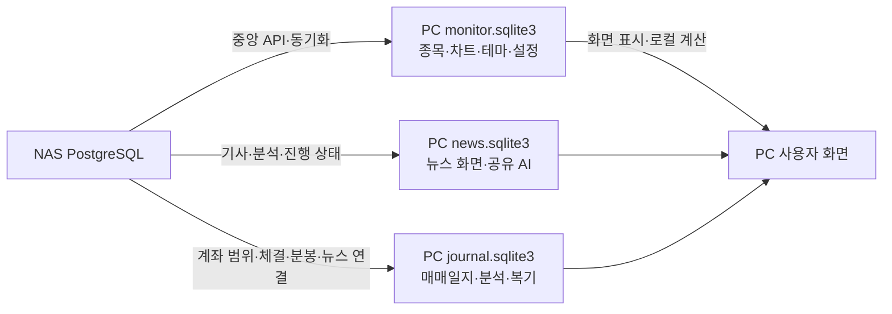

# PC SQLite 보조 사전

이 부록은 현재 PC `data/monitor.sqlite3`, `data/news.sqlite3`, `data/journal.sqlite3`의 **60개 테이블·478개 컬럼**을 읽기 전용으로 조회한 물리 구조다. NAS 43개 테이블과 별도로 센다. FK는 SQLite 선언이며 실행 연결의 `PRAGMA foreign_keys` 활성 여부까지 확인한 것은 아니다.

PC 기능/키 의미의 기존 상세 설명은 [DB_SCHEMA.md](../../DB_SCHEMA.md), NAS와 연결되는 문서 종류는 [COLLECTIONS.md](COLLECTIONS.md)를 함께 본다. 이 부록은 물리 구조를 보존하며, 로컬 모든 컬럼의 도메인 의미를 재검증한 전수 계보 감사는 아니다.

범위 밖: `historical_intelligence.sqlite3`, `naver_stock_market_news.sqlite3`, probe/백업 파일, `data/research/` 아래 연구 산출 DB, 별도 PC 과거수집 작업 폴더. `data/research.sqlite3`는 이 경로에 없었으며 연구 DB 전체가 없다는 뜻이 아니다.



## monitor.sqlite3

### `central_column_setting_versions`

| 컬럼 | 선언 자료형 | NOT NULL 선언 | PK 순번 | 기본값 |
|---|---|---|---|---|
| `column_name` | `TEXT` | False | 1 | — |
| `updated_at` | `TEXT` | True | — | — |

**선언된 외래키**

없음.

<details><summary>실제 생성 SQL</summary>

```sql
CREATE TABLE central_column_setting_versions (column_name TEXT PRIMARY KEY, updated_at TEXT NOT NULL)
```
</details>

### `central_setting_versions`

| 컬럼 | 선언 자료형 | NOT NULL 선언 | PK 순번 | 기본값 |
|---|---|---|---|---|
| `setting_key` | `TEXT` | False | 1 | — |
| `updated_at` | `TEXT` | True | — | — |

**선언된 외래키**

없음.

<details><summary>실제 생성 SQL</summary>

```sql
CREATE TABLE central_setting_versions (setting_key TEXT PRIMARY KEY, updated_at TEXT NOT NULL)
```
</details>

### `column_settings`

| 컬럼 | 선언 자료형 | NOT NULL 선언 | PK 순번 | 기본값 |
|---|---|---|---|---|
| `column_name` | `TEXT` | False | 1 | — |
| `visible` | `INTEGER` | True | — | — |
| `position` | `INTEGER` | True | — | — |
| `width` | `INTEGER` | True | — | — |

**선언된 외래키**

없음.

<details><summary>실제 생성 SQL</summary>

```sql
CREATE TABLE column_settings (
                column_name TEXT PRIMARY KEY,
                visible INTEGER NOT NULL CHECK (visible IN (0, 1)),
                position INTEGER NOT NULL,
                width INTEGER NOT NULL
            )
```
</details>

### `daily_bar_sync_log`

| 컬럼 | 선언 자료형 | NOT NULL 선언 | PK 순번 | 기본값 |
|---|---|---|---|---|
| `stock_code` | `TEXT` | False | 1 | — |
| `synced_on` | `TEXT` | True | — | — |

**선언된 외래키**

없음.

<details><summary>실제 생성 SQL</summary>

```sql
CREATE TABLE daily_bar_sync_log (
                stock_code TEXT PRIMARY KEY,
                synced_on TEXT NOT NULL
            )
```
</details>

### `daily_bars`

| 컬럼 | 선언 자료형 | NOT NULL 선언 | PK 순번 | 기본값 |
|---|---|---|---|---|
| `stock_code` | `TEXT` | True | 1 | — |
| `trade_date` | `TEXT` | True | 2 | — |
| `high_price` | `INTEGER` | True | — | — |
| `trade_value_eok` | `REAL` | False | — | — |
| `close_price` | `INTEGER` | False | — | — |
| `open_price` | `INTEGER` | False | — | — |
| `low_price` | `INTEGER` | False | — | — |
| `volume` | `INTEGER` | False | — | — |

**선언된 외래키**

없음.

<details><summary>실제 생성 SQL</summary>

```sql
CREATE TABLE daily_bars (
                stock_code TEXT NOT NULL,
                trade_date TEXT NOT NULL,
                high_price INTEGER NOT NULL,
                trade_value_eok REAL, close_price INTEGER, open_price INTEGER, low_price INTEGER, volume INTEGER,
                PRIMARY KEY(stock_code, trade_date)
            )
```
</details>

### `historical_high_evidence`

| 컬럼 | 선언 자료형 | NOT NULL 선언 | PK 순번 | 기본값 |
|---|---|---|---|---|
| `stock_code` | `TEXT` | True | 1 | — |
| `period` | `TEXT` | True | 2 | — |
| `trade_date` | `TEXT` | True | 3 | — |
| `high_price` | `INTEGER` | True | — | — |
| `adjustment_types` | `TEXT` | True | — | '' |
| `adjustment_rate` | `TEXT` | True | — | '' |
| `adjustment_event` | `TEXT` | True | — | '' |

**선언된 외래키**

없음.

<details><summary>실제 생성 SQL</summary>

```sql
CREATE TABLE historical_high_evidence (
                stock_code TEXT NOT NULL,
                period TEXT NOT NULL,
                trade_date TEXT NOT NULL,
                high_price INTEGER NOT NULL,
                adjustment_types TEXT NOT NULL DEFAULT '',
                adjustment_rate TEXT NOT NULL DEFAULT '',
                adjustment_event TEXT NOT NULL DEFAULT '',
                PRIMARY KEY(stock_code, period, trade_date)
            )
```
</details>

### `intraday_highs`

| 컬럼 | 선언 자료형 | NOT NULL 선언 | PK 순번 | 기본값 |
|---|---|---|---|---|
| `trade_date` | `TEXT` | True | 1 | — |
| `stock_code` | `TEXT` | True | 2 | — |
| `high_price` | `INTEGER` | True | — | — |
| `updated_at` | `TEXT` | True | — | CURRENT_TIMESTAMP |

**선언된 외래키**

없음.

<details><summary>실제 생성 SQL</summary>

```sql
CREATE TABLE intraday_highs (
                trade_date TEXT NOT NULL,
                stock_code TEXT NOT NULL,
                high_price INTEGER NOT NULL,
                updated_at TEXT NOT NULL DEFAULT CURRENT_TIMESTAMP,
                PRIMARY KEY(trade_date, stock_code)
            )
```
</details>

### `kind_name_disclosures`

| 컬럼 | 선언 자료형 | NOT NULL 선언 | PK 순번 | 기본값 |
|---|---|---|---|---|
| `acpt_no` | `TEXT` | False | 1 | — |
| `stock_code` | `TEXT` | True | — | — |
| `current_name` | `TEXT` | True | — | — |
| `disclosed_on` | `TEXT` | True | — | — |
| `status` | `TEXT` | True | — | 'pending' |

**선언된 외래키**

없음.

<details><summary>실제 생성 SQL</summary>

```sql
CREATE TABLE kind_name_disclosures (acpt_no TEXT PRIMARY KEY, stock_code TEXT NOT NULL, current_name TEXT NOT NULL, disclosed_on TEXT NOT NULL, status TEXT NOT NULL DEFAULT 'pending')
```
</details>

### `legacy_news_transfer_migrations`

| 컬럼 | 선언 자료형 | NOT NULL 선언 | PK 순번 | 기본값 |
|---|---|---|---|---|
| `version` | `INTEGER` | False | 1 | — |
| `name` | `TEXT` | True | — | — |
| `completed_at` | `TEXT` | True | — | — |

**선언된 외래키**

없음.

<details><summary>실제 생성 SQL</summary>

```sql
CREATE TABLE legacy_news_transfer_migrations (version INTEGER PRIMARY KEY,name TEXT NOT NULL,completed_at TEXT NOT NULL)
```
</details>

### `market_data_finalization_log`

| 컬럼 | 선언 자료형 | NOT NULL 선언 | PK 순번 | 기본값 |
|---|---|---|---|---|
| `trade_date` | `TEXT` | True | 1 | — |
| `stock_code` | `TEXT` | True | 2 | — |
| `finalized_at` | `TEXT` | True | — | CURRENT_TIMESTAMP |

**선언된 외래키**

없음.

<details><summary>실제 생성 SQL</summary>

```sql
CREATE TABLE market_data_finalization_log (
                trade_date TEXT NOT NULL,
                stock_code TEXT NOT NULL,
                finalized_at TEXT NOT NULL DEFAULT CURRENT_TIMESTAMP,
                PRIMARY KEY(trade_date, stock_code)
            )
```
</details>

### `market_data_observation_meta`

| 컬럼 | 선언 자료형 | NOT NULL 선언 | PK 순번 | 기본값 |
|---|---|---|---|---|
| `dataset_kind` | `TEXT` | True | 1 | — |
| `subject` | `TEXT` | True | 2 | — |
| `observation_key` | `TEXT` | True | 3 | — |
| `effective_at` | `TEXT` | False | — | — |
| `available_at` | `TEXT` | False | — | — |
| `venue` | `TEXT` | True | — | — |
| `unit` | `TEXT` | True | — | — |
| `value_kind` | `TEXT` | True | — | — |
| `completeness` | `TEXT` | True | — | — |
| `origin` | `TEXT` | True | — | — |
| `source` | `TEXT` | True | — | '' |
| `candidate_universe` | `TEXT` | True | — | — |

**선언된 외래키**

없음.

<details><summary>실제 생성 SQL</summary>

```sql
CREATE TABLE market_data_observation_meta (
            dataset_kind TEXT NOT NULL,
            subject TEXT NOT NULL,
            observation_key TEXT NOT NULL,
            effective_at TEXT,
            available_at TEXT,
            venue TEXT NOT NULL,
            unit TEXT NOT NULL,
            value_kind TEXT NOT NULL,
            completeness TEXT NOT NULL,
            origin TEXT NOT NULL,
            source TEXT NOT NULL DEFAULT '',
            candidate_universe TEXT NOT NULL,
            PRIMARY KEY(dataset_kind, subject, observation_key)
        )
```
</details>

### `market_data_unconfirmed_log`

| 컬럼 | 선언 자료형 | NOT NULL 선언 | PK 순번 | 기본값 |
|---|---|---|---|---|
| `trade_date` | `TEXT` | True | 1 | — |
| `stock_code` | `TEXT` | True | 2 | — |
| `missing_parts` | `TEXT` | True | — | — |
| `attempts` | `INTEGER` | True | — | — |
| `updated_at` | `TEXT` | True | — | CURRENT_TIMESTAMP |

**선언된 외래키**

없음.

<details><summary>실제 생성 SQL</summary>

```sql
CREATE TABLE market_data_unconfirmed_log (
                trade_date TEXT NOT NULL,
                stock_code TEXT NOT NULL,
                missing_parts TEXT NOT NULL,
                attempts INTEGER NOT NULL,
                updated_at TEXT NOT NULL DEFAULT CURRENT_TIMESTAMP,
                PRIMARY KEY(trade_date, stock_code)
            )
```
</details>

### `market_index_daily_bars`

| 컬럼 | 선언 자료형 | NOT NULL 선언 | PK 순번 | 기본값 |
|---|---|---|---|---|
| `trade_date` | `TEXT` | True | 1 | — |
| `market` | `TEXT` | True | 2 | — |
| `open_value` | `REAL` | True | — | — |
| `high_value` | `REAL` | True | — | — |
| `low_value` | `REAL` | True | — | — |
| `close_value` | `REAL` | True | — | — |
| `volume` | `INTEGER` | True | — | 0 |
| `trade_value_eok` | `REAL` | False | — | — |

**선언된 외래키**

없음.

<details><summary>실제 생성 SQL</summary>

```sql
CREATE TABLE market_index_daily_bars (
                trade_date TEXT NOT NULL, market TEXT NOT NULL,
                open_value REAL NOT NULL, high_value REAL NOT NULL,
                low_value REAL NOT NULL, close_value REAL NOT NULL,
                volume INTEGER NOT NULL DEFAULT 0, trade_value_eok REAL,
                PRIMARY KEY(trade_date, market)
            )
```
</details>

### `market_index_minute_bars`

| 컬럼 | 선언 자료형 | NOT NULL 선언 | PK 순번 | 기본값 |
|---|---|---|---|---|
| `trade_date` | `TEXT` | True | 1 | — |
| `market` | `TEXT` | True | 2 | — |
| `minute` | `TEXT` | True | 3 | — |
| `open_value` | `REAL` | True | — | — |
| `high_value` | `REAL` | True | — | — |
| `low_value` | `REAL` | True | — | — |
| `close_value` | `REAL` | True | — | — |
| `trade_value_eok` | `REAL` | False | — | — |

**선언된 외래키**

없음.

<details><summary>실제 생성 SQL</summary>

```sql
CREATE TABLE market_index_minute_bars (
                trade_date TEXT NOT NULL, market TEXT NOT NULL, minute TEXT NOT NULL,
                open_value REAL NOT NULL, high_value REAL NOT NULL,
                low_value REAL NOT NULL, close_value REAL NOT NULL,
                trade_value_eok REAL,
                PRIMARY KEY(trade_date, market, minute)
            )
```
</details>

### `minute_bars`

| 컬럼 | 선언 자료형 | NOT NULL 선언 | PK 순번 | 기본값 |
|---|---|---|---|---|
| `trade_date` | `TEXT` | True | 1 | — |
| `stock_code` | `TEXT` | True | 2 | — |
| `minute` | `TEXT` | True | 3 | — |
| `open_price` | `INTEGER` | True | — | — |
| `high_price` | `INTEGER` | True | — | — |
| `low_price` | `INTEGER` | True | — | — |
| `close_price` | `INTEGER` | True | — | — |
| `volume` | `INTEGER` | True | — | — |
| `trade_value_eok` | `REAL` | False | — | — |

**선언된 외래키**

없음.

<details><summary>실제 생성 SQL</summary>

```sql
CREATE TABLE minute_bars (
                trade_date TEXT NOT NULL,
                stock_code TEXT NOT NULL,
                minute TEXT NOT NULL,
                open_price INTEGER NOT NULL,
                high_price INTEGER NOT NULL,
                low_price INTEGER NOT NULL,
                close_price INTEGER NOT NULL,
                volume INTEGER NOT NULL, trade_value_eok REAL,
                PRIMARY KEY(trade_date, stock_code, minute)
            )
```
</details>

### `minute_history_sync_log`

| 컬럼 | 선언 자료형 | NOT NULL 선언 | PK 순번 | 기본값 |
|---|---|---|---|---|
| `trade_date` | `TEXT` | True | 1 | — |
| `stock_code` | `TEXT` | True | 2 | — |
| `completed_at` | `TEXT` | True | — | — |
| `bar_count` | `INTEGER` | True | — | — |

**선언된 외래키**

없음.

<details><summary>실제 생성 SQL</summary>

```sql
CREATE TABLE minute_history_sync_log (
                trade_date TEXT NOT NULL,
                stock_code TEXT NOT NULL,
                completed_at TEXT NOT NULL,
                bar_count INTEGER NOT NULL,
                PRIMARY KEY(trade_date, stock_code)
            )
```
</details>

### `new_high_snapshot`

| 컬럼 | 선언 자료형 | NOT NULL 선언 | PK 순번 | 기본값 |
|---|---|---|---|---|
| `period` | `INTEGER` | True | 1 | — |
| `stock_code` | `TEXT` | True | 2 | — |

**선언된 외래키**

- `stock_code` → `stocks.code`; ON DELETE NO ACTION, ON UPDATE NO ACTION

<details><summary>실제 생성 SQL</summary>

```sql
CREATE TABLE new_high_snapshot (period INTEGER NOT NULL, stock_code TEXT NOT NULL, PRIMARY KEY(period, stock_code), FOREIGN KEY(stock_code) REFERENCES stocks(code))
```
</details>

### `new_high_snapshot_meta`

| 컬럼 | 선언 자료형 | NOT NULL 선언 | PK 순번 | 기본값 |
|---|---|---|---|---|
| `period` | `INTEGER` | False | 1 | — |
| `checked_at` | `TEXT` | True | — | — |

**선언된 외래키**

없음.

<details><summary>실제 생성 SQL</summary>

```sql
CREATE TABLE new_high_snapshot_meta (period INTEGER PRIMARY KEY, checked_at TEXT NOT NULL)
```
</details>

### `profile_stock_themes`

| 컬럼 | 선언 자료형 | NOT NULL 선언 | PK 순번 | 기본값 |
|---|---|---|---|---|
| `profile_id` | `INTEGER` | True | 1 | — |
| `stock_code` | `TEXT` | True | 2 | — |
| `theme_name` | `TEXT` | True | 3 | — |
| `custom_color` | `TEXT` | False | — | — |

**선언된 외래키**

- `profile_id` → `profile_themes.profile_id`; ON DELETE CASCADE, ON UPDATE NO ACTION
- `theme_name` → `profile_themes.theme_name`; ON DELETE CASCADE, ON UPDATE NO ACTION

<details><summary>실제 생성 SQL</summary>

```sql
CREATE TABLE profile_stock_themes (
                profile_id INTEGER NOT NULL,
                stock_code TEXT NOT NULL,
                theme_name TEXT NOT NULL COLLATE NOCASE,
                custom_color TEXT,
                PRIMARY KEY(profile_id, stock_code, theme_name),
                FOREIGN KEY(profile_id, theme_name) REFERENCES profile_themes(profile_id, theme_name) ON DELETE CASCADE
            )
```
</details>

### `profile_theme_name_decisions`

| 컬럼 | 선언 자료형 | NOT NULL 선언 | PK 순번 | 기본값 |
|---|---|---|---|---|
| `profile_id` | `INTEGER` | True | 1 | — |
| `decision_kind` | `TEXT` | True | 2 | — |
| `source_name` | `TEXT` | True | 3 | — |
| `target_name` | `TEXT` | True | 4 | — |
| `decision_source` | `TEXT` | True | — | 'user' |
| `updated_at` | `TEXT` | True | — | CURRENT_TIMESTAMP |

**선언된 외래키**

- `profile_id` → `theme_profiles.profile_id`; ON DELETE CASCADE, ON UPDATE NO ACTION

<details><summary>실제 생성 SQL</summary>

```sql
CREATE TABLE profile_theme_name_decisions (profile_id INTEGER NOT NULL,decision_kind TEXT NOT NULL CHECK(decision_kind IN ('alias', 'split_to', 'keep_separate')),source_name TEXT NOT NULL COLLATE NOCASE,target_name TEXT NOT NULL COLLATE NOCASE,decision_source TEXT NOT NULL DEFAULT 'user',updated_at TEXT NOT NULL DEFAULT CURRENT_TIMESTAMP,PRIMARY KEY(profile_id, decision_kind, source_name, target_name),FOREIGN KEY(profile_id) REFERENCES theme_profiles(profile_id) ON DELETE CASCADE)
```
</details>

### `profile_theme_suggestions`

| 컬럼 | 선언 자료형 | NOT NULL 선언 | PK 순번 | 기본값 |
|---|---|---|---|---|
| `profile_id` | `INTEGER` | True | 1 | — |
| `stock_code` | `TEXT` | True | 2 | — |
| `news_identity` | `TEXT` | True | 3 | — |
| `raw_theme_name` | `TEXT` | True | 4 | — |
| `evidence` | `TEXT` | True | — | — |
| `confidence` | `INTEGER` | True | — | — |
| `provider` | `TEXT` | True | — | — |
| `model` | `TEXT` | True | — | — |
| `body_hash` | `TEXT` | True | — | — |
| `analyzed_at` | `TEXT` | True | — | — |
| `status` | `TEXT` | True | — | 'pending' |
| `reviewed_theme_names` | `TEXT` | True | — | '[]' |
| `reviewed_at` | `TEXT` | False | — | — |
| `article_title` | `TEXT` | True | — | '' |
| `article_published_at` | `TEXT` | True | — | '' |
| `article_url` | `TEXT` | True | — | '' |

**선언된 외래키**

- `profile_id` → `theme_profiles.profile_id`; ON DELETE CASCADE, ON UPDATE NO ACTION

<details><summary>실제 생성 SQL</summary>

```sql
CREATE TABLE profile_theme_suggestions (profile_id INTEGER NOT NULL,stock_code TEXT NOT NULL,news_identity TEXT NOT NULL,raw_theme_name TEXT NOT NULL COLLATE NOCASE,evidence TEXT NOT NULL,confidence INTEGER NOT NULL CHECK(confidence BETWEEN 0 AND 100),provider TEXT NOT NULL,model TEXT NOT NULL,body_hash TEXT NOT NULL,analyzed_at TEXT NOT NULL,status TEXT NOT NULL DEFAULT 'pending' CHECK(status IN ('pending','approved','rejected')),reviewed_theme_names TEXT NOT NULL DEFAULT '[]',reviewed_at TEXT, article_title TEXT NOT NULL DEFAULT '', article_published_at TEXT NOT NULL DEFAULT '', article_url TEXT NOT NULL DEFAULT '',PRIMARY KEY(profile_id,stock_code,news_identity,raw_theme_name),FOREIGN KEY(profile_id) REFERENCES theme_profiles(profile_id) ON DELETE CASCADE)
```
</details>

### `profile_themes`

| 컬럼 | 선언 자료형 | NOT NULL 선언 | PK 순번 | 기본값 |
|---|---|---|---|---|
| `profile_id` | `INTEGER` | True | 1 | — |
| `theme_name` | `TEXT` | True | 2 | — |
| `default_color` | `TEXT` | True | — | '#DCE6F1' |

**선언된 외래키**

- `profile_id` → `theme_profiles.profile_id`; ON DELETE CASCADE, ON UPDATE NO ACTION

<details><summary>실제 생성 SQL</summary>

```sql
CREATE TABLE profile_themes (
                profile_id INTEGER NOT NULL,
                theme_name TEXT NOT NULL COLLATE NOCASE,
                default_color TEXT NOT NULL DEFAULT '#DCE6F1',
                PRIMARY KEY(profile_id, theme_name),
                FOREIGN KEY(profile_id) REFERENCES theme_profiles(profile_id) ON DELETE CASCADE
            )
```
</details>

### `schema_migrations`

| 컬럼 | 선언 자료형 | NOT NULL 선언 | PK 순번 | 기본값 |
|---|---|---|---|---|
| `version` | `INTEGER` | False | 1 | — |
| `name` | `TEXT` | True | — | '' |
| `applied_at` | `TEXT` | True | — | '' |

**선언된 외래키**

없음.

<details><summary>실제 생성 SQL</summary>

```sql
CREATE TABLE schema_migrations (version INTEGER PRIMARY KEY, name TEXT NOT NULL DEFAULT '', applied_at TEXT NOT NULL DEFAULT '')
```
</details>

### `settings`

| 컬럼 | 선언 자료형 | NOT NULL 선언 | PK 순번 | 기본값 |
|---|---|---|---|---|
| `key` | `TEXT` | False | 1 | — |
| `value` | `TEXT` | True | — | — |

**선언된 외래키**

없음.

<details><summary>실제 생성 SQL</summary>

```sql
CREATE TABLE settings (
                key TEXT PRIMARY KEY,
                value TEXT NOT NULL
            )
```
</details>

### `stock_aliases`

| 컬럼 | 선언 자료형 | NOT NULL 선언 | PK 순번 | 기본값 |
|---|---|---|---|---|
| `alias` | `TEXT` | False | 1 | — |
| `stock_code` | `TEXT` | True | — | — |

**선언된 외래키**

- `stock_code` → `stocks.code`; ON DELETE NO ACTION, ON UPDATE NO ACTION

<details><summary>실제 생성 SQL</summary>

```sql
CREATE TABLE stock_aliases (alias TEXT PRIMARY KEY, stock_code TEXT NOT NULL, FOREIGN KEY(stock_code) REFERENCES stocks(code))
```
</details>

### `stock_name_history`

| 컬럼 | 선언 자료형 | NOT NULL 선언 | PK 순번 | 기본값 |
|---|---|---|---|---|
| `stock_code` | `TEXT` | True | 1 | — |
| `old_name` | `TEXT` | True | 2 | — |
| `new_name` | `TEXT` | True | — | — |
| `changed_at` | `TEXT` | True | — | CURRENT_TIMESTAMP |
| `source` | `TEXT` | True | — | 'KRX' |
| `decision` | `TEXT` | True | — | 'pending' |

**선언된 외래키**

- `stock_code` → `stocks.code`; ON DELETE NO ACTION, ON UPDATE NO ACTION

<details><summary>실제 생성 SQL</summary>

```sql
CREATE TABLE stock_name_history (stock_code TEXT NOT NULL, old_name TEXT NOT NULL, new_name TEXT NOT NULL, changed_at TEXT NOT NULL DEFAULT CURRENT_TIMESTAMP, source TEXT NOT NULL DEFAULT 'KRX', decision TEXT NOT NULL DEFAULT 'pending', PRIMARY KEY(stock_code, old_name), FOREIGN KEY(stock_code) REFERENCES stocks(code))
```
</details>

### `stock_themes`

| 컬럼 | 선언 자료형 | NOT NULL 선언 | PK 순번 | 기본값 |
|---|---|---|---|---|
| `stock_code` | `TEXT` | True | 1 | — |
| `theme_id` | `INTEGER` | True | 2 | — |
| `custom_color` | `TEXT` | False | — | — |

**선언된 외래키**

- `theme_id` → `themes.theme_id`; ON DELETE NO ACTION, ON UPDATE NO ACTION
- `stock_code` → `stocks.code`; ON DELETE NO ACTION, ON UPDATE NO ACTION

<details><summary>실제 생성 SQL</summary>

```sql
CREATE TABLE stock_themes (stock_code TEXT NOT NULL, theme_id INTEGER NOT NULL, custom_color TEXT, PRIMARY KEY(stock_code, theme_id), FOREIGN KEY(stock_code) REFERENCES stocks(code), FOREIGN KEY(theme_id) REFERENCES themes(theme_id))
```
</details>

### `stocks`

| 컬럼 | 선언 자료형 | NOT NULL 선언 | PK 순번 | 기본값 |
|---|---|---|---|---|
| `code` | `TEXT` | False | 1 | — |
| `name` | `TEXT` | True | — | — |
| `market` | `TEXT` | True | — | '' |
| `updated_at` | `TEXT` | True | — | CURRENT_TIMESTAMP |
| `market_cap` | `REAL` | False | — | — |
| `float_ratio` | `REAL` | False | — | — |
| `circulating_market_cap` | `REAL` | False | — | — |
| `high_250_price` | `REAL` | False | — | — |
| `fundamentals_updated_at` | `REAL` | False | — | — |
| `nxt_enabled` | `REAL` | False | — | — |
| `nxt_checked_at` | `REAL` | False | — | — |
| `last_price` | `REAL` | False | — | — |
| `last_price_updated_at` | `REAL` | False | — | — |
| `float_shares` | `REAL` | False | — | — |
| `historical_high_price` | `REAL` | False | — | — |
| `historical_high_first_year` | `REAL` | False | — | — |
| `historical_high_last_year` | `REAL` | False | — | — |
| `historical_high_updated_at` | `REAL` | False | — | — |
| `historical_high_checked_on` | `REAL` | False | — | — |
| `historical_high_occurred_on` | `TEXT` | False | — | — |
| `upper_limit_price` | `INTEGER` | False | — | — |

**선언된 외래키**

없음.

<details><summary>실제 생성 SQL</summary>

```sql
CREATE TABLE stocks (code TEXT PRIMARY KEY, name TEXT NOT NULL, market TEXT NOT NULL DEFAULT '', updated_at TEXT NOT NULL DEFAULT CURRENT_TIMESTAMP, market_cap REAL, float_ratio REAL, circulating_market_cap REAL, high_250_price REAL, fundamentals_updated_at REAL, nxt_enabled REAL, nxt_checked_at REAL, last_price REAL, last_price_updated_at REAL, float_shares REAL, historical_high_price REAL, historical_high_first_year REAL, historical_high_last_year REAL, historical_high_updated_at REAL, historical_high_checked_on REAL, historical_high_occurred_on TEXT, upper_limit_price INTEGER)
```
</details>

### `theme_profiles`

| 컬럼 | 선언 자료형 | NOT NULL 선언 | PK 순번 | 기본값 |
|---|---|---|---|---|
| `profile_id` | `INTEGER` | False | 1 | — |
| `profile_name` | `TEXT` | True | — | — |

**선언된 외래키**

없음.

<details><summary>실제 생성 SQL</summary>

```sql
CREATE TABLE theme_profiles (
                profile_id INTEGER PRIMARY KEY,
                profile_name TEXT NOT NULL COLLATE NOCASE UNIQUE
            )
```
</details>

### `themes`

| 컬럼 | 선언 자료형 | NOT NULL 선언 | PK 순번 | 기본값 |
|---|---|---|---|---|
| `theme_id` | `INTEGER` | False | 1 | — |
| `theme_name` | `TEXT` | True | — | — |
| `default_color` | `TEXT` | True | — | '#DCE6F1' |

**선언된 외래키**

없음.

<details><summary>실제 생성 SQL</summary>

```sql
CREATE TABLE themes (theme_id INTEGER PRIMARY KEY, theme_name TEXT NOT NULL UNIQUE, default_color TEXT NOT NULL DEFAULT '#DCE6F1')
```
</details>

### `top20_statistics_daily_cache`

| 컬럼 | 선언 자료형 | NOT NULL 선언 | PK 순번 | 기본값 |
|---|---|---|---|---|
| `trade_date` | `TEXT` | False | 1 | — |
| `summary_json` | `TEXT` | True | — | — |

**선언된 외래키**

없음.

<details><summary>실제 생성 SQL</summary>

```sql
CREATE TABLE top20_statistics_daily_cache (
                trade_date TEXT PRIMARY KEY,
                summary_json TEXT NOT NULL
            )
```
</details>

### `top20_trade_value_index`

| 컬럼 | 선언 자료형 | NOT NULL 선언 | PK 순번 | 기본값 |
|---|---|---|---|---|
| `minute` | `TEXT` | False | 1 | — |
| `trade_date` | `TEXT` | True | — | — |
| `trade_value_eok` | `REAL` | True | — | — |
| `stock_codes` | `TEXT` | True | — | — |
| `stock_count` | `INTEGER` | True | — | — |
| `capture_state` | `TEXT` | True | — | 'realtime_complete' |
| `kospi_trade_value_eok` | `REAL` | True | — | 0 |
| `kosdaq_trade_value_eok` | `REAL` | True | — | 0 |
| `unknown_trade_value_eok` | `REAL` | True | — | 0 |
| `kospi_stock_count` | `INTEGER` | True | — | 0 |
| `kosdaq_stock_count` | `INTEGER` | True | — | 0 |
| `unknown_stock_count` | `INTEGER` | True | — | 0 |
| `updated_at` | `TEXT` | True | — | CURRENT_TIMESTAMP |
| `cohort_segments` | `TEXT` | True | — | '[]' |

**선언된 외래키**

없음.

<details><summary>실제 생성 SQL</summary>

```sql
CREATE TABLE top20_trade_value_index (
                minute TEXT PRIMARY KEY,
                trade_date TEXT NOT NULL,
                trade_value_eok REAL NOT NULL,
                stock_codes TEXT NOT NULL,
                stock_count INTEGER NOT NULL,
                capture_state TEXT NOT NULL DEFAULT 'realtime_complete',
                kospi_trade_value_eok REAL NOT NULL DEFAULT 0,
                kosdaq_trade_value_eok REAL NOT NULL DEFAULT 0,
                unknown_trade_value_eok REAL NOT NULL DEFAULT 0,
                kospi_stock_count INTEGER NOT NULL DEFAULT 0,
                kosdaq_stock_count INTEGER NOT NULL DEFAULT 0,
                unknown_stock_count INTEGER NOT NULL DEFAULT 0,
                updated_at TEXT NOT NULL DEFAULT CURRENT_TIMESTAMP
            , cohort_segments TEXT NOT NULL DEFAULT '[]')
```
</details>

## news.sqlite3

### `journal_news_links`

| 컬럼 | 선언 자료형 | NOT NULL 선언 | PK 순번 | 기본값 |
|---|---|---|---|---|
| `group_id` | `TEXT` | True | 4 | — |
| `stock_code` | `TEXT` | True | 5 | — |
| `identity` | `TEXT` | True | 6 | — |
| `linked_at` | `TEXT` | True | — | CURRENT_TIMESTAMP |
| `origin_broker` | `TEXT` | True | 1 | — |
| `origin_environment` | `TEXT` | True | 2 | — |
| `origin_account_ref` | `TEXT` | True | 3 | — |
| `canonical_account_ref` | `TEXT` | True | — | — |
| `is_deleted` | `INTEGER` | True | — | 0 |
| `updated_at` | `TEXT` | True | — | '' |
| `source_collection` | `TEXT` | True | — | 'unknown' |
| `source_owner` | `TEXT` | True | — | 'unknown' |
| `source_key` | `TEXT` | True | — | 'unknown' |
| `source_content_hash` | `TEXT` | True | — | 'unknown' |

**선언된 외래키**

없음.

<details><summary>실제 생성 SQL</summary>

```sql
CREATE TABLE journal_news_links (group_id TEXT NOT NULL, stock_code TEXT NOT NULL, identity TEXT NOT NULL, linked_at TEXT NOT NULL DEFAULT CURRENT_TIMESTAMP, origin_broker TEXT NOT NULL, origin_environment TEXT NOT NULL, origin_account_ref TEXT NOT NULL, canonical_account_ref TEXT NOT NULL, is_deleted INTEGER NOT NULL DEFAULT 0, updated_at TEXT NOT NULL DEFAULT '', source_collection TEXT NOT NULL DEFAULT 'unknown', source_owner TEXT NOT NULL DEFAULT 'unknown', source_key TEXT NOT NULL DEFAULT 'unknown', source_content_hash TEXT NOT NULL DEFAULT 'unknown', PRIMARY KEY(origin_broker, origin_environment, origin_account_ref, group_id, stock_code, identity))
```
</details>

### `news_ai_requests`

| 컬럼 | 선언 자료형 | NOT NULL 선언 | PK 순번 | 기본값 |
|---|---|---|---|---|
| `id` | `INTEGER` | False | 1 | — |
| `requested_at` | `TEXT` | True | — | — |
| `provider` | `TEXT` | True | — | — |
| `model` | `TEXT` | True | — | — |
| `request_mode` | `TEXT` | True | — | — |
| `event_count` | `INTEGER` | True | — | — |
| `article_count` | `INTEGER` | True | — | — |
| `input_tokens` | `INTEGER` | True | — | 0 |
| `output_tokens` | `INTEGER` | True | — | 0 |
| `total_tokens` | `INTEGER` | True | — | 0 |

**선언된 외래키**

없음.

<details><summary>실제 생성 SQL</summary>

```sql
CREATE TABLE news_ai_requests (id INTEGER PRIMARY KEY AUTOINCREMENT, requested_at TEXT NOT NULL, provider TEXT NOT NULL, model TEXT NOT NULL, request_mode TEXT NOT NULL, event_count INTEGER NOT NULL, article_count INTEGER NOT NULL, input_tokens INTEGER NOT NULL DEFAULT 0, output_tokens INTEGER NOT NULL DEFAULT 0, total_tokens INTEGER NOT NULL DEFAULT 0)
```
</details>

### `news_ai_shared`

| 컬럼 | 선언 자료형 | NOT NULL 선언 | PK 순번 | 기본값 |
|---|---|---|---|---|
| `identity` | `TEXT` | False | 1 | — |
| `provider` | `TEXT` | True | — | — |
| `model` | `TEXT` | True | — | — |
| `summary` | `TEXT` | True | — | — |
| `category` | `TEXT` | True | — | — |
| `positive_evidence` | `TEXT` | True | — | — |
| `negative_evidence` | `TEXT` | True | — | — |
| `company_impacts` | `TEXT` | True | — | — |
| `body_hash` | `TEXT` | True | — | — |
| `analyzed_at` | `TEXT` | True | — | — |
| `theme_candidates` | `TEXT` | True | — | '[]' |

**선언된 외래키**

없음.

<details><summary>실제 생성 SQL</summary>

```sql
CREATE TABLE news_ai_shared (identity TEXT PRIMARY KEY, provider TEXT NOT NULL, model TEXT NOT NULL, summary TEXT NOT NULL, category TEXT NOT NULL, positive_evidence TEXT NOT NULL, negative_evidence TEXT NOT NULL, company_impacts TEXT NOT NULL, body_hash TEXT NOT NULL, analyzed_at TEXT NOT NULL, theme_candidates TEXT NOT NULL DEFAULT '[]')
```
</details>

### `news_schema_migrations`

| 컬럼 | 선언 자료형 | NOT NULL 선언 | PK 순번 | 기본값 |
|---|---|---|---|---|
| `version` | `INTEGER` | False | 1 | — |
| `name` | `TEXT` | True | — | '' |
| `applied_at` | `TEXT` | True | — | '' |

**선언된 외래키**

없음.

<details><summary>실제 생성 SQL</summary>

```sql
CREATE TABLE news_schema_migrations (version INTEGER PRIMARY KEY, name TEXT NOT NULL DEFAULT '', applied_at TEXT NOT NULL DEFAULT '')
```
</details>

### `stock_news`

| 컬럼 | 선언 자료형 | NOT NULL 선언 | PK 순번 | 기본값 |
|---|---|---|---|---|
| `stock_code` | `TEXT` | True | 1 | — |
| `identity` | `TEXT` | True | 2 | — |
| `title` | `TEXT` | True | — | — |
| `description` | `TEXT` | True | — | '' |
| `link` | `TEXT` | True | — | '' |
| `original_link` | `TEXT` | True | — | '' |
| `published_at` | `TEXT` | False | — | — |
| `relevant` | `INTEGER` | True | — | 0 |
| `category` | `TEXT` | True | — | '' |
| `outlook` | `TEXT` | True | — | '' |
| `reason` | `TEXT` | True | — | '' |
| `relevance_score` | `INTEGER` | True | — | 0 |
| `outlook_score` | `INTEGER` | True | — | 0 |
| `first_seen_at` | `TEXT` | True | — | CURRENT_TIMESTAMP |

**선언된 외래키**

없음.

<details><summary>실제 생성 SQL</summary>

```sql
CREATE TABLE stock_news (
                    stock_code TEXT NOT NULL,
                    identity TEXT NOT NULL,
                    title TEXT NOT NULL,
                    description TEXT NOT NULL DEFAULT '',
                    link TEXT NOT NULL DEFAULT '',
                    original_link TEXT NOT NULL DEFAULT '',
                    published_at TEXT,
                    relevant INTEGER NOT NULL DEFAULT 0,
                    category TEXT NOT NULL DEFAULT '',
                    outlook TEXT NOT NULL DEFAULT '',
                    reason TEXT NOT NULL DEFAULT '',
                    relevance_score INTEGER NOT NULL DEFAULT 0,
                    outlook_score INTEGER NOT NULL DEFAULT 0,
                    first_seen_at TEXT NOT NULL DEFAULT CURRENT_TIMESTAMP,
                    PRIMARY KEY(stock_code, identity)
                )
```
</details>

### `stock_news_ai`

| 컬럼 | 선언 자료형 | NOT NULL 선언 | PK 순번 | 기본값 |
|---|---|---|---|---|
| `stock_code` | `TEXT` | True | 1 | — |
| `identity` | `TEXT` | True | 2 | — |
| `provider` | `TEXT` | True | — | — |
| `model` | `TEXT` | True | — | — |
| `summary` | `TEXT` | True | — | — |
| `category` | `TEXT` | True | — | '' |
| `outlook` | `TEXT` | True | — | — |
| `confidence` | `INTEGER` | True | — | — |
| `reason` | `TEXT` | True | — | — |
| `positive_evidence` | `TEXT` | True | — | '[]' |
| `negative_evidence` | `TEXT` | True | — | '[]' |
| `body_hash` | `TEXT` | True | — | '' |
| `analyzed_at` | `TEXT` | True | — | — |
| `theme_candidates` | `TEXT` | True | — | '[]' |

**선언된 외래키**

없음.

<details><summary>실제 생성 SQL</summary>

```sql
CREATE TABLE stock_news_ai (stock_code TEXT NOT NULL, identity TEXT NOT NULL, provider TEXT NOT NULL, model TEXT NOT NULL, summary TEXT NOT NULL, category TEXT NOT NULL DEFAULT '', outlook TEXT NOT NULL, confidence INTEGER NOT NULL, reason TEXT NOT NULL, positive_evidence TEXT NOT NULL DEFAULT '[]', negative_evidence TEXT NOT NULL DEFAULT '[]', body_hash TEXT NOT NULL DEFAULT '', analyzed_at TEXT NOT NULL, theme_candidates TEXT NOT NULL DEFAULT '[]', PRIMARY KEY(stock_code, identity))
```
</details>

### `stock_news_sync`

| 컬럼 | 선언 자료형 | NOT NULL 선언 | PK 순번 | 기본값 |
|---|---|---|---|---|
| `stock_code` | `TEXT` | False | 1 | — |
| `checked_at` | `TEXT` | True | — | — |
| `naver_checked_at` | `TEXT` | False | — | — |

**선언된 외래키**

없음.

<details><summary>실제 생성 SQL</summary>

```sql
CREATE TABLE stock_news_sync (
                    stock_code TEXT PRIMARY KEY,
                    checked_at TEXT NOT NULL,
                    naver_checked_at TEXT
                )
```
</details>

## journal.sqlite3

### `daily_trade_costs`

| 컬럼 | 선언 자료형 | NOT NULL 선언 | PK 순번 | 기본값 |
|---|---|---|---|---|
| `origin_broker` | `TEXT` | True | 1 | — |
| `origin_environment` | `TEXT` | True | 2 | — |
| `origin_account_ref` | `TEXT` | True | 3 | — |
| `canonical_account_ref` | `TEXT` | True | — | — |
| `fill_date` | `TEXT` | True | 4 | — |
| `settlement_date` | `TEXT` | True | — | — |
| `stock_code` | `TEXT` | True | 5 | — |
| `side` | `TEXT` | True | 6 | — |
| `gross_amount` | `INTEGER` | True | — | — |
| `settlement_amount` | `INTEGER` | True | — | — |
| `commission` | `INTEGER` | True | — | — |
| `tax` | `INTEGER` | True | — | — |
| `total_cost` | `INTEGER` | True | — | — |
| `confirmed_at` | `TEXT` | True | — | — |

**선언된 외래키**

없음.

<details><summary>실제 생성 SQL</summary>

```sql
CREATE TABLE daily_trade_costs (origin_broker TEXT NOT NULL,origin_environment TEXT NOT NULL,origin_account_ref TEXT NOT NULL,canonical_account_ref TEXT NOT NULL,fill_date TEXT NOT NULL,settlement_date TEXT NOT NULL,stock_code TEXT NOT NULL,side TEXT NOT NULL,gross_amount INTEGER NOT NULL,settlement_amount INTEGER NOT NULL,commission INTEGER NOT NULL,tax INTEGER NOT NULL,total_cost INTEGER NOT NULL,confirmed_at TEXT NOT NULL,PRIMARY KEY(origin_broker,origin_environment,origin_account_ref,fill_date,stock_code,side))
```
</details>

### `journal_analysis_revisions`

| 컬럼 | 선언 자료형 | NOT NULL 선언 | PK 순번 | 기본값 |
|---|---|---|---|---|
| `revision_id` | `TEXT` | False | 1 | — |
| `group_id` | `TEXT` | True | — | — |
| `analysis_kind` | `TEXT` | True | — | — |
| `input_fingerprint` | `TEXT` | True | — | — |
| `analysis_version` | `TEXT` | True | — | — |
| `content_json` | `TEXT` | True | — | — |
| `created_at` | `TEXT` | True | — | — |
| `origin_broker` | `TEXT` | True | — | — |
| `origin_environment` | `TEXT` | True | — | — |
| `origin_account_ref` | `TEXT` | True | — | — |
| `canonical_account_ref` | `TEXT` | True | — | — |

**선언된 외래키**

없음.

<details><summary>실제 생성 SQL</summary>

```sql
CREATE TABLE journal_analysis_revisions (revision_id TEXT PRIMARY KEY,group_id TEXT NOT NULL,analysis_kind TEXT NOT NULL,input_fingerprint TEXT NOT NULL,analysis_version TEXT NOT NULL,content_json TEXT NOT NULL,created_at TEXT NOT NULL,origin_broker TEXT NOT NULL,origin_environment TEXT NOT NULL,origin_account_ref TEXT NOT NULL,canonical_account_ref TEXT NOT NULL,UNIQUE(origin_broker,origin_environment,origin_account_ref,group_id,analysis_kind,input_fingerprint,analysis_version))
```
</details>

### `journal_bar_backfill`

| 컬럼 | 선언 자료형 | NOT NULL 선언 | PK 순번 | 기본값 |
|---|---|---|---|---|
| `trade_date` | `TEXT` | True | 1 | — |
| `stock_code` | `TEXT` | True | 2 | — |
| `state` | `TEXT` | True | — | — |
| `message` | `TEXT` | True | — | '' |
| `updated_at` | `TEXT` | True | — | — |

**선언된 외래키**

없음.

<details><summary>실제 생성 SQL</summary>

```sql
CREATE TABLE journal_bar_backfill (
            trade_date TEXT NOT NULL, stock_code TEXT NOT NULL,
            state TEXT NOT NULL, message TEXT NOT NULL DEFAULT '', updated_at TEXT NOT NULL,
            PRIMARY KEY(trade_date, stock_code)
        )
```
</details>

### `journal_daily_bars`

| 컬럼 | 선언 자료형 | NOT NULL 선언 | PK 순번 | 기본값 |
|---|---|---|---|---|
| `trade_date` | `TEXT` | True | 1 | — |
| `stock_code` | `TEXT` | True | 2 | — |
| `open_price` | `INTEGER` | True | — | — |
| `high_price` | `INTEGER` | True | — | — |
| `low_price` | `INTEGER` | True | — | — |
| `close_price` | `INTEGER` | True | — | — |
| `volume` | `INTEGER` | True | — | — |
| `trade_value_eok` | `REAL` | True | — | — |
| `confirmed_at` | `TEXT` | True | — | — |

**선언된 외래키**

없음.

<details><summary>실제 생성 SQL</summary>

```sql
CREATE TABLE journal_daily_bars (
            trade_date TEXT NOT NULL, stock_code TEXT NOT NULL,
            open_price INTEGER NOT NULL, high_price INTEGER NOT NULL,
            low_price INTEGER NOT NULL, close_price INTEGER NOT NULL,
            volume INTEGER NOT NULL, trade_value_eok REAL NOT NULL,
            confirmed_at TEXT NOT NULL,
            PRIMARY KEY(trade_date, stock_code)
        )
```
</details>

### `journal_enrichment_tasks`

| 컬럼 | 선언 자료형 | NOT NULL 선언 | PK 순번 | 기본값 |
|---|---|---|---|---|
| `task_id` | `TEXT` | False | 1 | — |
| `target_type` | `TEXT` | True | — | — |
| `target_ref` | `TEXT` | True | — | — |
| `kind` | `TEXT` | True | — | — |
| `input_fingerprint` | `TEXT` | True | — | — |
| `policy_version` | `TEXT` | True | — | — |
| `state` | `TEXT` | True | — | — |
| `attempts` | `INTEGER` | True | — | 0 |
| `next_retry_at` | `TEXT` | False | — | — |
| `owner` | `TEXT` | True | — | '' |
| `result_json` | `TEXT` | True | — | '{}' |
| `last_error` | `TEXT` | True | — | '' |
| `created_at` | `TEXT` | True | — | — |
| `updated_at` | `TEXT` | True | — | — |
| `started_at` | `TEXT` | False | — | — |
| `completed_at` | `TEXT` | False | — | — |
| `origin_broker` | `TEXT` | True | — | — |
| `origin_environment` | `TEXT` | True | — | — |
| `origin_account_ref` | `TEXT` | True | — | — |
| `canonical_account_ref` | `TEXT` | True | — | — |

**선언된 외래키**

없음.

<details><summary>실제 생성 SQL</summary>

```sql
CREATE TABLE journal_enrichment_tasks (task_id TEXT PRIMARY KEY,target_type TEXT NOT NULL,target_ref TEXT NOT NULL,kind TEXT NOT NULL,input_fingerprint TEXT NOT NULL,policy_version TEXT NOT NULL,state TEXT NOT NULL,attempts INTEGER NOT NULL DEFAULT 0,next_retry_at TEXT,owner TEXT NOT NULL DEFAULT '',result_json TEXT NOT NULL DEFAULT '{}',last_error TEXT NOT NULL DEFAULT '',created_at TEXT NOT NULL,updated_at TEXT NOT NULL,started_at TEXT,completed_at TEXT,origin_broker TEXT NOT NULL,origin_environment TEXT NOT NULL,origin_account_ref TEXT NOT NULL,canonical_account_ref TEXT NOT NULL,UNIQUE(origin_broker,origin_environment,origin_account_ref,target_type,target_ref,kind,input_fingerprint,policy_version))
```
</details>

### `journal_execution_event_projections`

| 컬럼 | 선언 자료형 | NOT NULL 선언 | PK 순번 | 기본값 |
|---|---|---|---|---|
| `origin_broker` | `TEXT` | True | 1 | — |
| `origin_environment` | `TEXT` | True | 2 | — |
| `origin_account_ref` | `TEXT` | True | 3 | — |
| `canonical_account_ref` | `TEXT` | True | — | — |
| `projection_name` | `TEXT` | True | — | — |
| `source_event_id` | `TEXT` | True | 4 | — |
| `accepted_sequence` | `INTEGER` | True | — | — |
| `event_type` | `TEXT` | True | — | — |
| `trading_date` | `TEXT` | True | — | — |
| `intent_id` | `TEXT` | True | — | — |
| `run_id` | `TEXT` | True | — | — |
| `decision_id` | `TEXT` | True | — | — |
| `broker_order_id` | `TEXT` | True | — | — |
| `broker_execution_id` | `TEXT` | True | — | — |
| `stock_code` | `TEXT` | True | — | — |
| `venue` | `TEXT` | True | — | — |
| `side` | `TEXT` | True | — | — |
| `occurred_at` | `TEXT` | True | — | — |
| `received_at` | `TEXT` | True | — | — |
| `quantity` | `INTEGER` | True | — | — |
| `price` | `INTEGER` | True | — | — |
| `broker_as_of` | `TEXT` | False | — | — |
| `fill_identity` | `TEXT` | False | — | — |
| `content_hash` | `TEXT` | True | — | — |
| `projected_at` | `TEXT` | True | — | — |

**선언된 외래키**

없음.

<details><summary>실제 생성 SQL</summary>

```sql
CREATE TABLE journal_execution_event_projections (origin_broker TEXT NOT NULL,origin_environment TEXT NOT NULL,origin_account_ref TEXT NOT NULL,canonical_account_ref TEXT NOT NULL,projection_name TEXT NOT NULL,source_event_id TEXT NOT NULL,accepted_sequence INTEGER NOT NULL,event_type TEXT NOT NULL,trading_date TEXT NOT NULL,intent_id TEXT NOT NULL,run_id TEXT NOT NULL,decision_id TEXT NOT NULL,broker_order_id TEXT NOT NULL,broker_execution_id TEXT NOT NULL,stock_code TEXT NOT NULL,venue TEXT NOT NULL,side TEXT NOT NULL,occurred_at TEXT NOT NULL,received_at TEXT NOT NULL,quantity INTEGER NOT NULL,price INTEGER NOT NULL,broker_as_of TEXT,fill_identity TEXT,content_hash TEXT NOT NULL,projected_at TEXT NOT NULL,PRIMARY KEY(origin_broker,origin_environment,origin_account_ref,source_event_id),UNIQUE(origin_broker,origin_environment,origin_account_ref,fill_identity))
```
</details>

### `journal_execution_projection_states`

| 컬럼 | 선언 자료형 | NOT NULL 선언 | PK 순번 | 기본값 |
|---|---|---|---|---|
| `projection_name` | `TEXT` | True | 1 | — |
| `origin_broker` | `TEXT` | True | 2 | — |
| `origin_environment` | `TEXT` | True | 3 | — |
| `origin_account_ref` | `TEXT` | True | 4 | — |
| `canonical_account_ref` | `TEXT` | True | — | — |
| `cursor` | `INTEGER` | True | — | — |
| `updated_at` | `TEXT` | True | — | — |

**선언된 외래키**

없음.

<details><summary>실제 생성 SQL</summary>

```sql
CREATE TABLE journal_execution_projection_states (projection_name TEXT NOT NULL,origin_broker TEXT NOT NULL,origin_environment TEXT NOT NULL,origin_account_ref TEXT NOT NULL,canonical_account_ref TEXT NOT NULL,cursor INTEGER NOT NULL,updated_at TEXT NOT NULL,PRIMARY KEY(projection_name,origin_broker,origin_environment,origin_account_ref))
```
</details>

### `journal_legacy_imports`

| 컬럼 | 선언 자료형 | NOT NULL 선언 | PK 순번 | 기본값 |
|---|---|---|---|---|
| `source_collection` | `TEXT` | True | 1 | — |
| `source_owner` | `TEXT` | True | 2 | — |
| `source_key` | `TEXT` | True | 3 | — |
| `source_content_hash` | `TEXT` | True | 4 | — |
| `source_observed_at` | `TEXT` | True | — | '' |
| `source_modified_at` | `TEXT` | True | — | '' |
| `target_collection` | `TEXT` | True | — | — |
| `target_key` | `TEXT` | True | — | — |
| `status` | `TEXT` | True | — | 'IMPORTED' |
| `imported_at` | `TEXT` | True | — | CURRENT_TIMESTAMP |

**선언된 외래키**

없음.

<details><summary>실제 생성 SQL</summary>

```sql
CREATE TABLE journal_legacy_imports (source_collection TEXT NOT NULL,source_owner TEXT NOT NULL,source_key TEXT NOT NULL,source_content_hash TEXT NOT NULL,source_observed_at TEXT NOT NULL DEFAULT '',source_modified_at TEXT NOT NULL DEFAULT '',target_collection TEXT NOT NULL,target_key TEXT NOT NULL,status TEXT NOT NULL DEFAULT 'IMPORTED',imported_at TEXT NOT NULL DEFAULT CURRENT_TIMESTAMP,PRIMARY KEY(source_collection,source_owner,source_key,source_content_hash))
```
</details>

### `journal_minute_bars`

| 컬럼 | 선언 자료형 | NOT NULL 선언 | PK 순번 | 기본값 |
|---|---|---|---|---|
| `trade_date` | `TEXT` | True | 1 | — |
| `stock_code` | `TEXT` | True | 2 | — |
| `minute` | `TEXT` | True | 3 | — |
| `open_price` | `INTEGER` | True | — | — |
| `high_price` | `INTEGER` | True | — | — |
| `low_price` | `INTEGER` | True | — | — |
| `close_price` | `INTEGER` | True | — | — |
| `volume` | `INTEGER` | True | — | — |
| `trade_value_eok` | `REAL` | True | — | — |
| `source` | `TEXT` | True | — | — |
| `confirmed_at` | `TEXT` | False | — | — |

**선언된 외래키**

없음.

<details><summary>실제 생성 SQL</summary>

```sql
CREATE TABLE journal_minute_bars (
            trade_date TEXT NOT NULL, stock_code TEXT NOT NULL, minute TEXT NOT NULL,
            open_price INTEGER NOT NULL, high_price INTEGER NOT NULL,
            low_price INTEGER NOT NULL, close_price INTEGER NOT NULL,
            volume INTEGER NOT NULL, trade_value_eok REAL NOT NULL,
            source TEXT NOT NULL, confirmed_at TEXT,
            PRIMARY KEY(trade_date, stock_code, minute)
        )
```
</details>

### `journal_research_links`

| 컬럼 | 선언 자료형 | NOT NULL 선언 | PK 순번 | 기본값 |
|---|---|---|---|---|
| `link_id` | `TEXT` | False | 1 | — |
| `execution_ref` | `TEXT` | True | — | — |
| `run_id` | `TEXT` | False | — | — |
| `decision_id` | `TEXT` | False | — | — |
| `snapshot_id` | `TEXT` | False | — | — |
| `entry_thesis_id` | `TEXT` | False | — | — |
| `evidence_timing` | `TEXT` | True | — | — |
| `available_at` | `TEXT` | False | — | — |
| `created_at` | `TEXT` | True | — | — |
| `origin_broker` | `TEXT` | True | — | 'legacy' |
| `origin_environment` | `TEXT` | True | — | 'unknown' |
| `origin_account_ref` | `TEXT` | True | — | 'legacy-unassigned' |
| `canonical_account_ref` | `TEXT` | True | — | 'legacy-unassigned' |

**선언된 외래키**

없음.

<details><summary>실제 생성 SQL</summary>

```sql
CREATE TABLE journal_research_links (link_id TEXT PRIMARY KEY,execution_ref TEXT NOT NULL,run_id TEXT,decision_id TEXT,snapshot_id TEXT,entry_thesis_id TEXT,evidence_timing TEXT NOT NULL,available_at TEXT,created_at TEXT NOT NULL, origin_broker TEXT NOT NULL DEFAULT 'legacy', origin_environment TEXT NOT NULL DEFAULT 'unknown', origin_account_ref TEXT NOT NULL DEFAULT 'legacy-unassigned', canonical_account_ref TEXT NOT NULL DEFAULT 'legacy-unassigned')
```
</details>

### `journal_schema_migrations`

| 컬럼 | 선언 자료형 | NOT NULL 선언 | PK 순번 | 기본값 |
|---|---|---|---|---|
| `version` | `INTEGER` | False | 1 | — |
| `name` | `TEXT` | True | — | '' |
| `applied_at` | `TEXT` | True | — | '' |

**선언된 외래키**

없음.

<details><summary>실제 생성 SQL</summary>

```sql
CREATE TABLE journal_schema_migrations (version INTEGER PRIMARY KEY, name TEXT NOT NULL DEFAULT '', applied_at TEXT NOT NULL DEFAULT '')
```
</details>

### `journal_settings`

| 컬럼 | 선언 자료형 | NOT NULL 선언 | PK 순번 | 기본값 |
|---|---|---|---|---|
| `setting_key` | `TEXT` | False | 1 | — |
| `value_json` | `TEXT` | True | — | — |
| `updated_at` | `TEXT` | True | — | — |

**선언된 외래키**

없음.

<details><summary>실제 생성 SQL</summary>

```sql
CREATE TABLE journal_settings (
            setting_key TEXT PRIMARY KEY, value_json TEXT NOT NULL, updated_at TEXT NOT NULL
        )
```
</details>

### `journal_stocks`

| 컬럼 | 선언 자료형 | NOT NULL 선언 | PK 순번 | 기본값 |
|---|---|---|---|---|
| `trade_date` | `TEXT` | True | 1 | — |
| `stock_code` | `TEXT` | True | 2 | — |
| `stock_name` | `TEXT` | True | — | — |
| `reason` | `TEXT` | True | — | 'opened' |
| `last_opened_at` | `TEXT` | True | — | — |

**선언된 외래키**

없음.

<details><summary>실제 생성 SQL</summary>

```sql
CREATE TABLE journal_stocks (
            trade_date TEXT NOT NULL, stock_code TEXT NOT NULL, stock_name TEXT NOT NULL,
            reason TEXT NOT NULL DEFAULT 'opened', last_opened_at TEXT NOT NULL,
            PRIMARY KEY(trade_date, stock_code)
        )
```
</details>

### `journal_sync_states`

| 컬럼 | 선언 자료형 | NOT NULL 선언 | PK 순번 | 기본값 |
|---|---|---|---|---|
| `collection` | `TEXT` | True | 1 | — |
| `owner` | `TEXT` | True | 2 | — |
| `document_key` | `TEXT` | True | 3 | — |
| `origin_broker` | `TEXT` | True | — | — |
| `origin_environment` | `TEXT` | True | — | — |
| `origin_account_ref` | `TEXT` | True | — | — |
| `canonical_account_ref` | `TEXT` | True | — | — |
| `is_deleted` | `INTEGER` | True | — | — |
| `updated_at` | `TEXT` | True | — | — |

**선언된 외래키**

없음.

<details><summary>실제 생성 SQL</summary>

```sql
CREATE TABLE journal_sync_states (collection TEXT NOT NULL,owner TEXT NOT NULL,document_key TEXT NOT NULL,origin_broker TEXT NOT NULL,origin_environment TEXT NOT NULL,origin_account_ref TEXT NOT NULL,canonical_account_ref TEXT NOT NULL,is_deleted INTEGER NOT NULL,updated_at TEXT NOT NULL,PRIMARY KEY(collection,owner,document_key))
```
</details>

### `market_data_observation_meta`

| 컬럼 | 선언 자료형 | NOT NULL 선언 | PK 순번 | 기본값 |
|---|---|---|---|---|
| `dataset_kind` | `TEXT` | True | 1 | — |
| `subject` | `TEXT` | True | 2 | — |
| `observation_key` | `TEXT` | True | 3 | — |
| `effective_at` | `TEXT` | False | — | — |
| `available_at` | `TEXT` | False | — | — |
| `venue` | `TEXT` | True | — | — |
| `unit` | `TEXT` | True | — | — |
| `value_kind` | `TEXT` | True | — | — |
| `completeness` | `TEXT` | True | — | — |
| `origin` | `TEXT` | True | — | — |
| `source` | `TEXT` | True | — | '' |
| `candidate_universe` | `TEXT` | True | — | — |

**선언된 외래키**

없음.

<details><summary>실제 생성 SQL</summary>

```sql
CREATE TABLE market_data_observation_meta (
            dataset_kind TEXT NOT NULL,
            subject TEXT NOT NULL,
            observation_key TEXT NOT NULL,
            effective_at TEXT,
            available_at TEXT,
            venue TEXT NOT NULL,
            unit TEXT NOT NULL,
            value_kind TEXT NOT NULL,
            completeness TEXT NOT NULL,
            origin TEXT NOT NULL,
            source TEXT NOT NULL DEFAULT '',
            candidate_universe TEXT NOT NULL,
            PRIMARY KEY(dataset_kind, subject, observation_key)
        )
```
</details>

### `trade_entry_snapshots`

| 컬럼 | 선언 자료형 | NOT NULL 선언 | PK 순번 | 기본값 |
|---|---|---|---|---|
| `execution_key` | `TEXT` | False | 1 | — |
| `order_no` | `TEXT` | True | — | — |
| `stock_code` | `TEXT` | True | — | — |
| `stock_name` | `TEXT` | True | — | — |
| `side` | `TEXT` | True | — | — |
| `executed_at` | `TEXT` | True | — | — |
| `price` | `INTEGER` | True | — | — |
| `quantity` | `INTEGER` | True | — | — |
| `market` | `TEXT` | True | — | '' |
| `rank` | `INTEGER` | False | — | — |
| `trade_value_1m_eok` | `REAL` | False | — | — |
| `trade_value_5m_eok` | `REAL` | False | — | — |
| `themes_json` | `TEXT` | True | — | '[]' |
| `theme_ranks_json` | `TEXT` | True | — | '{}' |
| `high_distance_percent` | `REAL` | False | — | — |
| `news_json` | `TEXT` | True | — | '[]' |
| `investor_flow_json` | `TEXT` | True | — | '{}' |
| `orderbook_json` | `TEXT` | True | — | '{}' |
| `market_state_json` | `TEXT` | True | — | '{}' |
| `capture_state` | `TEXT` | True | — | — |
| `captured_at` | `TEXT` | True | — | — |
| `origin_broker` | `TEXT` | True | — | 'legacy' |
| `origin_environment` | `TEXT` | True | — | 'unknown' |
| `origin_account_ref` | `TEXT` | True | — | 'legacy-unassigned' |
| `canonical_account_ref` | `TEXT` | True | — | 'legacy-unassigned' |

**선언된 외래키**

없음.

<details><summary>실제 생성 SQL</summary>

```sql
CREATE TABLE trade_entry_snapshots (
            execution_key TEXT PRIMARY KEY, order_no TEXT NOT NULL,
            stock_code TEXT NOT NULL, stock_name TEXT NOT NULL, side TEXT NOT NULL,
            executed_at TEXT NOT NULL, price INTEGER NOT NULL, quantity INTEGER NOT NULL,
            market TEXT NOT NULL DEFAULT '', rank INTEGER,
            trade_value_1m_eok REAL, trade_value_5m_eok REAL,
            themes_json TEXT NOT NULL DEFAULT '[]', theme_ranks_json TEXT NOT NULL DEFAULT '{}',
            high_distance_percent REAL, news_json TEXT NOT NULL DEFAULT '[]',
            investor_flow_json TEXT NOT NULL DEFAULT '{}', orderbook_json TEXT NOT NULL DEFAULT '{}',
            market_state_json TEXT NOT NULL DEFAULT '{}', capture_state TEXT NOT NULL,
            captured_at TEXT NOT NULL
        , origin_broker TEXT NOT NULL DEFAULT 'legacy', origin_environment TEXT NOT NULL DEFAULT 'unknown', origin_account_ref TEXT NOT NULL DEFAULT 'legacy-unassigned', canonical_account_ref TEXT NOT NULL DEFAULT 'legacy-unassigned')
```
</details>

### `trade_fills`

| 컬럼 | 선언 자료형 | NOT NULL 선언 | PK 순번 | 기본값 |
|---|---|---|---|---|
| `fill_key` | `TEXT` | False | 1 | — |
| `origin_broker` | `TEXT` | True | — | — |
| `origin_environment` | `TEXT` | True | — | — |
| `origin_account_ref` | `TEXT` | True | — | — |
| `canonical_account_ref` | `TEXT` | True | — | — |
| `order_no` | `TEXT` | True | — | — |
| `stock_code` | `TEXT` | True | — | — |
| `stock_name` | `TEXT` | True | — | — |
| `side` | `TEXT` | True | — | — |
| `filled_at` | `TEXT` | True | — | — |
| `quantity` | `INTEGER` | True | — | — |
| `price` | `INTEGER` | True | — | — |
| `order_type` | `TEXT` | True | — | '' |
| `market` | `TEXT` | True | — | '' |

**선언된 외래키**

없음.

<details><summary>실제 생성 SQL</summary>

```sql
CREATE TABLE trade_fills (fill_key TEXT PRIMARY KEY,origin_broker TEXT NOT NULL,origin_environment TEXT NOT NULL,origin_account_ref TEXT NOT NULL,canonical_account_ref TEXT NOT NULL,order_no TEXT NOT NULL,stock_code TEXT NOT NULL,stock_name TEXT NOT NULL,side TEXT NOT NULL,filled_at TEXT NOT NULL,quantity INTEGER NOT NULL,price INTEGER NOT NULL,order_type TEXT NOT NULL DEFAULT '',market TEXT NOT NULL DEFAULT '',UNIQUE(origin_broker,origin_environment,origin_account_ref,order_no,stock_code,filled_at,side))
```
</details>

### `trade_group_overrides`

| 컬럼 | 선언 자료형 | NOT NULL 선언 | PK 순번 | 기본값 |
|---|---|---|---|---|
| `fill_key` | `TEXT` | False | 1 | — |
| `group_id` | `TEXT` | True | — | — |
| `updated_at` | `TEXT` | True | — | — |
| `origin_broker` | `TEXT` | True | — | 'legacy' |
| `origin_environment` | `TEXT` | True | — | 'unknown' |
| `origin_account_ref` | `TEXT` | True | — | 'legacy-unassigned' |
| `canonical_account_ref` | `TEXT` | True | — | 'legacy-unassigned' |

**선언된 외래키**

없음.

<details><summary>실제 생성 SQL</summary>

```sql
CREATE TABLE trade_group_overrides (
            fill_key TEXT PRIMARY KEY, group_id TEXT NOT NULL, updated_at TEXT NOT NULL
        , origin_broker TEXT NOT NULL DEFAULT 'legacy', origin_environment TEXT NOT NULL DEFAULT 'unknown', origin_account_ref TEXT NOT NULL DEFAULT 'legacy-unassigned', canonical_account_ref TEXT NOT NULL DEFAULT 'legacy-unassigned')
```
</details>

### `trade_reviews`

| 컬럼 | 선언 자료형 | NOT NULL 선언 | PK 순번 | 기본값 |
|---|---|---|---|---|
| `group_id` | `TEXT` | False | 1 | — |
| `reason` | `TEXT` | True | — | '' |
| `review` | `TEXT` | True | — | '' |
| `tags` | `TEXT` | True | — | '' |
| `rating` | `TEXT` | True | — | '보통' |
| `status` | `TEXT` | True | — | '미작성' |
| `updated_at` | `TEXT` | True | — | — |
| `origin_broker` | `TEXT` | True | — | 'legacy' |
| `origin_environment` | `TEXT` | True | — | 'unknown' |
| `origin_account_ref` | `TEXT` | True | — | 'legacy-unassigned' |
| `canonical_account_ref` | `TEXT` | True | — | 'legacy-unassigned' |

**선언된 외래키**

없음.

<details><summary>실제 생성 SQL</summary>

```sql
CREATE TABLE trade_reviews (
            group_id TEXT PRIMARY KEY, reason TEXT NOT NULL DEFAULT '',
            review TEXT NOT NULL DEFAULT '', tags TEXT NOT NULL DEFAULT '',
            rating TEXT NOT NULL DEFAULT '보통', status TEXT NOT NULL DEFAULT '미작성',
            updated_at TEXT NOT NULL
        , origin_broker TEXT NOT NULL DEFAULT 'legacy', origin_environment TEXT NOT NULL DEFAULT 'unknown', origin_account_ref TEXT NOT NULL DEFAULT 'legacy-unassigned', canonical_account_ref TEXT NOT NULL DEFAULT 'legacy-unassigned')
```
</details>

### `trade_setup_classifications`

| 컬럼 | 선언 자료형 | NOT NULL 선언 | PK 순번 | 기본값 |
|---|---|---|---|---|
| `group_id` | `TEXT` | False | 1 | — |
| `automatic_type` | `TEXT` | True | — | — |
| `confidence` | `INTEGER` | True | — | — |
| `evidence_json` | `TEXT` | True | — | — |
| `manual_type` | `TEXT` | True | — | '' |
| `updated_at` | `TEXT` | True | — | — |
| `origin_broker` | `TEXT` | True | — | 'legacy' |
| `origin_environment` | `TEXT` | True | — | 'unknown' |
| `origin_account_ref` | `TEXT` | True | — | 'legacy-unassigned' |
| `canonical_account_ref` | `TEXT` | True | — | 'legacy-unassigned' |

**선언된 외래키**

없음.

<details><summary>실제 생성 SQL</summary>

```sql
CREATE TABLE trade_setup_classifications (
            group_id TEXT PRIMARY KEY, automatic_type TEXT NOT NULL, confidence INTEGER NOT NULL,
            evidence_json TEXT NOT NULL, manual_type TEXT NOT NULL DEFAULT '', updated_at TEXT NOT NULL
        , origin_broker TEXT NOT NULL DEFAULT 'legacy', origin_environment TEXT NOT NULL DEFAULT 'unknown', origin_account_ref TEXT NOT NULL DEFAULT 'legacy-unassigned', canonical_account_ref TEXT NOT NULL DEFAULT 'legacy-unassigned')
```
</details>

### `trade_setup_cycle_overrides`

| 컬럼 | 선언 자료형 | NOT NULL 선언 | PK 순번 | 기본값 |
|---|---|---|---|---|
| `group_id` | `TEXT` | True | 1 | — |
| `cycle_index` | `INTEGER` | True | 2 | — |
| `manual_type` | `TEXT` | True | — | '' |
| `updated_at` | `TEXT` | True | — | — |
| `origin_broker` | `TEXT` | True | — | 'legacy' |
| `origin_environment` | `TEXT` | True | — | 'unknown' |
| `origin_account_ref` | `TEXT` | True | — | 'legacy-unassigned' |
| `canonical_account_ref` | `TEXT` | True | — | 'legacy-unassigned' |

**선언된 외래키**

없음.

<details><summary>실제 생성 SQL</summary>

```sql
CREATE TABLE trade_setup_cycle_overrides (
            group_id TEXT NOT NULL, cycle_index INTEGER NOT NULL,
            manual_type TEXT NOT NULL DEFAULT '', updated_at TEXT NOT NULL, origin_broker TEXT NOT NULL DEFAULT 'legacy', origin_environment TEXT NOT NULL DEFAULT 'unknown', origin_account_ref TEXT NOT NULL DEFAULT 'legacy-unassigned', canonical_account_ref TEXT NOT NULL DEFAULT 'legacy-unassigned',
            PRIMARY KEY(group_id, cycle_index)
        )
```
</details>
