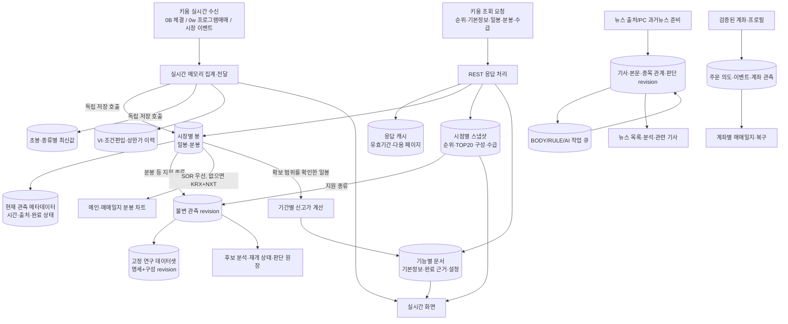
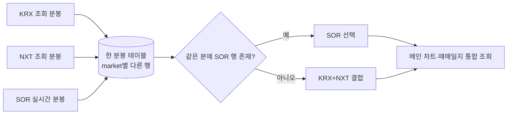

# 데이터는 언제 들어오고, 어디에 저장되고, 어디서 쓰이나

**NAS 운영 DB의 43개 테이블·418개 SQL 컬럼을 전부 수록했다.** 큰 흐름을 먼저 보고, 관심 있는 저장소를 선택하면 컬럼·키·입력·사용처·연결 근거를 확인할 수 있다.

- **[선택형 전체 관계도 열기](atlas.html)** — 설치 없이 브라우저에서 열기. 테이블·컬럼·기능명 검색, 연결된 저장소로 이동.
- [분야별 관계도](RELATIONSHIPS.md) — 문서 안에서 보는 도식.
- [모든 테이블·컬럼 사전](TABLES.md) — 43개 테이블, 418개 컬럼, 실제 자료형·NULL·기본값·제약·인덱스.
- [94개 JSON 문서 종류](COLLECTIONS.md) — 뉴스·매매일지·준비 상태·설정·자동실행 문서의 의미.
- [PC 주 앱 SQLite 구조](LOCAL_SQLITE.md) · [로컬 DB 전체 파일/구조 목록](SQLITE_INVENTORY.md).
- [기계 판독용 카탈로그](catalog.json).

## 확인한 기준과 범위

| 구분 | 실제 확인한 상태 |
|---|---|
| NAS 카탈로그 수집 | **2026-10-01 23:41:36 KST**, PostgreSQL 17.11, DB `kiwoom_monitor`, public 사용자 테이블 전체 |
| 운영 테이블 / 컬럼 | **43 / 418**, 모두 물리 카탈로그에서 읽음 |
| DB migration | **20** (`central_schema_migrations` 기준). `/health.schema_version`은 이 번호가 아님 |
| 운영 build | `2026.10.01-vi-inflight-dedup-v1` |
| 활성 소스 | `2026.10.01-vi-inflight-dedup-v1-72f5614957befcec` — NAS `active.json`에서 확인. health의 source_release 필드는 null이었음 |
| PC 코드 기준 | `d92ded6` — 기존 누적 변경을 먼저 커밋한 상태 |
| 물리 FOREIGN KEY | **0개**. 아래 선은 코드가 연결하는 논리 관계이며 FK가 아님 |
| 읽은 자료 | PostgreSQL 카탈로그·migration 원장, SQLite 스키마, 작성/조회 소스. 기사·주문·계좌 데이터 행을 전수 조회하지 않음 |

`autonomous_top20.py`, `market_ingest.py`, `realtime_collector.py`, `minute_chart_service.py`, `ranking_schedule.py`는 NAS 활성 릴리즈와 PC 파일 해시가 같았다. `database.py`, `central_schema.py`, `app.py`는 다르다. DB 접근 파일의 차이는 주로 아래 shadow 체크포인트 후보이므로, **실제 스키마는 NAS 카탈로그**, **코드 위치 근거는 PC 커밋**으로 구분했다. 이 문서 작성이 배포를 의미하지 않는다.

## 전체 흐름

화살표는 데이터 이동/참조를 뜻한다. 한 줄로 연결됐다고 같은 transaction이거나 같은 connection이라는 뜻은 아니다. writer는 공통 DB 접근·계측 계층을 거치지만 독립 transaction과 concurrency를 유지한다.

## 시장 자료: 요청 시점부터 사용처까지

| 자료 | 언제 요청/수신하는가 | 어디에 남는가 | 어디서 쓰는가 |
|---|---|---|---|
| 조회종목순위 | 주 순위 ka00198 `qry_tp=5`는 30초 경계로 갱신. 조회와 보관 시간창은 별개 | `ranking` snapshot의 별도 보관은 **07:55 이상 08:06 미만 KST**. TOP20 membership snapshot은 계속 별도 기록 | 현재 순위 표시·편입 감지·구성 이력 |
| 당일 TOP20 편입 | 해당 거래일에 처음 편입된 종목 | `top20_daily_entrants` 문서 | 장후 보완 대상. 30초마다 전체 순위를 다시 쓰는 문서가 아님 |
| 기본정보 | 준비 단계에서 ka10001. 00~07시 관측은 07시 이후 다시 나타나면 갱신 대상 | `stock_fundamentals` 문서/데이터셋 | 시총·주식수 등 표시와 준비 상태 |
| 일봉 | ka10081. 종목·시장별 필요한 이력/완료 근거가 부족할 때 | `central_daily_bars` + 관측 메타 + coverage 문서 | 일봉 차트·5/20/250일 등 신고가 계산 |
| 조회 분봉 | ka10080. 편입 준비는 당일 08시 이후, 장후에는 당일 편입 종목을 시장별 최종 보완 | `central_minute_bars`의 KRX / 대상이면 NXT 행, coverage·revision | 분봉 차트·보완 상태·연구 |
| 체결 | 0B 실시간 수신. 메모리에 모은 뒤 저장 호출 | 분봉·초봉·실시간 최신값을 독립적으로 저장 | 진행 중 화면·당일 집계·관측 이력 |
| 프로그램매매 | **0w는 프로그램매매 실시간 타입**. 장후 조회 ka90008도 별도 존재 | `program_flow` snapshot과 확보/최종화 문서 | 수급 표시·분석. 0w를 체결 봉 입력으로 해석하지 않음 |
| 외국인·기관 수급 | 편입 준비/장후 보완의 ka10045 | `investor_flow` snapshot, `candidate_flow_capture/finalization` | 후보 준비·수급 분석. 실제 매수 체결 시점에만 요청하는 자료가 아님 |
| 해외/외부시장 | 공급자 수집 주기에 따라 | `central_external_bars`, roll/collection 상태 문서 | 외부시장 차트·상태 |

실제 TR 발생은 캐시·완료 표식·재시도·시장 대상 여부에 따라 달라진다. 이 표는 호출 조건 설명이지 매번 모든 TR을 실행한다는 의미가 아니다. [관련 상세 흐름](../MARKET_DATA_FLOW.md), [TOP20 구현](../../src/kiwoom_monitor/central_server/autonomous_top20.py), [응답 저장](../../src/kiwoom_monitor/central_server/market_ingest.py).

## 분봉에서 특히 구분할 것

장후 KRX/NXT 보완은 **SOR 행을 덮어쓰지 않는다**. 현재 통합 reader는 SOR 행의 완전성까지 평가하지 않고 존재하면 우선한다. 따라서 수신 누락이 있는 SOR가 더 완전한 KRX/NXT보다 선택될 여지는 남아 있다. 이번 문서 작업에서는 이 규칙을 바꾸지 않았다. 근거: [통합 reader](../../src/kiwoom_monitor/central_server/app.py)의 `_combined_minute_bars`.

`available_at`은 정보를 사용할 수 있게 된 시각이고 `effective_at`은 시장 기준 시각이다. `updated_at`·cache 만료·coverage 완료 여부와 서로 대체할 수 없다. 거래대금도 초봉은 원, 중앙 일/분봉은 백만원, 과거 5분봉은 provider raw 계약을 사용한다.

## 뉴스: 원본·처리 큐·화면은 별개

뉴스 source cursor는 다음에 어디부터 읽을지, run/observation은 어느 페이지에서 무엇을 발견했는지 기록한다. article revision은 기사 원본, body revision은 추출 본문, target revision은 종목 관련성이다. RULE 결과는 사건 revision과 근거 기사 membership, AI 결과는 모델·입력 버전을 포함한 분석 revision에 남는다.

`central_news_jobs`는 이 처리를 진행하는 큐다. `state=완료`와 `기사 존재`, `본문 확보`, `화면 최신 문서`는 다른 사실이다. PC가 준비한 과거뉴스의 수집 완료·BODY/RULE 완료·NAS 반영도 각각 확인해야 한다. 과거 준비 자료의 전체 JSON 내용이나 원본 SQLite 이관 상태까지 이 스키마 조사로 검증한 것은 아니다.

## 계좌·주문·매매일지

계좌 신원 등록 → 자격증명 프로필과 검증된 연결 → 해당 계좌의 설정/실행 소유권 → 주문 의도 → 주문/체결 이벤트 순으로 연결된다. 계좌번호·API 비밀키를 테이블 간 연결 설명에 노출하지 않는다. 자격증명 프로필 메타데이터와 암호화 vault는 다르다.

주문 이벤트와 intent 현재 상태는 함께 유지하지만 후보 판단·체크포인트·모의 자동실행의 현재 투영까지 모두 같은 transaction은 아니다. 매매일지의 복기·뉴스 연결·비용은 `central_documents`의 journal 계열과 PC `journal.sqlite3`에서 이어진다. DB에 저장됐다는 것만으로 주문 승인 또는 실제 주문 실행을 의미하지 않는다.

## PC 후보에만 있는 shadow 테이블 2개

| 테이블 | 모든 컬럼 | 실제 선언 관계 |
|---|---|---|
| `central_shadow_checkpoint_state` | `monitor_id TEXT PK`, `storage_version INTEGER NOT NULL`, `updated_at TIMESTAMPTZ NOT NULL`, `document_json JSONB NOT NULL`, `bar_order JSONB NOT NULL` | monitor_id → central_shadow_monitor_state.monitor_id, ON DELETE CASCADE |
| `central_shadow_checkpoint_frames` | `monitor_id TEXT NOT NULL`, `code TEXT NOT NULL`, `observation_key TEXT NOT NULL`, `frame_json JSONB NOT NULL`; PK(monitor_id,code,observation_key) | monitor_id → central_shadow_checkpoint_state.monitor_id, ON DELETE CASCADE |

이는 로컬 PostgreSQL migration **21** 후보이며 **현재 NAS 43개에는 없다**. 기존 큰 checkpoint의 공통 상태와 봉 frame을 나누는 실험이다. header의 `bar_order`는 봉 순서, frame의 `observation_key`는 봉 관측 키, `frame_json`은 해당 봉 상태다. 새 writer 옵션은 기본 false지만, **옵션을 끈 것과 migration을 적용하지 않은 것은 다르다**. 로컬 reader도 후보 header를 조회하므로 단순 파일 복사로 v20 DB에 바로 연결하는 호환성을 뜻하지 않는다. 근거: [shadow_checkpoint.py](../../src/kiwoom_monitor/central_server/shadow_checkpoint.py).

## 확인하지 않은 것

- 모든 JSON 문서의 실제 내부 키·값·버전 분포, 각 테이블의 실시간 행 수, 전체 데이터의 참조 무결성.
- 운영 테이블의 현재 실행 빈도·WAL량·쿼리 지연. 구조 지도만으로 성능 병목을 단정하지 않는다.
- PC 외부 경로의 모든 DB, 별도 NAS archive 파일·다른 PostgreSQL DB. 로컬 파일 목록은 `data/` 범위와 실패 항목을 명시했다.
- 운영 배포/DB migration은 수행하지 않았다. 관측 계보·소유권·transaction 경계도 변경하지 않았다.

기존 코드는 먼저 `d92ded6`으로 커밋했으며 관련 로컬 회귀 171건이 통과했다. 지도는 해당 코드와 실제 catalog snapshot을 설명하는 문서이고, 과거 진단의 `OK`를 현재 운영 데이터 무결성 검사로 대신하지 않는다.
