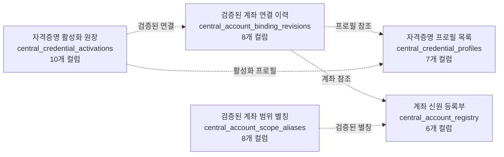
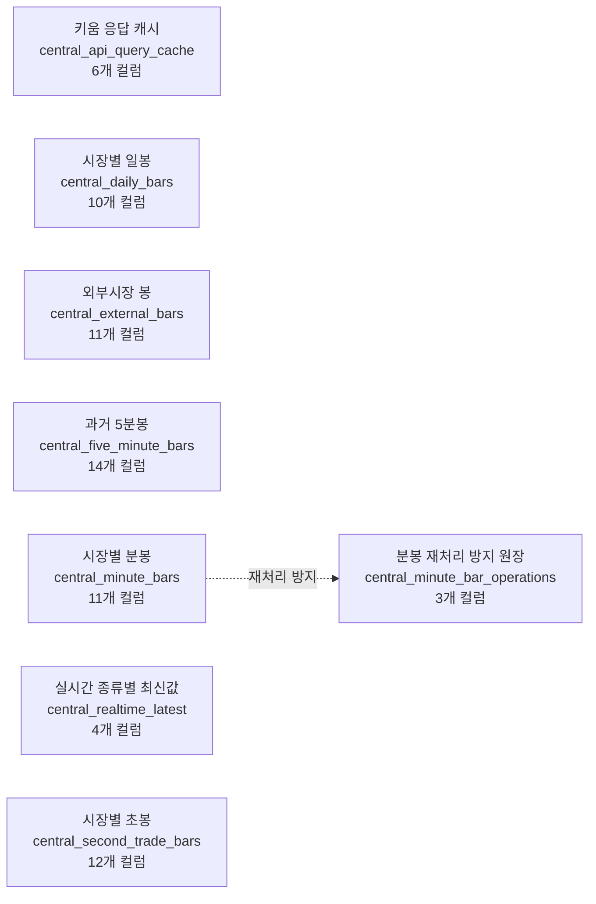
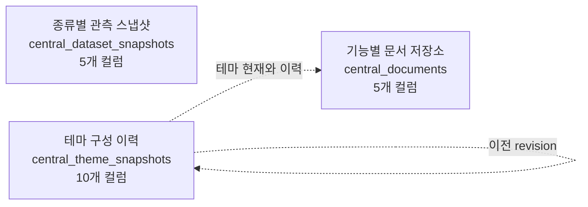
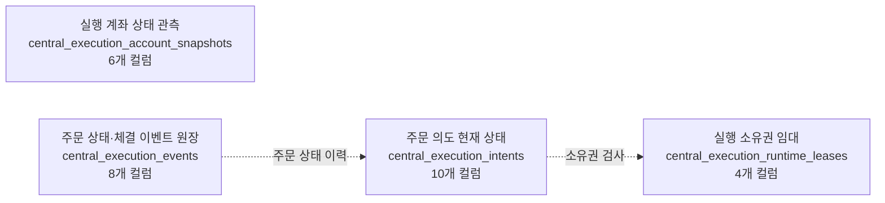
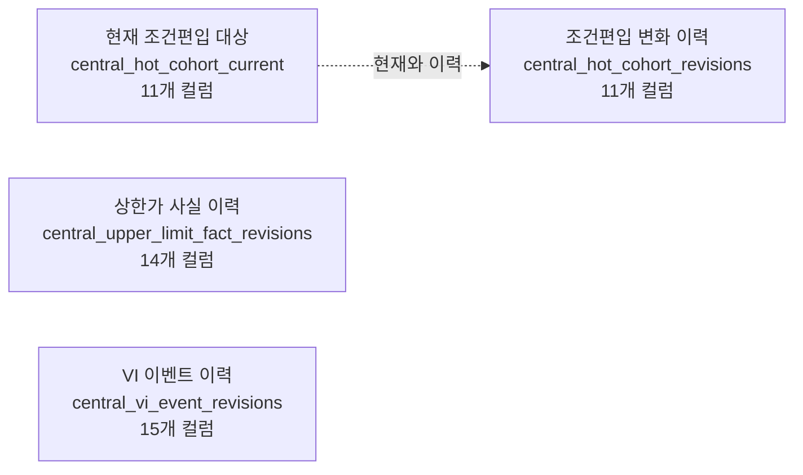
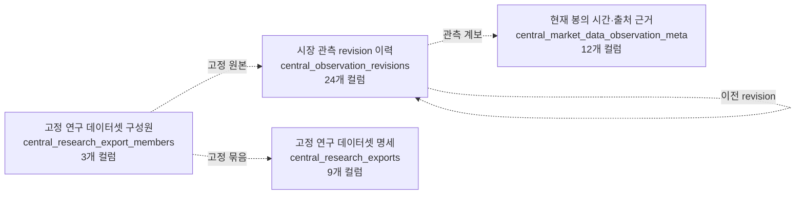
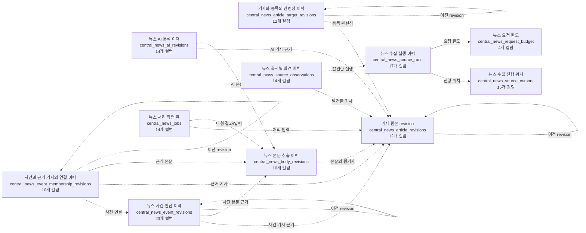
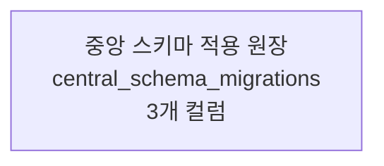
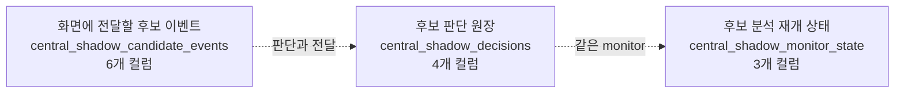

# 분야별 테이블 관계도

표시한 화살표는 **참조/투영/같은 작업 경계**이며 실제 FK가 아니다. 카디널리티를 DB가 강제하지 않으므로 1:N을 일괄 단정하지 않는다. 선택형 지도에서는 분야를 넘는 연결도 볼 수 있다. 각 테이블의 모든 컬럼과 정확한 제약은 [사전](TABLES.md), [검색 가능한 지도](atlas.html)에 있다.

## 계좌·자격증명

| 테이블 | 범위를 넘는 논리 연결 |
|---|---|
| [검증된 계좌 연결 이력](TABLES.md#central_account_binding_revisions) | — |
| [계좌 신원 등록부](TABLES.md#central_account_registry) | [주문 의도 현재 상태](TABLES.md#central_execution_intents) → [계좌 신원 등록부](TABLES.md#central_account_registry): 계좌 범위; [실행 계좌 상태 관측](TABLES.md#central_execution_account_snapshots) → [계좌 신원 등록부](TABLES.md#central_account_registry): 계좌 관측 |
| [검증된 계좌 범위 별칭](TABLES.md#central_account_scope_aliases) | — |
| [자격증명 활성화 원장](TABLES.md#central_credential_activations) | — |
| [자격증명 프로필 목록](TABLES.md#central_credential_profiles) | — |

## 시장 원본·캐시

| 테이블 | 범위를 넘는 논리 연결 |
|---|---|
| [키움 응답 캐시](TABLES.md#central_api_query_cache) | — |
| [시장별 일봉](TABLES.md#central_daily_bars) | [시장별 일봉](TABLES.md#central_daily_bars) → [현재 봉의 시간·출처 근거](TABLES.md#central_market_data_observation_meta): 품질·가용성 |
| [외부시장 봉](TABLES.md#central_external_bars) | — |
| [과거 5분봉](TABLES.md#central_five_minute_bars) | — |
| [분봉 재처리 방지 원장](TABLES.md#central_minute_bar_operations) | — |
| [시장별 분봉](TABLES.md#central_minute_bars) | [시장별 분봉](TABLES.md#central_minute_bars) → [현재 봉의 시간·출처 근거](TABLES.md#central_market_data_observation_meta): 품질·가용성 |
| [실시간 종류별 최신값](TABLES.md#central_realtime_latest) | — |
| [시장별 초봉](TABLES.md#central_second_trade_bars) | — |

## 문서·스냅샷

| 테이블 | 범위를 넘는 논리 연결 |
|---|---|
| [종류별 관측 스냅샷](TABLES.md#central_dataset_snapshots) | [종류별 관측 스냅샷](TABLES.md#central_dataset_snapshots) → [시장 관측 revision 이력](TABLES.md#central_observation_revisions): 관측 이력 |
| [기능별 문서 저장소](TABLES.md#central_documents) | [기사 원본 revision](TABLES.md#central_news_article_revisions) → [기능별 문서 저장소](TABLES.md#central_documents): 현재와 이력; [뉴스 AI 분석 이력](TABLES.md#central_news_ai_revisions) → [기능별 문서 저장소](TABLES.md#central_documents): 현재와 이력 |
| [테마 구성 이력](TABLES.md#central_theme_snapshots) | — |

## 주문·모의 실행

| 테이블 | 범위를 넘는 논리 연결 |
|---|---|
| [실행 계좌 상태 관측](TABLES.md#central_execution_account_snapshots) | [실행 계좌 상태 관측](TABLES.md#central_execution_account_snapshots) → [계좌 신원 등록부](TABLES.md#central_account_registry): 계좌 관측 |
| [주문 상태·체결 이벤트 원장](TABLES.md#central_execution_events) | — |
| [주문 의도 현재 상태](TABLES.md#central_execution_intents) | [주문 의도 현재 상태](TABLES.md#central_execution_intents) → [계좌 신원 등록부](TABLES.md#central_account_registry): 계좌 범위 |
| [실행 소유권 임대](TABLES.md#central_execution_runtime_leases) | — |

## 시장 이벤트

| 테이블 | 범위를 넘는 논리 연결 |
|---|---|
| [현재 조건편입 대상](TABLES.md#central_hot_cohort_current) | — |
| [조건편입 변화 이력](TABLES.md#central_hot_cohort_revisions) | — |
| [상한가 사실 이력](TABLES.md#central_upper_limit_fact_revisions) | — |
| [VI 이벤트 이력](TABLES.md#central_vi_event_revisions) | — |

## 관측 계보·연구

| 테이블 | 범위를 넘는 논리 연결 |
|---|---|
| [현재 봉의 시간·출처 근거](TABLES.md#central_market_data_observation_meta) | [시장별 분봉](TABLES.md#central_minute_bars) → [현재 봉의 시간·출처 근거](TABLES.md#central_market_data_observation_meta): 품질·가용성; [시장별 일봉](TABLES.md#central_daily_bars) → [현재 봉의 시간·출처 근거](TABLES.md#central_market_data_observation_meta): 품질·가용성 |
| [시장 관측 revision 이력](TABLES.md#central_observation_revisions) | [종류별 관측 스냅샷](TABLES.md#central_dataset_snapshots) → [시장 관측 revision 이력](TABLES.md#central_observation_revisions): 관측 이력 |
| [고정 연구 데이터셋 구성원](TABLES.md#central_research_export_members) | — |
| [고정 연구 데이터셋 명세](TABLES.md#central_research_exports) | — |

## 뉴스

| 테이블 | 범위를 넘는 논리 연결 |
|---|---|
| [뉴스 AI 분석 이력](TABLES.md#central_news_ai_revisions) | [뉴스 AI 분석 이력](TABLES.md#central_news_ai_revisions) → [기능별 문서 저장소](TABLES.md#central_documents): 현재와 이력 |
| [기사 원본 revision](TABLES.md#central_news_article_revisions) | [기사 원본 revision](TABLES.md#central_news_article_revisions) → [기능별 문서 저장소](TABLES.md#central_documents): 현재와 이력 |
| [기사와 종목의 관련성 이력](TABLES.md#central_news_article_target_revisions) | — |
| [뉴스 본문 추출 이력](TABLES.md#central_news_body_revisions) | — |
| [사건과 근거 기사의 연결 이력](TABLES.md#central_news_event_membership_revisions) | — |
| [뉴스 사건 판단 이력](TABLES.md#central_news_event_revisions) | — |
| [뉴스 처리 작업 큐](TABLES.md#central_news_jobs) | — |
| [뉴스 요청 한도](TABLES.md#central_news_request_budget) | — |
| [뉴스 수집 진행 위치](TABLES.md#central_news_source_cursors) | — |
| [뉴스 출처별 발견 이력](TABLES.md#central_news_source_observations) | — |
| [뉴스 수집 실행 이력](TABLES.md#central_news_source_runs) | — |

## 운영 메타

| 테이블 | 범위를 넘는 논리 연결 |
|---|---|
| [중앙 스키마 적용 원장](TABLES.md#central_schema_migrations) | — |

## 후보·그림자 분석

| 테이블 | 범위를 넘는 논리 연결 |
|---|---|
| [화면에 전달할 후보 이벤트](TABLES.md#central_shadow_candidate_events) | — |
| [후보 판단 원장](TABLES.md#central_shadow_decisions) | — |
| [후보 분석 재개 상태](TABLES.md#central_shadow_monitor_state) | — |
