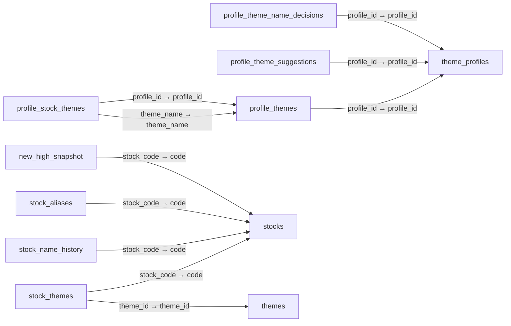
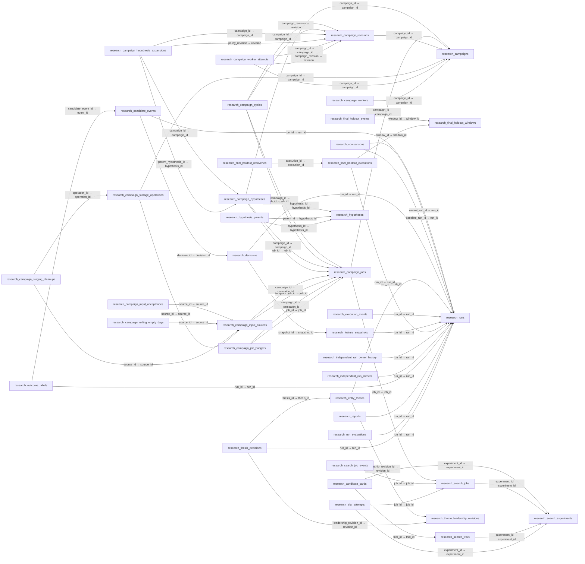
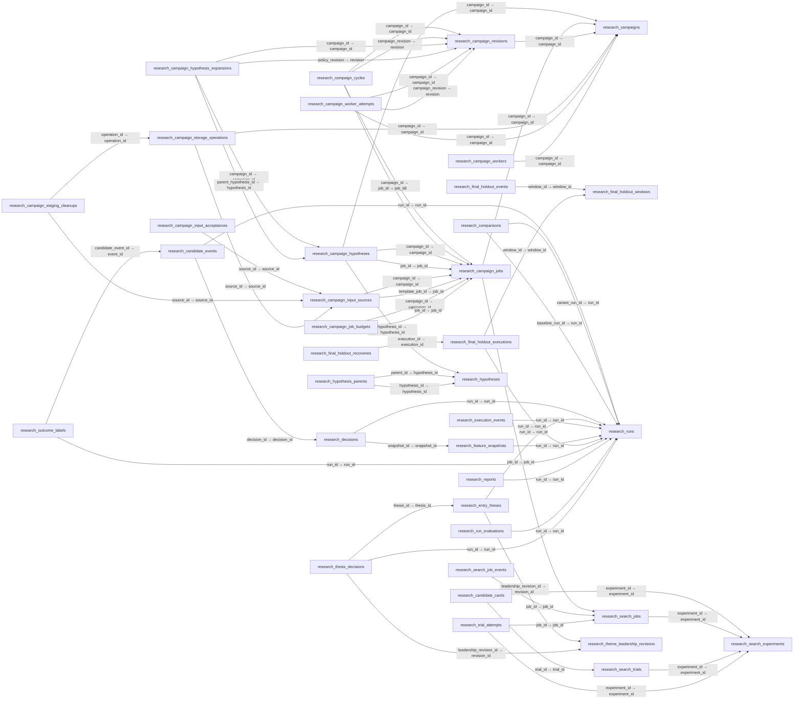

# PC 로컬 DB 전체 파일·구조 목록

수집 범위: 저장소 `data/` 아래 확장자 `.sqlite3` / `.db` 파일 전체. **44개 발견, 43개 스키마 확인, 1개 읽기 실패**. 동일한 구조를 가진 복사본은 한 구조로 묶었다. **19개 서로 다른 구조, 구조별 테이블 합계 254개**이며 동일 테이블이 여러 구조에 중복 포함될 수 있다. 이 숫자를 운영 테이블 254개라고 해석하지 않는다.

실제 자료형·PK·NULL·기본값·선언 FK를 전부 적었다. 도메인 설명은 [기존 DB 설계 지도](../../DB_SCHEMA.md), 주 앱 3개 DB는 [별도 부록](LOCAL_SQLITE.md), NAS와 연결되는 기능은 [전체 지도](README.md)를 본다. 이 목록은 실제 데이터 내용이나 모든 로컬 컬럼의 의미를 재검증한 보고서는 아니다.

백업·probe·연구 산출 파일도 목록에 포함한다. 파일이 존재한다는 것만으로 현재 프로세스가 사용한다고 판단하지 않는다. 실행 프로그램의 설정 경로와 reader를 추가 대조해야 한다. 저장소 밖 PC 수집 폴더, NAS 파일 기반 archive, 다른 PostgreSQL DB는 이 목록 밖이다.

## 읽기 실패

- `data/research/historical-development-results/multi-period-2024-2026-stocks-pairs-v4-1g/research.sqlite3`: `OperationalError: attempt to write a readonly database`. 읽기 전용 schema 조회 단계에서 실패. 복구/쓰기 허용/immutable 우회는 하지 않았으며 내부 구조는 미확인이다.

## 파일별 구조 찾아가기

| 파일 | 구조 ID | 테이블 | 컬럼 |
|---|---|---|---|
| `data/historical_backfill_probe.sqlite3` | [1d2a79fa244af3c4](#s-1d2a79fa244af3c4) | 5 | 62 |
| `data/historical_collection/historical-news-page-keys-20260927.sqlite3` | [a5213bd059b5eaf5](#s-a5213bd059b5eaf5) | 2 | 4 |
| `data/historical_collection/historical-news-page-versions-20260927.sqlite3` | [b9dc291ad1b70fb2](#s-b9dc291ad1b70fb2) | 3 | 20 |
| `data/historical_collection/nas-news-seed-20260927.sqlite3` | [2b660d6519356460](#s-2b660d6519356460) | 2 | 7 |
| `data/historical_collection/news-archive-20260927.building.sqlite3` | [121050f39361939b](#s-121050f39361939b) | 48 | 456 |
| `data/historical_collection/prepared-market-news-snapshot-20260924.sqlite3` | [ec0dff39667e1e45](#s-ec0dff39667e1e45) | 1 | 9 |
| `data/historical_collection/prepared-market-news.sqlite3` | [ec0dff39667e1e45](#s-ec0dff39667e1e45) | 1 | 9 |
| `data/historical_collection/prepared-market-pilot-20260924.sqlite3` | [ec0dff39667e1e45](#s-ec0dff39667e1e45) | 1 | 9 |
| `data/historical_collection/prepared-news-20260925T2215.sqlite3` | [ec0dff39667e1e45](#s-ec0dff39667e1e45) | 1 | 9 |
| `data/historical_collection/prepared-news-batch-20260924-1427.sqlite3` | [ec0dff39667e1e45](#s-ec0dff39667e1e45) | 1 | 9 |
| `data/historical_collection/prepared-news-pilot-20260924.sqlite3` | [ec0dff39667e1e45](#s-ec0dff39667e1e45) | 1 | 9 |
| `data/historical_collection/prepared_news.sqlite3` | [ec0dff39667e1e45](#s-ec0dff39667e1e45) | 1 | 9 |
| `data/historical_intelligence.sqlite3` | [da2b55c3b0aef64e](#s-da2b55c3b0aef64e) | 14 | 166 |
| `data/journal.before-alpha-cost-fix.sqlite3` | [20f749d3043d33e0](#s-20f749d3043d33e0) | 8 | 59 |
| `data/journal.before-investor-timing-fix.sqlite3` | [c22e2cca52141fb7](#s-c22e2cca52141fb7) | 12 | 93 |
| `data/journal.sqlite3` | [568797ed0bb186e1](#s-568797ed0bb186e1) | 21 | 232 |
| `data/kiwoom_monitor.db` | [4f53cda18c2baa0c](#s-4f53cda18c2baa0c) | 0 | 0 |
| `data/monitor.sqlite3` | [ea561f481f6d22b5](#s-ea561f481f6d22b5) | 32 | 177 |
| `data/nas_publish_verify_20260922/historical_intelligence.sqlite3` | [93f7e5e246e15790](#s-93f7e5e246e15790) | 7 | 93 |
| `data/nas_reference_inspect_20260922/historical_reference.sqlite3` | [eafc8ea0105bd5a6](#s-eafc8ea0105bd5a6) | 4 | 33 |
| `data/naver_stock_market_news.sqlite3` | [8eec584758c575b0](#s-8eec584758c575b0) | 4 | 36 |
| `data/news.sqlite3` | [a96ea81d28fc7af3](#s-a96ea81d28fc7af3) | 7 | 69 |
| `data/probe_naver_market_news.sqlite3` | [ea203495ca8f9955](#s-ea203495ca8f9955) | 3 | 28 |
| `data/research/historical-development-results/clockfix-control-old-input-current-code/research.sqlite3` | [9a83cfbafc455a75](#s-9a83cfbafc455a75) | 42 | 319 |
| `data/research/historical-development-results/monthly-2024-09-to-2025-12-clockfix-v2/research.sqlite3` | [9a83cfbafc455a75](#s-9a83cfbafc455a75) | 42 | 319 |
| `data/research/historical-development-results/monthly-2024-09-to-2025-12-v1-compact-4g/research.sqlite3` | [5fb6f5a9925737cb](#s-5fb6f5a9925737cb) | 39 | 304 |
| `data/research/historical-development-results/monthly-2024-09-to-2025-12-v1-optimized-4g/research.sqlite3` | [5fb6f5a9925737cb](#s-5fb6f5a9925737cb) | 39 | 304 |
| `data/research/historical-development-results/monthly-2024-09-to-2025-12-v1-streamed-4g/research.sqlite3` | [5fb6f5a9925737cb](#s-5fb6f5a9925737cb) | 39 | 304 |
| `data/research/historical-development-results/monthly-2024-09-to-2025-12-v1-structural/research.sqlite3` | [5fb6f5a9925737cb](#s-5fb6f5a9925737cb) | 39 | 304 |
| `data/research/historical-development-results/monthly-2024-09-to-2025-12-v1-structural-4g/research.sqlite3` | [5fb6f5a9925737cb](#s-5fb6f5a9925737cb) | 39 | 304 |
| `data/research/historical-development-results/monthly-2024-09-to-2025-12-v2/research.sqlite3` | [5fb6f5a9925737cb](#s-5fb6f5a9925737cb) | 39 | 304 |
| `data/research/historical-development-results/monthly-memory-probe-v2/research.sqlite3` | [5fb6f5a9925737cb](#s-5fb6f5a9925737cb) | 39 | 304 |
| `data/research/historical-development-results/monthly-memory-probe-v3/research.sqlite3` | [5fb6f5a9925737cb](#s-5fb6f5a9925737cb) | 39 | 304 |
| `data/research/historical-development-results/monthly-memory-probe-v4/research.sqlite3` | [5fb6f5a9925737cb](#s-5fb6f5a9925737cb) | 39 | 304 |
| `data/research/historical-development-results/monthly-memory-profile-v1/research.sqlite3` | [5fb6f5a9925737cb](#s-5fb6f5a9925737cb) | 39 | 304 |
| `data/research/historical-development-results/multi-period-2024-2026-stocks-pairs-v4/research.sqlite3` | [5fb6f5a9925737cb](#s-5fb6f5a9925737cb) | 39 | 304 |
| `data/research/historical-development-results/multi-period-2024-2026-stocks-pairs-v4-1g-clockfix/research.sqlite3` | [5fb6f5a9925737cb](#s-5fb6f5a9925737cb) | 39 | 304 |
| `data/research/historical-development-results/multi-period-2024-2026-v1/research.sqlite3` | [5fb6f5a9925737cb](#s-5fb6f5a9925737cb) | 39 | 304 |
| `data/research/historical-development-results/profile-1day-20260924/research.sqlite3` | [5fb6f5a9925737cb](#s-5fb6f5a9925737cb) | 39 | 304 |
| `data/research/historical-development-results/profile-1day-batched-v3/research.sqlite3` | [5fb6f5a9925737cb](#s-5fb6f5a9925737cb) | 39 | 304 |
| `data/research/historical-development-results/profile-1day-cancel-v2/research.sqlite3` | [5fb6f5a9925737cb](#s-5fb6f5a9925737cb) | 39 | 304 |
| `data/research/historical-development-results/profile-1day-final-v5/research.sqlite3` | [5fb6f5a9925737cb](#s-5fb6f5a9925737cb) | 39 | 304 |
| `data/research/historical-development-results/profile-1day-optimized-v4/research.sqlite3` | [5fb6f5a9925737cb](#s-5fb6f5a9925737cb) | 39 | 304 |

## 구조 1d2a79fa244af3c4

해당 파일: `data/historical_backfill_probe.sqlite3`

이 구조에 선언된 FK 없음. 코드가 관리하는 논리 관계가 없다는 뜻은 아니다.

### `market_bars`

동명 테이블 생성 코드(방언·버전별 확인 필요): [historical_backfill.py:L1366](../../src/kiwoom_monitor/infrastructure/historical_backfill.py)

| 컬럼 | 선언 자료형 | NOT NULL 선언 | PK 순번 | 기본값 |
|---|---|---|---|---|
| `provider` | `TEXT` | True | 1 | — |
| `code` | `TEXT` | True | 2 | — |
| `venue` | `TEXT` | True | 3 | — |
| `session_scope` | `TEXT` | True | 4 | — |
| `interval_seconds` | `INTEGER` | True | 5 | — |
| `adjustment_mode` | `TEXT` | True | 6 | — |
| `bar_time` | `TEXT` | True | 7 | — |
| `open` | `INTEGER` | False | — | — |
| `high` | `INTEGER` | False | — | — |
| `low` | `INTEGER` | False | — | — |
| `close` | `INTEGER` | False | — | — |
| `volume` | `INTEGER` | False | — | — |
| `trading_value` | `INTEGER` | False | — | — |
| `observed_at` | `TEXT` | True | — | — |
| `available_at` | `TEXT` | True | — | — |
| `bar_time_semantics` | `TEXT` | True | — | 'provider_value_unverified' |
| `raw_date` | `INTEGER` | False | — | — |
| `raw_time` | `INTEGER` | False | — | — |

### `news_article_symbols`

동명 테이블 생성 코드(방언·버전별 확인 필요): [historical_backfill.py:L1366](../../src/kiwoom_monitor/infrastructure/historical_backfill.py)

| 컬럼 | 선언 자료형 | NOT NULL 선언 | PK 순번 | 기본값 |
|---|---|---|---|---|
| `provider` | `TEXT` | True | 1 | — |
| `office_id` | `TEXT` | True | 2 | — |
| `article_id` | `TEXT` | True | 3 | — |
| `code` | `TEXT` | True | 4 | — |
| `page` | `INTEGER` | True | — | — |
| `cluster_index` | `INTEGER` | True | — | — |
| `related_index` | `INTEGER` | True | — | — |
| `observed_at` | `TEXT` | True | — | — |

### `news_articles`

동명 테이블 생성 코드(방언·버전별 확인 필요): [historical_backfill.py:L1366](../../src/kiwoom_monitor/infrastructure/historical_backfill.py)

| 컬럼 | 선언 자료형 | NOT NULL 선언 | PK 순번 | 기본값 |
|---|---|---|---|---|
| `provider` | `TEXT` | True | 1 | — |
| `office_id` | `TEXT` | True | 2 | — |
| `article_id` | `TEXT` | True | 3 | — |
| `published_at` | `TEXT` | True | — | — |
| `published_precision` | `TEXT` | True | — | — |
| `office_name` | `TEXT` | True | — | — |
| `title` | `TEXT` | True | — | — |
| `summary` | `TEXT` | True | — | — |
| `article_url` | `TEXT` | True | — | — |
| `image_url` | `TEXT` | True | — | — |
| `first_observed_at` | `TEXT` | True | — | — |
| `last_observed_at` | `TEXT` | True | — | — |
| `original_url` | `TEXT` | True | — | '' |
| `portal_url` | `TEXT` | True | — | '' |
| `published_at_source` | `TEXT` | True | — | '' |
| `published_at_raw` | `TEXT` | True | — | '' |
| `publication_source_url` | `TEXT` | True | — | '' |
| `article_fetch_status` | `TEXT` | True | — | 'not_fetched' |
| `article_fetched_at` | `TEXT` | True | — | '' |

### `news_search_observations`

동명 테이블 생성 코드(방언·버전별 확인 필요): [historical_backfill.py:L1366](../../src/kiwoom_monitor/infrastructure/historical_backfill.py)

| 컬럼 | 선언 자료형 | NOT NULL 선언 | PK 순번 | 기본값 |
|---|---|---|---|---|
| `provider` | `TEXT` | True | 1 | — |
| `office_id` | `TEXT` | True | 2 | — |
| `article_id` | `TEXT` | True | 3 | — |
| `code` | `TEXT` | True | 4 | — |
| `source_date` | `TEXT` | True | 5 | — |
| `query_text` | `TEXT` | True | 6 | — |
| `start` | `INTEGER` | True | — | — |
| `position` | `INTEGER` | True | — | — |
| `observed_at` | `TEXT` | True | — | — |

### `source_pages`

동명 테이블 생성 코드(방언·버전별 확인 필요): [historical_backfill.py:L1366](../../src/kiwoom_monitor/infrastructure/historical_backfill.py)

| 컬럼 | 선언 자료형 | NOT NULL 선언 | PK 순번 | 기본값 |
|---|---|---|---|---|
| `provider` | `TEXT` | True | 1 | — |
| `request_key` | `TEXT` | True | 2 | — |
| `observed_at` | `TEXT` | True | 3 | — |
| `endpoint` | `TEXT` | True | — | — |
| `response_sha256` | `TEXT` | True | — | — |
| `payload_json` | `TEXT` | True | — | — |
| `item_count` | `INTEGER` | True | — | — |
| `reported_total` | `INTEGER` | False | — | — |

## 구조 a5213bd059b5eaf5

해당 파일: `data/historical_collection/historical-news-page-keys-20260927.sqlite3`

이 구조에 선언된 FK 없음. 코드가 관리하는 논리 관계가 없다는 뜻은 아니다.

### `input_manifest`

직접 CREATE TABLE 리터럴 근거 미확인. 생성 SQL은 카탈로그 원본에 포함.

| 컬럼 | 선언 자료형 | NOT NULL 선언 | PK 순번 | 기본값 |
|---|---|---|---|---|
| `key` | `TEXT` | False | 1 | — |
| `value_json` | `TEXT` | True | — | — |

### `selected_request_keys`

직접 CREATE TABLE 리터럴 근거 미확인. 생성 SQL은 카탈로그 원본에 포함.

| 컬럼 | 선언 자료형 | NOT NULL 선언 | PK 순번 | 기본값 |
|---|---|---|---|---|
| `request_key` | `TEXT` | False | 1 | — |
| `observation_count` | `INTEGER` | True | — | — |

## 구조 b9dc291ad1b70fb2

해당 파일: `data/historical_collection/historical-news-page-versions-20260927.sqlite3`

이 구조에 선언된 FK 없음. 코드가 관리하는 논리 관계가 없다는 뜻은 아니다.

### `page_article_observations`

직접 CREATE TABLE 리터럴 근거 미확인. 생성 SQL은 카탈로그 원본에 포함.

| 컬럼 | 선언 자료형 | NOT NULL 선언 | PK 순번 | 기본값 |
|---|---|---|---|---|
| `source_rowid` | `INTEGER` | True | 1 | — |
| `article_key` | `TEXT` | True | 2 | — |
| `stock_code` | `TEXT` | True | — | — |
| `identity` | `TEXT` | True | — | — |
| `observed_at` | `TEXT` | True | — | — |
| `position` | `INTEGER` | True | — | — |
| `item_hash` | `TEXT` | True | — | — |
| `item_json` | `TEXT` | True | — | — |
| `prepared_match` | `INTEGER` | True | — | — |

### `page_parse_manifest`

직접 CREATE TABLE 리터럴 근거 미확인. 생성 SQL은 카탈로그 원본에 포함.

| 컬럼 | 선언 자료형 | NOT NULL 선언 | PK 순번 | 기본값 |
|---|---|---|---|---|
| `key` | `TEXT` | False | 1 | — |
| `value_json` | `TEXT` | True | — | — |

### `page_versions`

직접 CREATE TABLE 리터럴 근거 미확인. 생성 SQL은 카탈로그 원본에 포함.

| 컬럼 | 선언 자료형 | NOT NULL 선언 | PK 순번 | 기본값 |
|---|---|---|---|---|
| `source_rowid` | `INTEGER` | False | 1 | — |
| `request_key` | `TEXT` | True | — | — |
| `observed_at` | `TEXT` | True | — | — |
| `response_sha256` | `TEXT` | True | — | — |
| `declared_item_count` | `INTEGER` | True | — | — |
| `status` | `TEXT` | True | — | 'pending' |
| `parsed_items` | `INTEGER` | True | — | 0 |
| `prepared_matches` | `INTEGER` | True | — | 0 |
| `error` | `TEXT` | True | — | '' |

## 구조 2b660d6519356460

해당 파일: `data/historical_collection/nas-news-seed-20260927.sqlite3`

이 구조에 선언된 FK 없음. 코드가 관리하는 논리 관계가 없다는 뜻은 아니다.

### `seed_manifest`

직접 CREATE TABLE 리터럴 근거 미확인. 생성 SQL은 카탈로그 원본에 포함.

| 컬럼 | 선언 자료형 | NOT NULL 선언 | PK 순번 | 기본값 |
|---|---|---|---|---|
| `key` | `TEXT` | False | 1 | — |
| `value_json` | `TEXT` | True | — | — |

### `seed_rows`

직접 CREATE TABLE 리터럴 근거 미확인. 생성 SQL은 카탈로그 원본에 포함.

| 컬럼 | 선언 자료형 | NOT NULL 선언 | PK 순번 | 기본값 |
|---|---|---|---|---|
| `table_name` | `TEXT` | True | 1 | — |
| `row_key` | `TEXT` | True | 2 | — |
| `payload_json` | `TEXT` | True | — | — |
| `payload_hash` | `TEXT` | True | — | — |
| `role` | `TEXT` | True | — | — |

## 구조 121050f39361939b

해당 파일: `data/historical_collection/news-archive-20260927.building.sqlite3`

이 구조에 선언된 FK 없음. 코드가 관리하는 논리 관계가 없다는 뜻은 아니다.

### `archive_body_provenance`

직접 CREATE TABLE 리터럴 근거 미확인. 생성 SQL은 카탈로그 원본에 포함.

| 컬럼 | 선언 자료형 | NOT NULL 선언 | PK 순번 | 기본값 |
|---|---|---|---|---|
| `scope` | `TEXT` | True | 1 | — |
| `stock_code` | `TEXT` | True | 2 | — |
| `identity` | `TEXT` | True | 3 | — |
| `article_revision_id` | `TEXT` | True | — | — |
| `body_revision_id` | `TEXT` | True | — | — |
| `source_status` | `TEXT` | True | — | — |
| `extractor_version` | `TEXT` | True | — | — |
| `provider` | `TEXT` | True | — | — |
| `office_id` | `TEXT` | True | — | — |
| `source_article_id` | `TEXT` | True | — | — |
| `raw_body_sha256` | `TEXT` | True | — | — |
| `prepared_input_hash` | `TEXT` | True | — | — |
| `fetched_at` | `REAL` | True | — | — |
| `source_url` | `TEXT` | True | — | — |

### `archive_build_manifest`

직접 CREATE TABLE 리터럴 근거 미확인. 생성 SQL은 카탈로그 원본에 포함.

| 컬럼 | 선언 자료형 | NOT NULL 선언 | PK 순번 | 기본값 |
|---|---|---|---|---|
| `key` | `TEXT` | False | 1 | — |
| `value_json` | `TEXT` | True | — | — |

### `archive_input_progress`

직접 CREATE TABLE 리터럴 근거 미확인. 생성 SQL은 카탈로그 원본에 포함.

| 컬럼 | 선언 자료형 | NOT NULL 선언 | PK 순번 | 기본값 |
|---|---|---|---|---|
| `scope` | `TEXT` | True | 1 | — |
| `stock_code` | `TEXT` | True | 2 | — |
| `identity` | `TEXT` | True | 3 | — |
| `input_hash` | `TEXT` | True | — | — |
| `source_state` | `TEXT` | True | — | — |
| `progress_state` | `TEXT` | True | — | — |
| `error` | `TEXT` | True | — | — |
| `article_revision_id` | `TEXT` | False | — | — |
| `body_revision_id` | `TEXT` | False | — | — |

### `archive_prepared_rule_inputs`

직접 CREATE TABLE 리터럴 근거 미확인. 생성 SQL은 카탈로그 원본에 포함.

| 컬럼 | 선언 자료형 | NOT NULL 선언 | PK 순번 | 기본값 |
|---|---|---|---|---|
| `scope` | `TEXT` | True | 1 | — |
| `stock_code` | `TEXT` | True | 2 | — |
| `identity` | `TEXT` | True | 3 | — |
| `input_hash` | `TEXT` | True | — | — |
| `article_revision_id` | `TEXT` | True | — | — |
| `body_revision_id` | `TEXT` | True | — | — |
| `target_id` | `TEXT` | True | — | — |
| `rule_version` | `TEXT` | True | — | — |
| `rule_result_json` | `TEXT` | True | — | — |

### `archive_seed_roles`

직접 CREATE TABLE 리터럴 근거 미확인. 생성 SQL은 카탈로그 원본에 포함.

| 컬럼 | 선언 자료형 | NOT NULL 선언 | PK 순번 | 기본값 |
|---|---|---|---|---|
| `table_name` | `TEXT` | True | 1 | — |
| `row_key` | `TEXT` | True | 2 | — |
| `payload_hash` | `TEXT` | True | — | — |
| `role` | `TEXT` | True | — | — |

### `central_account_binding_revisions`

동명 테이블 생성 코드(방언·버전별 확인 필요): [central_schema.py:L774](../../src/kiwoom_monitor/central_server/central_schema.py) · [central_schema.py:L787](../../src/kiwoom_monitor/central_server/central_schema.py)

| 컬럼 | 선언 자료형 | NOT NULL 선언 | PK 순번 | 기본값 |
|---|---|---|---|---|
| `binding_id` | `TEXT` | False | 1 | — |
| `credential_profile_id` | `TEXT` | True | — | — |
| `broker` | `TEXT` | True | — | — |
| `environment` | `TEXT` | True | — | — |
| `account_ref` | `TEXT` | True | — | — |
| `binding_revision` | `INTEGER` | True | — | — |
| `verified_at` | `TEXT` | True | — | — |
| `verification_method` | `TEXT` | True | — | — |

### `central_account_registry`

동명 테이블 생성 코드(방언·버전별 확인 필요): [central_schema.py:L770](../../src/kiwoom_monitor/central_server/central_schema.py) · [central_schema.py:L783](../../src/kiwoom_monitor/central_server/central_schema.py)

| 컬럼 | 선언 자료형 | NOT NULL 선언 | PK 순번 | 기본값 |
|---|---|---|---|---|
| `account_ref` | `TEXT` | False | 1 | — |
| `broker` | `TEXT` | True | — | — |
| `environment` | `TEXT` | True | — | — |
| `identity_fingerprint` | `TEXT` | True | — | — |
| `created_at` | `TEXT` | True | — | — |
| `status` | `TEXT` | True | — | — |

### `central_account_scope_aliases`

동명 테이블 생성 코드(방언·버전별 확인 필요): [central_schema.py:L800](../../src/kiwoom_monitor/central_server/central_schema.py) · [central_schema.py:L808](../../src/kiwoom_monitor/central_server/central_schema.py)

| 컬럼 | 선언 자료형 | NOT NULL 선언 | PK 순번 | 기본값 |
|---|---|---|---|---|
| `origin_account_ref` | `TEXT` | False | 1 | — |
| `canonical_account_ref` | `TEXT` | True | — | — |
| `broker` | `TEXT` | True | — | — |
| `environment` | `TEXT` | True | — | — |
| `credential_profile_id` | `TEXT` | True | — | — |
| `binding_revision` | `INTEGER` | True | — | — |
| `verified_at` | `TEXT` | True | — | — |
| `verification_method` | `TEXT` | True | — | — |

### `central_api_query_cache`

동명 테이블 생성 코드(방언·버전별 확인 필요): [central_schema.py:L109](../../src/kiwoom_monitor/central_server/central_schema.py) · [central_schema.py:L153](../../src/kiwoom_monitor/central_server/central_schema.py)

| 컬럼 | 선언 자료형 | NOT NULL 선언 | PK 순번 | 기본값 |
|---|---|---|---|---|
| `cache_key` | `TEXT` | False | 1 | — |
| `api_id` | `TEXT` | True | — | — |
| `expires_at` | `REAL` | True | — | — |
| `payload_json` | `TEXT` | True | — | — |
| `has_next` | `INTEGER` | True | — | — |
| `next_key` | `TEXT` | True | — | — |

### `central_credential_activations`

동명 테이블 생성 코드(방언·버전별 확인 필요): [central_schema.py:L871](../../src/kiwoom_monitor/central_server/central_schema.py)

| 컬럼 | 선언 자료형 | NOT NULL 선언 | PK 순번 | 기본값 |
|---|---|---|---|---|
| `operation_id` | `TEXT` | False | 1 | — |
| `provider` | `TEXT` | True | — | — |
| `credential_revision` | `INTEGER` | True | — | — |
| `request_id` | `TEXT` | True | — | — |
| `request_digest` | `TEXT` | True | — | — |
| `profile_id` | `TEXT` | True | — | — |
| `account_ref` | `TEXT` | False | — | — |
| `run_id` | `TEXT` | False | — | — |
| `binding_revision` | `INTEGER` | False | — | — |
| `committed_at` | `TEXT` | True | — | — |

### `central_credential_profiles`

동명 테이블 생성 코드(방언·버전별 확인 필요): [central_schema.py:L868](../../src/kiwoom_monitor/central_server/central_schema.py)

| 컬럼 | 선언 자료형 | NOT NULL 선언 | PK 순번 | 기본값 |
|---|---|---|---|---|
| `profile_id` | `TEXT` | False | 1 | — |
| `provider` | `TEXT` | True | — | — |
| `environment` | `TEXT` | False | — | — |
| `label` | `TEXT` | True | — | — |
| `lifecycle_state` | `TEXT` | True | — | — |
| `created_at` | `TEXT` | True | — | — |
| `archived_at` | `TEXT` | False | — | — |

### `central_daily_bars`

동명 테이블 생성 코드(방언·버전별 확인 필요): [central_schema.py:L124](../../src/kiwoom_monitor/central_server/central_schema.py) · [central_schema.py:L168](../../src/kiwoom_monitor/central_server/central_schema.py)

| 컬럼 | 선언 자료형 | NOT NULL 선언 | PK 순번 | 기본값 |
|---|---|---|---|---|
| `trading_date` | `TEXT` | True | 1 | — |
| `code` | `TEXT` | True | 2 | — |
| `market` | `TEXT` | True | 3 | — |
| `open` | `INTEGER` | True | — | — |
| `high` | `INTEGER` | True | — | — |
| `low` | `INTEGER` | True | — | — |
| `close` | `INTEGER` | True | — | — |
| `volume` | `INTEGER` | True | — | — |
| `trade_value_million_won` | `INTEGER` | False | — | — |
| `updated_at` | `REAL` | True | — | — |

### `central_dataset_snapshots`

동명 테이블 생성 코드(방언·버전별 확인 필요): [central_schema.py:L129](../../src/kiwoom_monitor/central_server/central_schema.py) · [central_schema.py:L173](../../src/kiwoom_monitor/central_server/central_schema.py)

| 컬럼 | 선언 자료형 | NOT NULL 선언 | PK 순번 | 기본값 |
|---|---|---|---|---|
| `kind` | `TEXT` | True | 1 | — |
| `subject` | `TEXT` | True | 2 | — |
| `snapshot_key` | `TEXT` | True | 3 | — |
| `saved_at` | `REAL` | True | — | — |
| `payload_json` | `TEXT` | True | — | — |

### `central_documents`

동명 테이블 생성 코드(방언·버전별 확인 필요): [central_schema.py:L135](../../src/kiwoom_monitor/central_server/central_schema.py) · [central_schema.py:L179](../../src/kiwoom_monitor/central_server/central_schema.py)

| 컬럼 | 선언 자료형 | NOT NULL 선언 | PK 순번 | 기본값 |
|---|---|---|---|---|
| `collection` | `TEXT` | True | 1 | — |
| `owner` | `TEXT` | True | 2 | — |
| `document_key` | `TEXT` | True | 3 | — |
| `updated_at` | `REAL` | True | — | — |
| `document_json` | `TEXT` | True | — | — |

### `central_execution_account_snapshots`

동명 테이블 생성 코드(방언·버전별 확인 필요): [central_schema.py:L733](../../src/kiwoom_monitor/central_server/central_schema.py) · [central_schema.py:L756](../../src/kiwoom_monitor/central_server/central_schema.py)

| 컬럼 | 선언 자료형 | NOT NULL 선언 | PK 순번 | 기본값 |
|---|---|---|---|---|
| `snapshot_id` | `TEXT` | False | 1 | — |
| `environment` | `TEXT` | True | — | — |
| `account_ref` | `TEXT` | True | — | — |
| `as_of` | `TEXT` | True | — | — |
| `received_at` | `TEXT` | True | — | — |
| `document_json` | `TEXT` | True | — | — |

### `central_execution_events`

동명 테이블 생성 코드(방언·버전별 확인 필요): [central_schema.py:L727](../../src/kiwoom_monitor/central_server/central_schema.py) · [central_schema.py:L750](../../src/kiwoom_monitor/central_server/central_schema.py)

| 컬럼 | 선언 자료형 | NOT NULL 선언 | PK 순번 | 기본값 |
|---|---|---|---|---|
| `accepted_sequence` | `INTEGER` | False | 1 | — |
| `event_id` | `TEXT` | True | — | — |
| `intent_id` | `TEXT` | True | — | — |
| `state` | `TEXT` | True | — | — |
| `occurred_at` | `TEXT` | True | — | — |
| `received_at` | `TEXT` | True | — | — |
| `broker_execution_id` | `TEXT` | True | — | — |
| `document_json` | `TEXT` | True | — | — |

### `central_execution_intents`

동명 테이블 생성 코드(방언·버전별 확인 필요): [central_schema.py:L720](../../src/kiwoom_monitor/central_server/central_schema.py) · [central_schema.py:L743](../../src/kiwoom_monitor/central_server/central_schema.py)

| 컬럼 | 선언 자료형 | NOT NULL 선언 | PK 순번 | 기본값 |
|---|---|---|---|---|
| `intent_id` | `TEXT` | False | 1 | — |
| `run_id` | `TEXT` | True | — | — |
| `environment` | `TEXT` | True | — | — |
| `account_ref` | `TEXT` | True | — | — |
| `state` | `TEXT` | True | — | — |
| `broker_order_id` | `TEXT` | True | — | — |
| `last_broker_as_of` | `TEXT` | False | — | — |
| `created_at` | `TEXT` | True | — | — |
| `updated_at` | `TEXT` | True | — | — |
| `document_json` | `TEXT` | True | — | — |

### `central_execution_runtime_leases`

동명 테이블 생성 코드(방언·버전별 확인 필요): [central_schema.py:L738](../../src/kiwoom_monitor/central_server/central_schema.py) · [central_schema.py:L761](../../src/kiwoom_monitor/central_server/central_schema.py)

| 컬럼 | 선언 자료형 | NOT NULL 선언 | PK 순번 | 기본값 |
|---|---|---|---|---|
| `owner_key` | `TEXT` | False | 1 | — |
| `owner_token` | `TEXT` | True | — | — |
| `lease_expires_at` | `TEXT` | True | — | — |
| `updated_at` | `TEXT` | True | — | — |

### `central_external_bars`

동명 테이블 생성 코드(방언·버전별 확인 필요): [central_schema.py:L141](../../src/kiwoom_monitor/central_server/central_schema.py) · [central_schema.py:L185](../../src/kiwoom_monitor/central_server/central_schema.py)

| 컬럼 | 선언 자료형 | NOT NULL 선언 | PK 순번 | 기본값 |
|---|---|---|---|---|
| `provider` | `TEXT` | True | 1 | — |
| `instrument` | `TEXT` | True | 2 | — |
| `contract` | `TEXT` | True | 3 | — |
| `timeframe` | `TEXT` | True | 4 | — |
| `bar_time` | `TEXT` | True | 5 | — |
| `open` | `REAL` | False | — | — |
| `high` | `REAL` | False | — | — |
| `low` | `REAL` | False | — | — |
| `close` | `REAL` | False | — | — |
| `volume` | `REAL` | False | — | — |
| `updated_at` | `REAL` | True | — | — |

### `central_five_minute_bars`

동명 테이블 생성 코드(방언·버전별 확인 필요): [central_schema.py:L850](../../src/kiwoom_monitor/central_server/central_schema.py)

| 컬럼 | 선언 자료형 | NOT NULL 선언 | PK 순번 | 기본값 |
|---|---|---|---|---|
| `trading_date` | `TEXT` | True | 1 | — |
| `minute` | `TEXT` | True | 2 | — |
| `code` | `TEXT` | True | 3 | — |
| `market` | `TEXT` | True | 4 | — |
| `provider` | `TEXT` | True | 5 | — |
| `adjustment_mode` | `TEXT` | True | 6 | — |
| `bar_time_semantics` | `TEXT` | True | — | — |
| `open` | `INTEGER` | True | — | — |
| `high` | `INTEGER` | True | — | — |
| `low` | `INTEGER` | True | — | — |
| `close` | `INTEGER` | True | — | — |
| `volume` | `INTEGER` | True | — | — |
| `trading_value_raw` | `INTEGER` | False | — | — |
| `observed_at` | `TEXT` | True | — | — |

### `central_hot_cohort_current`

동명 테이블 생성 코드(방언·버전별 확인 필요): [central_schema.py:L537](../../src/kiwoom_monitor/central_server/central_schema.py) · [central_schema.py:L567](../../src/kiwoom_monitor/central_server/central_schema.py)

| 컬럼 | 선언 자료형 | NOT NULL 선언 | PK 순번 | 기본값 |
|---|---|---|---|---|
| `stock_code` | `TEXT` | False | 1 | — |
| `stock_name` | `TEXT` | True | — | — |
| `condition_name` | `TEXT` | True | — | — |
| `first_seen_at` | `REAL` | True | — | — |
| `entry_session` | `TEXT` | True | — | — |
| `last_signal` | `TEXT` | True | — | — |
| `last_signal_at` | `REAL` | True | — | — |
| `active` | `INTEGER` | True | — | — |
| `nxt_eligible` | `INTEGER` | False | — | — |
| `expired_at` | `REAL` | False | — | — |
| `document_json` | `TEXT` | True | — | — |

### `central_hot_cohort_revisions`

동명 테이블 생성 코드(방언·버전별 확인 필요): [central_schema.py:L542](../../src/kiwoom_monitor/central_server/central_schema.py) · [central_schema.py:L572](../../src/kiwoom_monitor/central_server/central_schema.py)

| 컬럼 | 선언 자료형 | NOT NULL 선언 | PK 순번 | 기본값 |
|---|---|---|---|---|
| `accepted_sequence` | `INTEGER` | False | 1 | — |
| `revision_id` | `TEXT` | True | — | — |
| `revision_key` | `TEXT` | True | — | — |
| `stock_code` | `TEXT` | True | — | — |
| `event_type` | `TEXT` | True | — | — |
| `condition_name` | `TEXT` | True | — | — |
| `condition_seq` | `TEXT` | True | — | — |
| `session_id` | `TEXT` | True | — | — |
| `effective_at` | `REAL` | True | — | — |
| `available_at` | `REAL` | True | — | — |
| `document_json` | `TEXT` | True | — | — |

### `central_market_data_observation_meta`

동명 테이블 생성 코드(방언·버전별 확인 필요): [central_schema.py:L213](../../src/kiwoom_monitor/central_server/central_schema.py) · [central_schema.py:L221](../../src/kiwoom_monitor/central_server/central_schema.py)

| 컬럼 | 선언 자료형 | NOT NULL 선언 | PK 순번 | 기본값 |
|---|---|---|---|---|
| `dataset_kind` | `TEXT` | True | 1 | — |
| `subject` | `TEXT` | True | 2 | — |
| `observation_key` | `TEXT` | True | 3 | — |
| `effective_at` | `TEXT` | False | — | — |
| `available_at` | `TEXT` | False | — | — |
| `venue` | `TEXT` | True | — | — |
| `unit` | `TEXT` | True | — | — |
| `value_kind` | `TEXT` | True | — | — |
| `completeness` | `TEXT` | True | — | — |
| `origin` | `TEXT` | True | — | — |
| `source` | `TEXT` | True | — | '' |
| `candidate_universe` | `TEXT` | True | — | — |

### `central_minute_bar_operations`

동명 테이블 생성 코드(방언·버전별 확인 필요): [central_schema.py:L672](../../src/kiwoom_monitor/central_server/central_schema.py) · [central_schema.py:L679](../../src/kiwoom_monitor/central_server/central_schema.py)

| 컬럼 | 선언 자료형 | NOT NULL 선언 | PK 순번 | 기본값 |
|---|---|---|---|---|
| `operation_id` | `TEXT` | False | 1 | — |
| `operation_hash` | `TEXT` | True | — | — |
| `processed_at` | `TEXT` | True | — | — |

### `central_minute_bars`

동명 테이블 생성 코드(방언·버전별 확인 필요): [central_schema.py:L117](../../src/kiwoom_monitor/central_server/central_schema.py) · [central_schema.py:L161](../../src/kiwoom_monitor/central_server/central_schema.py)

| 컬럼 | 선언 자료형 | NOT NULL 선언 | PK 순번 | 기본값 |
|---|---|---|---|---|
| `trading_date` | `TEXT` | True | 1 | — |
| `minute` | `TEXT` | True | 2 | — |
| `code` | `TEXT` | True | 3 | — |
| `market` | `TEXT` | True | 4 | — |
| `open` | `INTEGER` | True | — | — |
| `high` | `INTEGER` | True | — | — |
| `low` | `INTEGER` | True | — | — |
| `close` | `INTEGER` | True | — | — |
| `volume` | `INTEGER` | True | — | — |
| `trade_value_million_won` | `INTEGER` | True | — | — |
| `updated_at` | `REAL` | True | — | — |

### `central_news_ai_revisions`

동명 테이블 생성 코드(방언·버전별 확인 필요): [central_schema.py:L355](../../src/kiwoom_monitor/central_server/central_schema.py) · [central_schema.py:L388](../../src/kiwoom_monitor/central_server/central_schema.py)

| 컬럼 | 선언 자료형 | NOT NULL 선언 | PK 순번 | 기본값 |
|---|---|---|---|---|
| `accepted_sequence` | `INTEGER` | False | 1 | — |
| `analysis_revision_id` | `TEXT` | True | — | — |
| `target_id` | `TEXT` | True | — | — |
| `article_revision_id` | `TEXT` | True | — | — |
| `body_revision_id` | `TEXT` | False | — | — |
| `provider` | `TEXT` | True | — | — |
| `model` | `TEXT` | True | — | — |
| `prompt_version` | `TEXT` | True | — | — |
| `schema_version` | `TEXT` | True | — | — |
| `input_hash` | `TEXT` | True | — | — |
| `computed_at` | `REAL` | True | — | — |
| `available_at` | `REAL` | True | — | — |
| `output_json` | `TEXT` | True | — | — |
| `usage_json` | `TEXT` | True | — | — |

### `central_news_article_revisions`

동명 테이블 생성 코드(방언·버전별 확인 필요): [central_schema.py:L340](../../src/kiwoom_monitor/central_server/central_schema.py) · [central_schema.py:L373](../../src/kiwoom_monitor/central_server/central_schema.py)

| 컬럼 | 선언 자료형 | NOT NULL 선언 | PK 순번 | 기본값 |
|---|---|---|---|---|
| `accepted_sequence` | `INTEGER` | False | 1 | — |
| `article_revision_id` | `TEXT` | True | — | — |
| `stock_code` | `TEXT` | True | — | — |
| `identity` | `TEXT` | True | — | — |
| `content_hash` | `TEXT` | True | — | — |
| `collector_id` | `TEXT` | True | — | — |
| `published_at` | `TEXT` | False | — | — |
| `received_at` | `REAL` | True | — | — |
| `available_at` | `REAL` | True | — | — |
| `collection_scope` | `TEXT` | True | — | — |
| `revision_of` | `TEXT` | False | — | — |
| `document_json` | `TEXT` | True | — | — |

### `central_news_article_target_revisions`

동명 테이블 생성 코드(방언·버전별 확인 필요): [central_schema.py:L478](../../src/kiwoom_monitor/central_server/central_schema.py) · [central_schema.py:L512](../../src/kiwoom_monitor/central_server/central_schema.py)

| 컬럼 | 선언 자료형 | NOT NULL 선언 | PK 순번 | 기본값 |
|---|---|---|---|---|
| `accepted_sequence` | `INTEGER` | False | 1 | — |
| `target_revision_id` | `TEXT` | True | — | — |
| `article_revision_id` | `TEXT` | True | — | — |
| `identity` | `TEXT` | True | — | — |
| `stock_code` | `TEXT` | False | — | — |
| `stock_name` | `TEXT` | False | — | — |
| `relation_status` | `TEXT` | True | — | — |
| `evidence_text` | `TEXT` | True | — | — |
| `rule_version` | `TEXT` | True | — | — |
| `available_at` | `REAL` | True | — | — |
| `revision_of` | `TEXT` | False | — | — |
| `document_json` | `TEXT` | True | — | — |

### `central_news_body_revisions`

동명 테이블 생성 코드(방언·버전별 확인 필요): [central_schema.py:L348](../../src/kiwoom_monitor/central_server/central_schema.py) · [central_schema.py:L381](../../src/kiwoom_monitor/central_server/central_schema.py)

| 컬럼 | 선언 자료형 | NOT NULL 선언 | PK 순번 | 기본값 |
|---|---|---|---|---|
| `accepted_sequence` | `INTEGER` | False | 1 | — |
| `body_revision_id` | `TEXT` | True | — | — |
| `article_revision_id` | `TEXT` | True | — | — |
| `content_hash` | `TEXT` | True | — | — |
| `extractor_version` | `TEXT` | True | — | — |
| `fetched_at` | `REAL` | True | — | — |
| `available_at` | `REAL` | True | — | — |
| `status` | `TEXT` | True | — | — |
| `body_text` | `TEXT` | True | — | — |
| `error` | `TEXT` | True | — | — |

### `central_news_event_membership_revisions`

동명 테이블 생성 코드(방언·버전별 확인 필요): [central_schema.py:L421](../../src/kiwoom_monitor/central_server/central_schema.py) · [central_schema.py:L442](../../src/kiwoom_monitor/central_server/central_schema.py)

| 컬럼 | 선언 자료형 | NOT NULL 선언 | PK 순번 | 기본값 |
|---|---|---|---|---|
| `accepted_sequence` | `INTEGER` | False | 1 | — |
| `membership_revision_id` | `TEXT` | True | — | — |
| `event_id` | `TEXT` | True | — | — |
| `event_revision_id` | `TEXT` | True | — | — |
| `article_revision_id` | `TEXT` | True | — | — |
| `body_revision_id` | `TEXT` | True | — | — |
| `relation` | `TEXT` | True | — | — |
| `available_at` | `REAL` | True | — | — |
| `revision_of` | `TEXT` | False | — | — |
| `document_json` | `TEXT` | True | — | — |

### `central_news_event_revisions`

동명 테이블 생성 코드(방언·버전별 확인 필요): [central_schema.py:L410](../../src/kiwoom_monitor/central_server/central_schema.py) · [central_schema.py:L431](../../src/kiwoom_monitor/central_server/central_schema.py)

| 컬럼 | 선언 자료형 | NOT NULL 선언 | PK 순번 | 기본값 |
|---|---|---|---|---|
| `accepted_sequence` | `INTEGER` | False | 1 | — |
| `event_revision_id` | `TEXT` | True | — | — |
| `event_id` | `TEXT` | True | — | — |
| `event_key` | `TEXT` | False | — | — |
| `stock_code` | `TEXT` | True | — | — |
| `event_type` | `TEXT` | True | — | — |
| `article_revision_id` | `TEXT` | True | — | — |
| `body_revision_id` | `TEXT` | True | — | — |
| `rule_version` | `TEXT` | True | — | — |
| `input_hash` | `TEXT` | True | — | — |
| `role` | `TEXT` | True | — | — |
| `scope` | `TEXT` | True | — | — |
| `certainty` | `TEXT` | True | — | — |
| `novelty` | `TEXT` | True | — | — |
| `amount_won` | `INTEGER` | False | — | — |
| `counterparty` | `TEXT` | False | — | — |
| `importance_score` | `INTEGER` | True | — | — |
| `confidence_score` | `INTEGER` | True | — | — |
| `novelty_score` | `INTEGER` | True | — | — |
| `ai_required` | `INTEGER` | True | — | — |
| `available_at` | `REAL` | True | — | — |
| `revision_of` | `TEXT` | False | — | — |
| `result_json` | `TEXT` | True | — | — |

### `central_news_jobs`

동명 테이블 생성 코드(방언·버전별 확인 필요): [central_schema.py:L363](../../src/kiwoom_monitor/central_server/central_schema.py) · [central_schema.py:L396](../../src/kiwoom_monitor/central_server/central_schema.py)

| 컬럼 | 선언 자료형 | NOT NULL 선언 | PK 순번 | 기본값 |
|---|---|---|---|---|
| `job_key` | `TEXT` | False | 1 | — |
| `article_revision_id` | `TEXT` | True | — | — |
| `stock_code` | `TEXT` | True | — | — |
| `target_id` | `TEXT` | True | — | — |
| `stage` | `TEXT` | True | — | — |
| `input_hash` | `TEXT` | True | — | — |
| `processing_version` | `TEXT` | True | — | — |
| `attempts` | `INTEGER` | True | — | — |
| `next_retry_at` | `REAL` | True | — | — |
| `state` | `TEXT` | True | — | — |
| `output_ref` | `TEXT` | True | — | — |
| `error` | `TEXT` | True | — | — |
| `payload_json` | `TEXT` | True | — | — |
| `updated_at` | `REAL` | True | — | — |

### `central_news_request_budget`

동명 테이블 생성 코드(방언·버전별 확인 필요): [central_schema.py:L486](../../src/kiwoom_monitor/central_server/central_schema.py) · [central_schema.py:L520](../../src/kiwoom_monitor/central_server/central_schema.py)

| 컬럼 | 선언 자료형 | NOT NULL 선언 | PK 순번 | 기본값 |
|---|---|---|---|---|
| `budget_date` | `TEXT` | True | 1 | — |
| `scope` | `TEXT` | True | 2 | — |
| `request_count` | `INTEGER` | True | — | — |
| `updated_at` | `REAL` | True | — | — |

### `central_news_source_cursors`

동명 테이블 생성 코드(방언·버전별 확인 필요): [central_schema.py:L456](../../src/kiwoom_monitor/central_server/central_schema.py) · [central_schema.py:L491](../../src/kiwoom_monitor/central_server/central_schema.py)

| 컬럼 | 선언 자료형 | NOT NULL 선언 | PK 순번 | 기본값 |
|---|---|---|---|---|
| `source_id` | `TEXT` | False | 1 | — |
| `scope` | `TEXT` | True | — | — |
| `query_text` | `TEXT` | True | — | — |
| `cursor_published_at` | `TEXT` | False | — | — |
| `cursor_identity` | `TEXT` | True | — | — |
| `pending_published_at` | `TEXT` | False | — | — |
| `pending_identity` | `TEXT` | True | — | — |
| `next_start` | `INTEGER` | True | — | — |
| `next_schedule_at` | `REAL` | True | — | — |
| `checked_at` | `REAL` | False | — | — |
| `last_success` | `REAL` | False | — | — |
| `coverage` | `TEXT` | True | — | — |
| `truncated` | `INTEGER` | True | — | — |
| `error` | `TEXT` | True | — | — |
| `updated_at` | `REAL` | True | — | — |

### `central_news_source_observations`

동명 테이블 생성 코드(방언·버전별 확인 필요): [central_schema.py:L471](../../src/kiwoom_monitor/central_server/central_schema.py) · [central_schema.py:L505](../../src/kiwoom_monitor/central_server/central_schema.py)

| 컬럼 | 선언 자료형 | NOT NULL 선언 | PK 순번 | 기본값 |
|---|---|---|---|---|
| `accepted_sequence` | `INTEGER` | False | 1 | — |
| `observation_id` | `TEXT` | True | — | — |
| `run_id` | `TEXT` | True | — | — |
| `source_id` | `TEXT` | True | — | — |
| `query_text` | `TEXT` | True | — | — |
| `page_start` | `INTEGER` | True | — | — |
| `article_revision_id` | `TEXT` | True | — | — |
| `identity` | `TEXT` | True | — | — |
| `published_at` | `TEXT` | False | — | — |
| `received_at` | `REAL` | True | — | — |
| `available_at` | `REAL` | True | — | — |
| `content_hash` | `TEXT` | True | — | — |
| `duplicate` | `INTEGER` | True | — | — |
| `document_json` | `TEXT` | True | — | — |

### `central_news_source_runs`

동명 테이블 생성 코드(방언·버전별 확인 필요): [central_schema.py:L462](../../src/kiwoom_monitor/central_server/central_schema.py) · [central_schema.py:L497](../../src/kiwoom_monitor/central_server/central_schema.py)

| 컬럼 | 선언 자료형 | NOT NULL 선언 | PK 순번 | 기본값 |
|---|---|---|---|---|
| `accepted_sequence` | `INTEGER` | False | 1 | — |
| `run_revision_id` | `TEXT` | True | — | — |
| `run_id` | `TEXT` | True | — | — |
| `source_id` | `TEXT` | True | — | — |
| `scope` | `TEXT` | True | — | — |
| `page_start` | `INTEGER` | True | — | — |
| `checked_at` | `REAL` | True | — | — |
| `completed_at` | `REAL` | True | — | — |
| `raw_count` | `INTEGER` | True | — | — |
| `unique_count` | `INTEGER` | True | — | — |
| `duplicate_count` | `INTEGER` | True | — | — |
| `request_count` | `INTEGER` | True | — | — |
| `budget_remaining` | `INTEGER` | True | — | — |
| `truncated` | `INTEGER` | True | — | — |
| `coverage` | `TEXT` | True | — | — |
| `error` | `TEXT` | True | — | — |
| `document_json` | `TEXT` | True | — | — |

### `central_observation_revisions`

동명 테이블 생성 코드(방언·버전별 확인 필요): [central_schema.py:L617](../../src/kiwoom_monitor/central_server/central_schema.py) · [central_schema.py:L630](../../src/kiwoom_monitor/central_server/central_schema.py)

| 컬럼 | 선언 자료형 | NOT NULL 선언 | PK 순번 | 기본값 |
|---|---|---|---|---|
| `accepted_sequence` | `INTEGER` | False | 1 | — |
| `revision_id` | `TEXT` | True | — | — |
| `observation_key` | `TEXT` | True | — | — |
| `schema_version` | `INTEGER` | True | — | — |
| `source_id` | `TEXT` | True | — | — |
| `source_session_id` | `TEXT` | True | — | — |
| `source_sequence` | `TEXT` | True | — | — |
| `kind` | `TEXT` | True | — | — |
| `subject` | `TEXT` | True | — | — |
| `venue` | `TEXT` | True | — | — |
| `effective_at` | `TEXT` | False | — | — |
| `received_at` | `TEXT` | True | — | — |
| `available_at` | `TEXT` | False | — | — |
| `revision_of` | `TEXT` | False | — | — |
| `payload_hash` | `TEXT` | True | — | — |
| `unit` | `TEXT` | True | — | — |
| `value_kind` | `TEXT` | True | — | — |
| `completeness` | `TEXT` | True | — | — |
| `origin` | `TEXT` | True | — | — |
| `candidate_universe` | `TEXT` | True | — | — |
| `quality_flags_json` | `TEXT` | True | — | — |
| `clock_quality` | `TEXT` | True | — | — |
| `source_ref_json` | `TEXT` | True | — | — |
| `payload_json` | `TEXT` | True | — | — |

### `central_realtime_latest`

동명 테이블 생성 코드(방언·버전별 확인 필요): [central_schema.py:L114](../../src/kiwoom_monitor/central_server/central_schema.py) · [central_schema.py:L158](../../src/kiwoom_monitor/central_server/central_schema.py)

| 컬럼 | 선언 자료형 | NOT NULL 선언 | PK 순번 | 기본값 |
|---|---|---|---|---|
| `event_type` | `TEXT` | True | 1 | — |
| `item_key` | `TEXT` | True | 2 | — |
| `received_at` | `REAL` | True | — | — |
| `event_json` | `TEXT` | True | — | — |

### `central_research_export_members`

동명 테이블 생성 코드(방언·버전별 확인 필요): [central_schema.py:L653](../../src/kiwoom_monitor/central_server/central_schema.py) · [central_schema.py:L663](../../src/kiwoom_monitor/central_server/central_schema.py)

| 컬럼 | 선언 자료형 | NOT NULL 선언 | PK 순번 | 기본값 |
|---|---|---|---|---|
| `dataset_id` | `TEXT` | True | 1 | — |
| `ordinal` | `INTEGER` | True | 2 | — |
| `revision_id` | `TEXT` | True | — | — |

### `central_research_exports`

동명 테이블 생성 코드(방언·버전별 확인 필요): [central_schema.py:L648](../../src/kiwoom_monitor/central_server/central_schema.py) · [central_schema.py:L658](../../src/kiwoom_monitor/central_server/central_schema.py)

| 컬럼 | 선언 자료형 | NOT NULL 선언 | PK 순번 | 기본값 |
|---|---|---|---|---|
| `dataset_id` | `TEXT` | False | 1 | — |
| `created_at` | `TEXT` | True | — | — |
| `start_at` | `TEXT` | True | — | — |
| `end_at` | `TEXT` | True | — | — |
| `kinds_json` | `TEXT` | True | — | — |
| `subject` | `TEXT` | True | — | — |
| `revision_count` | `INTEGER` | True | — | — |
| `revision_ids_hash` | `TEXT` | True | — | — |
| `manifest_json` | `TEXT` | True | — | — |

### `central_schema_migrations`

직접 CREATE TABLE 리터럴 근거 미확인. 생성 SQL은 카탈로그 원본에 포함.

| 컬럼 | 선언 자료형 | NOT NULL 선언 | PK 순번 | 기본값 |
|---|---|---|---|---|
| `version` | `INTEGER` | False | 1 | — |
| `name` | `TEXT` | True | — | — |
| `applied_at` | `TEXT` | True | — | — |

### `central_second_trade_bars`

동명 테이블 생성 코드(방언·버전별 확인 필요): [central_schema.py:L292](../../src/kiwoom_monitor/central_server/central_schema.py) · [central_schema.py:L303](../../src/kiwoom_monitor/central_server/central_schema.py)

| 컬럼 | 선언 자료형 | NOT NULL 선언 | PK 순번 | 기본값 |
|---|---|---|---|---|
| `trading_date` | `TEXT` | True | 1 | — |
| `trade_second` | `TEXT` | True | 2 | — |
| `code` | `TEXT` | True | 3 | — |
| `market` | `TEXT` | True | 4 | — |
| `open` | `INTEGER` | True | — | — |
| `high` | `INTEGER` | True | — | — |
| `low` | `INTEGER` | True | — | — |
| `close` | `INTEGER` | True | — | — |
| `volume` | `INTEGER` | True | — | — |
| `trade_value_won` | `INTEGER` | True | — | — |
| `trade_count` | `INTEGER` | True | — | — |
| `available_at` | `REAL` | True | — | — |

### `central_shadow_candidate_events`

동명 테이블 생성 코드(방언·버전별 확인 필요): [central_schema.py:L695](../../src/kiwoom_monitor/central_server/central_schema.py) · [central_schema.py:L708](../../src/kiwoom_monitor/central_server/central_schema.py)

| 컬럼 | 선언 자료형 | NOT NULL 선언 | PK 순번 | 기본값 |
|---|---|---|---|---|
| `accepted_sequence` | `INTEGER` | False | 1 | — |
| `event_id` | `TEXT` | True | — | — |
| `monitor_id` | `TEXT` | True | — | — |
| `available_at` | `TEXT` | True | — | — |
| `expires_at` | `TEXT` | True | — | — |
| `document_json` | `TEXT` | True | — | — |

### `central_shadow_decisions`

동명 테이블 생성 코드(방언·버전별 확인 필요): [central_schema.py:L692](../../src/kiwoom_monitor/central_server/central_schema.py) · [central_schema.py:L705](../../src/kiwoom_monitor/central_server/central_schema.py)

| 컬럼 | 선언 자료형 | NOT NULL 선언 | PK 순번 | 기본값 |
|---|---|---|---|---|
| `decision_id` | `TEXT` | False | 1 | — |
| `monitor_id` | `TEXT` | True | — | — |
| `decided_at` | `TEXT` | True | — | — |
| `document_json` | `TEXT` | True | — | — |

### `central_shadow_monitor_state`

동명 테이블 생성 코드(방언·버전별 확인 필요): [central_schema.py:L690](../../src/kiwoom_monitor/central_server/central_schema.py) · [central_schema.py:L703](../../src/kiwoom_monitor/central_server/central_schema.py)

| 컬럼 | 선언 자료형 | NOT NULL 선언 | PK 순번 | 기본값 |
|---|---|---|---|---|
| `monitor_id` | `TEXT` | False | 1 | — |
| `updated_at` | `TEXT` | True | — | — |
| `document_json` | `TEXT` | True | — | — |

### `central_theme_snapshots`

동명 테이블 생성 코드(방언·버전별 확인 필요): [central_schema.py:L318](../../src/kiwoom_monitor/central_server/central_schema.py) · [central_schema.py:L327](../../src/kiwoom_monitor/central_server/central_schema.py)

| 컬럼 | 선언 자료형 | NOT NULL 선언 | PK 순번 | 기본값 |
|---|---|---|---|---|
| `accepted_sequence` | `INTEGER` | False | 1 | — |
| `snapshot_id` | `TEXT` | True | — | — |
| `profile_id` | `TEXT` | True | — | — |
| `content_hash` | `TEXT` | True | — | — |
| `effective_at` | `TEXT` | False | — | — |
| `received_at` | `REAL` | True | — | — |
| `available_at` | `REAL` | True | — | — |
| `origin_device` | `TEXT` | True | — | — |
| `revision_of` | `TEXT` | False | — | — |
| `document_json` | `TEXT` | True | — | — |

### `central_upper_limit_fact_revisions`

동명 테이블 생성 코드(방언·버전별 확인 필요): [central_schema.py:L549](../../src/kiwoom_monitor/central_server/central_schema.py) · [central_schema.py:L579](../../src/kiwoom_monitor/central_server/central_schema.py)

| 컬럼 | 선언 자료형 | NOT NULL 선언 | PK 순번 | 기본값 |
|---|---|---|---|---|
| `accepted_sequence` | `INTEGER` | False | 1 | — |
| `fact_id` | `TEXT` | True | — | — |
| `fact_key` | `TEXT` | True | — | — |
| `stock_code` | `TEXT` | True | — | — |
| `session_id` | `TEXT` | True | — | — |
| `status` | `TEXT` | True | — | — |
| `upper_limit_price` | `INTEGER` | False | — | — |
| `current_price` | `INTEGER` | False | — | — |
| `high_price` | `INTEGER` | False | — | — |
| `effective_at` | `REAL` | True | — | — |
| `available_at` | `REAL` | True | — | — |
| `source` | `TEXT` | True | — | — |
| `evidence` | `TEXT` | True | — | — |
| `document_json` | `TEXT` | True | — | — |

### `central_vi_event_revisions`

동명 테이블 생성 코드(방언·버전별 확인 필요): [central_schema.py:L529](../../src/kiwoom_monitor/central_server/central_schema.py) · [central_schema.py:L559](../../src/kiwoom_monitor/central_server/central_schema.py)

| 컬럼 | 선언 자료형 | NOT NULL 선언 | PK 순번 | 기본값 |
|---|---|---|---|---|
| `accepted_sequence` | `INTEGER` | False | 1 | — |
| `event_id` | `TEXT` | True | — | — |
| `event_key` | `TEXT` | True | — | — |
| `stock_code` | `TEXT` | True | — | — |
| `event_kind` | `TEXT` | True | — | — |
| `vi_type` | `TEXT` | True | — | — |
| `effective_at` | `TEXT` | False | — | — |
| `received_at` | `REAL` | True | — | — |
| `available_at` | `REAL` | True | — | — |
| `price` | `INTEGER` | False | — | — |
| `direction` | `TEXT` | True | — | — |
| `trigger_count` | `INTEGER` | False | — | — |
| `exchange` | `TEXT` | True | — | — |
| `source` | `TEXT` | True | — | — |
| `document_json` | `TEXT` | True | — | — |

## 구조 ec0dff39667e1e45

해당 파일: `data/historical_collection/prepared-market-news-snapshot-20260924.sqlite3`, `data/historical_collection/prepared-market-news.sqlite3`, `data/historical_collection/prepared-market-pilot-20260924.sqlite3`, `data/historical_collection/prepared-news-20260925T2215.sqlite3`, `data/historical_collection/prepared-news-batch-20260924-1427.sqlite3`, `data/historical_collection/prepared-news-pilot-20260924.sqlite3`, `data/historical_collection/prepared_news.sqlite3`

이 구조에 선언된 FK 없음. 코드가 관리하는 논리 관계가 없다는 뜻은 아니다.

### `prepared_news`

직접 CREATE TABLE 리터럴 근거 미확인. 생성 SQL은 카탈로그 원본에 포함.

| 컬럼 | 선언 자료형 | NOT NULL 선언 | PK 순번 | 기본값 |
|---|---|---|---|---|
| `scope` | `TEXT` | True | 1 | — |
| `stock_code` | `TEXT` | True | 2 | — |
| `identity` | `TEXT` | True | 3 | — |
| `state` | `TEXT` | True | — | — |
| `article_json` | `TEXT` | True | — | — |
| `body_json` | `TEXT` | True | — | — |
| `rules_json` | `TEXT` | True | — | — |
| `error` | `TEXT` | True | — | — |
| `updated_at` | `REAL` | True | — | — |

## 구조 da2b55c3b0aef64e

해당 파일: `data/historical_intelligence.sqlite3`

**선언된 테이블 관계** (SQLite 연결의 FK 활성 여부는 별도)

### `market_backfill_jobs`

직접 CREATE TABLE 리터럴 근거 미확인. 생성 SQL은 카탈로그 원본에 포함.

| 컬럼 | 선언 자료형 | NOT NULL 선언 | PK 순번 | 기본값 |
|---|---|---|---|---|
| `code` | `TEXT` | False | 1 | — |
| `state` | `TEXT` | True | — | — |
| `attempts` | `INTEGER` | True | — | 0 |
| `one_minute_bars` | `INTEGER` | True | — | 0 |
| `five_minute_bars` | `INTEGER` | True | — | 0 |
| `one_minute_oldest` | `TEXT` | True | — | '' |
| `one_minute_newest` | `TEXT` | True | — | '' |
| `five_minute_oldest` | `TEXT` | True | — | '' |
| `five_minute_newest` | `TEXT` | True | — | '' |
| `raw_directory` | `TEXT` | True | — | '' |
| `last_error` | `TEXT` | True | — | '' |
| `updated_at` | `TEXT` | True | — | — |

### `market_bars`

동명 테이블 생성 코드(방언·버전별 확인 필요): [historical_backfill.py:L1366](../../src/kiwoom_monitor/infrastructure/historical_backfill.py)

| 컬럼 | 선언 자료형 | NOT NULL 선언 | PK 순번 | 기본값 |
|---|---|---|---|---|
| `provider` | `TEXT` | True | 1 | — |
| `code` | `TEXT` | True | 2 | — |
| `venue` | `TEXT` | True | 3 | — |
| `session_scope` | `TEXT` | True | 4 | — |
| `interval_seconds` | `INTEGER` | True | 5 | — |
| `adjustment_mode` | `TEXT` | True | 6 | — |
| `bar_time` | `TEXT` | True | 7 | — |
| `bar_time_semantics` | `TEXT` | True | — | 'provider_value_unverified' |
| `raw_date` | `INTEGER` | False | — | — |
| `raw_time` | `INTEGER` | False | — | — |
| `open` | `INTEGER` | False | — | — |
| `high` | `INTEGER` | False | — | — |
| `low` | `INTEGER` | False | — | — |
| `close` | `INTEGER` | False | — | — |
| `volume` | `INTEGER` | False | — | — |
| `trading_value` | `INTEGER` | False | — | — |
| `observed_at` | `TEXT` | True | — | — |
| `available_at` | `TEXT` | True | — | — |

### `nas_news_imports`

직접 CREATE TABLE 리터럴 근거 미확인. 생성 SQL은 카탈로그 원본에 포함.

| 컬럼 | 선언 자료형 | NOT NULL 선언 | PK 순번 | 기본값 |
|---|---|---|---|---|
| `provider` | `TEXT` | True | 1 | — |
| `office_id` | `TEXT` | True | 2 | — |
| `article_id` | `TEXT` | True | 3 | — |
| `code` | `TEXT` | True | 4 | — |
| `identity` | `TEXT` | True | — | — |
| `content_hash` | `TEXT` | True | — | — |
| `state` | `TEXT` | True | — | — |
| `attempts` | `INTEGER` | True | — | 0 |
| `last_error` | `TEXT` | True | — | '' |
| `imported_at` | `TEXT` | True | — | '' |
| `updated_at` | `TEXT` | True | — | — |

### `news_article_body_snapshots`

동명 테이블 생성 코드(방언·버전별 확인 필요): [historical_backfill.py:L1366](../../src/kiwoom_monitor/infrastructure/historical_backfill.py)

| 컬럼 | 선언 자료형 | NOT NULL 선언 | PK 순번 | 기본값 |
|---|---|---|---|---|
| `provider` | `TEXT` | True | 1 | — |
| `office_id` | `TEXT` | True | 2 | — |
| `article_id` | `TEXT` | True | 3 | — |
| `extractor_version` | `TEXT` | True | 4 | — |
| `body_sha256` | `TEXT` | True | 5 | — |
| `body_text` | `TEXT` | True | — | — |
| `source_url` | `TEXT` | True | — | — |
| `published_at` | `TEXT` | True | — | '' |
| `fetched_at` | `TEXT` | True | — | — |

### `news_article_fetch_attempts`

동명 테이블 생성 코드(방언·버전별 확인 필요): [historical_backfill.py:L1366](../../src/kiwoom_monitor/infrastructure/historical_backfill.py)

| 컬럼 | 선언 자료형 | NOT NULL 선언 | PK 순번 | 기본값 |
|---|---|---|---|---|
| `attempt_id` | `TEXT` | False | 1 | — |
| `provider` | `TEXT` | True | — | — |
| `office_id` | `TEXT` | True | — | — |
| `article_id` | `TEXT` | True | — | — |
| `attempted_at` | `TEXT` | True | — | — |
| `url_role` | `TEXT` | True | — | — |
| `requested_url` | `TEXT` | True | — | — |
| `final_url` | `TEXT` | True | — | — |
| `http_status` | `INTEGER` | False | — | — |
| `status` | `TEXT` | True | — | — |
| `error` | `TEXT` | True | — | — |
| `published_at` | `TEXT` | True | — | — |
| `published_precision` | `TEXT` | True | — | — |
| `published_at_source` | `TEXT` | True | — | — |
| `published_at_raw` | `TEXT` | True | — | — |

### `news_article_host_cooldowns`

동명 테이블 생성 코드(방언·버전별 확인 필요): [historical_backfill.py:L1366](../../src/kiwoom_monitor/infrastructure/historical_backfill.py)

| 컬럼 | 선언 자료형 | NOT NULL 선언 | PK 순번 | 기본값 |
|---|---|---|---|---|
| `host` | `TEXT` | False | 1 | — |
| `retry_after` | `TEXT` | True | — | — |
| `reason` | `TEXT` | True | — | — |
| `updated_at` | `TEXT` | True | — | — |

### `news_article_pipeline`

동명 테이블 생성 코드(방언·버전별 확인 필요): [historical_backfill.py:L1366](../../src/kiwoom_monitor/infrastructure/historical_backfill.py)

| 컬럼 | 선언 자료형 | NOT NULL 선언 | PK 순번 | 기본값 |
|---|---|---|---|---|
| `queue_id` | `INTEGER` | False | 1 | — |
| `job_key` | `TEXT` | True | — | — |
| `provider` | `TEXT` | True | — | — |
| `office_id` | `TEXT` | True | — | — |
| `article_id` | `TEXT` | True | — | — |
| `code` | `TEXT` | True | — | — |
| `query_text` | `TEXT` | True | — | — |
| `target_date` | `TEXT` | True | — | — |
| `target_end_date` | `TEXT` | True | — | — |
| `start` | `INTEGER` | True | — | — |
| `position` | `INTEGER` | True | — | — |
| `search_published_date` | `TEXT` | True | — | — |
| `state` | `TEXT` | True | — | 'pending' |
| `claim_token` | `TEXT` | True | — | '' |
| `claimed_at` | `TEXT` | True | — | '' |
| `last_error` | `TEXT` | True | — | '' |
| `updated_at` | `TEXT` | True | — | — |
| `attempts` | `INTEGER` | True | — | 0 |

### `news_article_symbols`

동명 테이블 생성 코드(방언·버전별 확인 필요): [historical_backfill.py:L1366](../../src/kiwoom_monitor/infrastructure/historical_backfill.py)

| 컬럼 | 선언 자료형 | NOT NULL 선언 | PK 순번 | 기본값 |
|---|---|---|---|---|
| `provider` | `TEXT` | True | 1 | — |
| `office_id` | `TEXT` | True | 2 | — |
| `article_id` | `TEXT` | True | 3 | — |
| `code` | `TEXT` | True | 4 | — |
| `page` | `INTEGER` | True | — | — |
| `cluster_index` | `INTEGER` | True | — | — |
| `related_index` | `INTEGER` | True | — | — |
| `observed_at` | `TEXT` | True | — | — |

### `news_articles`

동명 테이블 생성 코드(방언·버전별 확인 필요): [historical_backfill.py:L1366](../../src/kiwoom_monitor/infrastructure/historical_backfill.py)

| 컬럼 | 선언 자료형 | NOT NULL 선언 | PK 순번 | 기본값 |
|---|---|---|---|---|
| `provider` | `TEXT` | True | 1 | — |
| `office_id` | `TEXT` | True | 2 | — |
| `article_id` | `TEXT` | True | 3 | — |
| `published_at` | `TEXT` | True | — | — |
| `published_precision` | `TEXT` | True | — | — |
| `office_name` | `TEXT` | True | — | — |
| `title` | `TEXT` | True | — | — |
| `summary` | `TEXT` | True | — | — |
| `article_url` | `TEXT` | True | — | — |
| `original_url` | `TEXT` | True | — | '' |
| `portal_url` | `TEXT` | True | — | '' |
| `image_url` | `TEXT` | True | — | — |
| `published_at_source` | `TEXT` | True | — | '' |
| `published_at_raw` | `TEXT` | True | — | '' |
| `publication_source_url` | `TEXT` | True | — | '' |
| `article_fetch_status` | `TEXT` | True | — | 'not_fetched' |
| `article_fetched_at` | `TEXT` | True | — | '' |
| `training_eligible` | `INTEGER` | True | — | 0 |
| `training_exclusion_reason` | `TEXT` | True | — | 'publication_time_unverified' |
| `first_observed_at` | `TEXT` | True | — | — |
| `last_observed_at` | `TEXT` | True | — | — |

### `news_backfill_jobs`

동명 테이블 생성 코드(방언·버전별 확인 필요): [historical_backfill.py:L1366](../../src/kiwoom_monitor/infrastructure/historical_backfill.py)

| 컬럼 | 선언 자료형 | NOT NULL 선언 | PK 순번 | 기본값 |
|---|---|---|---|---|
| `code` | `TEXT` | True | 1 | — |
| `target_date` | `TEXT` | True | 2 | — |
| `query_text` | `TEXT` | True | 3 | — |
| `state` | `TEXT` | True | — | — |
| `attempts` | `INTEGER` | True | — | 0 |
| `pages_observed` | `INTEGER` | True | — | 0 |
| `items_observed` | `INTEGER` | True | — | 0 |
| `usable_articles` | `INTEGER` | True | — | 0 |
| `unreadable_articles` | `INTEGER` | True | — | 0 |
| `missing_time_articles` | `INTEGER` | True | — | 0 |
| `last_error` | `TEXT` | True | — | '' |
| `updated_at` | `TEXT` | True | — | — |
| `name_source` | `TEXT` | True | — | 'stocks.current' |
| `name_source_ref` | `TEXT` | True | — | '' |

### `news_range_jobs`

동명 테이블 생성 코드(방언·버전별 확인 필요): [historical_backfill.py:L1366](../../src/kiwoom_monitor/infrastructure/historical_backfill.py)

| 컬럼 | 선언 자료형 | NOT NULL 선언 | PK 순번 | 기본값 |
|---|---|---|---|---|
| `range_id` | `TEXT` | False | 1 | — |
| `code` | `TEXT` | True | — | — |
| `query_text` | `TEXT` | True | — | — |
| `start_date` | `TEXT` | True | — | — |
| `end_date` | `TEXT` | True | — | — |
| `state` | `TEXT` | True | — | — |
| `attempts` | `INTEGER` | True | — | 0 |
| `member_count` | `INTEGER` | True | — | — |
| `pages_observed` | `INTEGER` | True | — | 0 |
| `items_observed` | `INTEGER` | True | — | 0 |
| `usable_articles` | `INTEGER` | True | — | 0 |
| `unreadable_articles` | `INTEGER` | True | — | 0 |
| `missing_time_articles` | `INTEGER` | True | — | 0 |
| `last_error` | `TEXT` | True | — | '' |
| `updated_at` | `TEXT` | True | — | — |

### `news_range_members`

동명 테이블 생성 코드(방언·버전별 확인 필요): [historical_backfill.py:L1366](../../src/kiwoom_monitor/infrastructure/historical_backfill.py)

| 컬럼 | 선언 자료형 | NOT NULL 선언 | PK 순번 | 기본값 |
|---|---|---|---|---|
| `range_id` | `TEXT` | True | 1 | — |
| `code` | `TEXT` | True | 2 | — |
| `target_date` | `TEXT` | True | 3 | — |
| `query_text` | `TEXT` | True | 4 | — |

- FK `range_id` → `news_range_jobs.range_id`; ON DELETE NO ACTION, ON UPDATE NO ACTION

### `news_search_observations`

동명 테이블 생성 코드(방언·버전별 확인 필요): [historical_backfill.py:L1366](../../src/kiwoom_monitor/infrastructure/historical_backfill.py)

| 컬럼 | 선언 자료형 | NOT NULL 선언 | PK 순번 | 기본값 |
|---|---|---|---|---|
| `provider` | `TEXT` | True | 1 | — |
| `office_id` | `TEXT` | True | 2 | — |
| `article_id` | `TEXT` | True | 3 | — |
| `code` | `TEXT` | True | 4 | — |
| `source_date` | `TEXT` | True | 5 | — |
| `query_text` | `TEXT` | True | 6 | — |
| `start` | `INTEGER` | True | — | — |
| `position` | `INTEGER` | True | — | — |
| `observed_at` | `TEXT` | True | — | — |

### `source_pages`

동명 테이블 생성 코드(방언·버전별 확인 필요): [historical_backfill.py:L1366](../../src/kiwoom_monitor/infrastructure/historical_backfill.py)

| 컬럼 | 선언 자료형 | NOT NULL 선언 | PK 순번 | 기본값 |
|---|---|---|---|---|
| `provider` | `TEXT` | True | 1 | — |
| `request_key` | `TEXT` | True | 2 | — |
| `observed_at` | `TEXT` | True | 3 | — |
| `endpoint` | `TEXT` | True | — | — |
| `response_sha256` | `TEXT` | True | — | — |
| `payload_json` | `TEXT` | True | — | — |
| `item_count` | `INTEGER` | True | — | — |
| `reported_total` | `INTEGER` | False | — | — |

## 구조 20f749d3043d33e0

해당 파일: `data/journal.before-alpha-cost-fix.sqlite3`

이 구조에 선언된 FK 없음. 코드가 관리하는 논리 관계가 없다는 뜻은 아니다.

### `daily_trade_costs`

동명 테이블 생성 코드(방언·버전별 확인 필요): [journal_schema.py:L173](../../src/kiwoom_monitor/infrastructure/persistence/journal_schema.py) · [journal_schema.py:L288](../../src/kiwoom_monitor/infrastructure/persistence/journal_schema.py)

| 컬럼 | 선언 자료형 | NOT NULL 선언 | PK 순번 | 기본값 |
|---|---|---|---|---|
| `fill_date` | `TEXT` | True | 1 | — |
| `settlement_date` | `TEXT` | True | — | — |
| `stock_code` | `TEXT` | True | 2 | — |
| `side` | `TEXT` | True | 3 | — |
| `gross_amount` | `INTEGER` | True | — | — |
| `settlement_amount` | `INTEGER` | True | — | — |
| `commission` | `INTEGER` | True | — | — |
| `tax` | `INTEGER` | True | — | — |
| `total_cost` | `INTEGER` | True | — | — |
| `confirmed_at` | `TEXT` | True | — | — |

### `journal_bar_backfill`

동명 테이블 생성 코드(방언·버전별 확인 필요): [journal_schema.py:L288](../../src/kiwoom_monitor/infrastructure/persistence/journal_schema.py)

| 컬럼 | 선언 자료형 | NOT NULL 선언 | PK 순번 | 기본값 |
|---|---|---|---|---|
| `trade_date` | `TEXT` | True | 1 | — |
| `stock_code` | `TEXT` | True | 2 | — |
| `state` | `TEXT` | True | — | — |
| `message` | `TEXT` | True | — | '' |
| `updated_at` | `TEXT` | True | — | — |

### `journal_daily_bars`

동명 테이블 생성 코드(방언·버전별 확인 필요): [journal_schema.py:L288](../../src/kiwoom_monitor/infrastructure/persistence/journal_schema.py)

| 컬럼 | 선언 자료형 | NOT NULL 선언 | PK 순번 | 기본값 |
|---|---|---|---|---|
| `trade_date` | `TEXT` | True | 1 | — |
| `stock_code` | `TEXT` | True | 2 | — |
| `open_price` | `INTEGER` | True | — | — |
| `high_price` | `INTEGER` | True | — | — |
| `low_price` | `INTEGER` | True | — | — |
| `close_price` | `INTEGER` | True | — | — |
| `volume` | `INTEGER` | True | — | — |
| `trade_value_eok` | `REAL` | True | — | — |
| `confirmed_at` | `TEXT` | True | — | — |

### `journal_minute_bars`

동명 테이블 생성 코드(방언·버전별 확인 필요): [journal_schema.py:L288](../../src/kiwoom_monitor/infrastructure/persistence/journal_schema.py)

| 컬럼 | 선언 자료형 | NOT NULL 선언 | PK 순번 | 기본값 |
|---|---|---|---|---|
| `trade_date` | `TEXT` | True | 1 | — |
| `stock_code` | `TEXT` | True | 2 | — |
| `minute` | `TEXT` | True | 3 | — |
| `open_price` | `INTEGER` | True | — | — |
| `high_price` | `INTEGER` | True | — | — |
| `low_price` | `INTEGER` | True | — | — |
| `close_price` | `INTEGER` | True | — | — |
| `volume` | `INTEGER` | True | — | — |
| `trade_value_eok` | `REAL` | True | — | — |
| `source` | `TEXT` | True | — | — |
| `confirmed_at` | `TEXT` | False | — | — |

### `journal_stocks`

동명 테이블 생성 코드(방언·버전별 확인 필요): [journal_schema.py:L288](../../src/kiwoom_monitor/infrastructure/persistence/journal_schema.py)

| 컬럼 | 선언 자료형 | NOT NULL 선언 | PK 순번 | 기본값 |
|---|---|---|---|---|
| `trade_date` | `TEXT` | True | 1 | — |
| `stock_code` | `TEXT` | True | 2 | — |
| `stock_name` | `TEXT` | True | — | — |
| `reason` | `TEXT` | True | — | 'opened' |
| `last_opened_at` | `TEXT` | True | — | — |

### `trade_fills`

동명 테이블 생성 코드(방언·버전별 확인 필요): [journal_schema.py:L148](../../src/kiwoom_monitor/infrastructure/persistence/journal_schema.py) · [journal_schema.py:L288](../../src/kiwoom_monitor/infrastructure/persistence/journal_schema.py)

| 컬럼 | 선언 자료형 | NOT NULL 선언 | PK 순번 | 기본값 |
|---|---|---|---|---|
| `order_no` | `TEXT` | True | 1 | — |
| `stock_code` | `TEXT` | True | 2 | — |
| `stock_name` | `TEXT` | True | — | — |
| `side` | `TEXT` | True | 4 | — |
| `filled_at` | `TEXT` | True | 3 | — |
| `quantity` | `INTEGER` | True | — | — |
| `price` | `INTEGER` | True | — | — |
| `order_type` | `TEXT` | True | — | '' |
| `market` | `TEXT` | True | — | '' |

### `trade_group_overrides`

동명 테이블 생성 코드(방언·버전별 확인 필요): [journal_schema.py:L288](../../src/kiwoom_monitor/infrastructure/persistence/journal_schema.py)

| 컬럼 | 선언 자료형 | NOT NULL 선언 | PK 순번 | 기본값 |
|---|---|---|---|---|
| `fill_key` | `TEXT` | False | 1 | — |
| `group_id` | `TEXT` | True | — | — |
| `updated_at` | `TEXT` | True | — | — |

### `trade_reviews`

동명 테이블 생성 코드(방언·버전별 확인 필요): [journal_schema.py:L288](../../src/kiwoom_monitor/infrastructure/persistence/journal_schema.py)

| 컬럼 | 선언 자료형 | NOT NULL 선언 | PK 순번 | 기본값 |
|---|---|---|---|---|
| `group_id` | `TEXT` | False | 1 | — |
| `reason` | `TEXT` | True | — | '' |
| `review` | `TEXT` | True | — | '' |
| `tags` | `TEXT` | True | — | '' |
| `rating` | `TEXT` | True | — | '보통' |
| `status` | `TEXT` | True | — | '미작성' |
| `updated_at` | `TEXT` | True | — | — |

## 구조 c22e2cca52141fb7

해당 파일: `data/journal.before-investor-timing-fix.sqlite3`

이 구조에 선언된 FK 없음. 코드가 관리하는 논리 관계가 없다는 뜻은 아니다.

### `daily_trade_costs`

동명 테이블 생성 코드(방언·버전별 확인 필요): [journal_schema.py:L173](../../src/kiwoom_monitor/infrastructure/persistence/journal_schema.py) · [journal_schema.py:L288](../../src/kiwoom_monitor/infrastructure/persistence/journal_schema.py)

| 컬럼 | 선언 자료형 | NOT NULL 선언 | PK 순번 | 기본값 |
|---|---|---|---|---|
| `fill_date` | `TEXT` | True | 1 | — |
| `settlement_date` | `TEXT` | True | — | — |
| `stock_code` | `TEXT` | True | 2 | — |
| `side` | `TEXT` | True | 3 | — |
| `gross_amount` | `INTEGER` | True | — | — |
| `settlement_amount` | `INTEGER` | True | — | — |
| `commission` | `INTEGER` | True | — | — |
| `tax` | `INTEGER` | True | — | — |
| `total_cost` | `INTEGER` | True | — | — |
| `confirmed_at` | `TEXT` | True | — | — |

### `journal_bar_backfill`

동명 테이블 생성 코드(방언·버전별 확인 필요): [journal_schema.py:L288](../../src/kiwoom_monitor/infrastructure/persistence/journal_schema.py)

| 컬럼 | 선언 자료형 | NOT NULL 선언 | PK 순번 | 기본값 |
|---|---|---|---|---|
| `trade_date` | `TEXT` | True | 1 | — |
| `stock_code` | `TEXT` | True | 2 | — |
| `state` | `TEXT` | True | — | — |
| `message` | `TEXT` | True | — | '' |
| `updated_at` | `TEXT` | True | — | — |

### `journal_daily_bars`

동명 테이블 생성 코드(방언·버전별 확인 필요): [journal_schema.py:L288](../../src/kiwoom_monitor/infrastructure/persistence/journal_schema.py)

| 컬럼 | 선언 자료형 | NOT NULL 선언 | PK 순번 | 기본값 |
|---|---|---|---|---|
| `trade_date` | `TEXT` | True | 1 | — |
| `stock_code` | `TEXT` | True | 2 | — |
| `open_price` | `INTEGER` | True | — | — |
| `high_price` | `INTEGER` | True | — | — |
| `low_price` | `INTEGER` | True | — | — |
| `close_price` | `INTEGER` | True | — | — |
| `volume` | `INTEGER` | True | — | — |
| `trade_value_eok` | `REAL` | True | — | — |
| `confirmed_at` | `TEXT` | True | — | — |

### `journal_minute_bars`

동명 테이블 생성 코드(방언·버전별 확인 필요): [journal_schema.py:L288](../../src/kiwoom_monitor/infrastructure/persistence/journal_schema.py)

| 컬럼 | 선언 자료형 | NOT NULL 선언 | PK 순번 | 기본값 |
|---|---|---|---|---|
| `trade_date` | `TEXT` | True | 1 | — |
| `stock_code` | `TEXT` | True | 2 | — |
| `minute` | `TEXT` | True | 3 | — |
| `open_price` | `INTEGER` | True | — | — |
| `high_price` | `INTEGER` | True | — | — |
| `low_price` | `INTEGER` | True | — | — |
| `close_price` | `INTEGER` | True | — | — |
| `volume` | `INTEGER` | True | — | — |
| `trade_value_eok` | `REAL` | True | — | — |
| `source` | `TEXT` | True | — | — |
| `confirmed_at` | `TEXT` | False | — | — |

### `journal_settings`

동명 테이블 생성 코드(방언·버전별 확인 필요): [journal_schema.py:L288](../../src/kiwoom_monitor/infrastructure/persistence/journal_schema.py)

| 컬럼 | 선언 자료형 | NOT NULL 선언 | PK 순번 | 기본값 |
|---|---|---|---|---|
| `setting_key` | `TEXT` | False | 1 | — |
| `value_json` | `TEXT` | True | — | — |
| `updated_at` | `TEXT` | True | — | — |

### `journal_stocks`

동명 테이블 생성 코드(방언·버전별 확인 필요): [journal_schema.py:L288](../../src/kiwoom_monitor/infrastructure/persistence/journal_schema.py)

| 컬럼 | 선언 자료형 | NOT NULL 선언 | PK 순번 | 기본값 |
|---|---|---|---|---|
| `trade_date` | `TEXT` | True | 1 | — |
| `stock_code` | `TEXT` | True | 2 | — |
| `stock_name` | `TEXT` | True | — | — |
| `reason` | `TEXT` | True | — | 'opened' |
| `last_opened_at` | `TEXT` | True | — | — |

### `trade_entry_snapshots`

동명 테이블 생성 코드(방언·버전별 확인 필요): [journal_schema.py:L288](../../src/kiwoom_monitor/infrastructure/persistence/journal_schema.py)

| 컬럼 | 선언 자료형 | NOT NULL 선언 | PK 순번 | 기본값 |
|---|---|---|---|---|
| `execution_key` | `TEXT` | False | 1 | — |
| `order_no` | `TEXT` | True | — | — |
| `stock_code` | `TEXT` | True | — | — |
| `stock_name` | `TEXT` | True | — | — |
| `side` | `TEXT` | True | — | — |
| `executed_at` | `TEXT` | True | — | — |
| `price` | `INTEGER` | True | — | — |
| `quantity` | `INTEGER` | True | — | — |
| `market` | `TEXT` | True | — | '' |
| `rank` | `INTEGER` | False | — | — |
| `trade_value_1m_eok` | `REAL` | False | — | — |
| `trade_value_5m_eok` | `REAL` | False | — | — |
| `themes_json` | `TEXT` | True | — | '[]' |
| `theme_ranks_json` | `TEXT` | True | — | '{}' |
| `high_distance_percent` | `REAL` | False | — | — |
| `news_json` | `TEXT` | True | — | '[]' |
| `investor_flow_json` | `TEXT` | True | — | '{}' |
| `orderbook_json` | `TEXT` | True | — | '{}' |
| `market_state_json` | `TEXT` | True | — | '{}' |
| `capture_state` | `TEXT` | True | — | — |
| `captured_at` | `TEXT` | True | — | — |

### `trade_fills`

동명 테이블 생성 코드(방언·버전별 확인 필요): [journal_schema.py:L148](../../src/kiwoom_monitor/infrastructure/persistence/journal_schema.py) · [journal_schema.py:L288](../../src/kiwoom_monitor/infrastructure/persistence/journal_schema.py)

| 컬럼 | 선언 자료형 | NOT NULL 선언 | PK 순번 | 기본값 |
|---|---|---|---|---|
| `order_no` | `TEXT` | True | 1 | — |
| `stock_code` | `TEXT` | True | 2 | — |
| `stock_name` | `TEXT` | True | — | — |
| `side` | `TEXT` | True | 4 | — |
| `filled_at` | `TEXT` | True | 3 | — |
| `quantity` | `INTEGER` | True | — | — |
| `price` | `INTEGER` | True | — | — |
| `order_type` | `TEXT` | True | — | '' |
| `market` | `TEXT` | True | — | '' |

### `trade_group_overrides`

동명 테이블 생성 코드(방언·버전별 확인 필요): [journal_schema.py:L288](../../src/kiwoom_monitor/infrastructure/persistence/journal_schema.py)

| 컬럼 | 선언 자료형 | NOT NULL 선언 | PK 순번 | 기본값 |
|---|---|---|---|---|
| `fill_key` | `TEXT` | False | 1 | — |
| `group_id` | `TEXT` | True | — | — |
| `updated_at` | `TEXT` | True | — | — |

### `trade_reviews`

동명 테이블 생성 코드(방언·버전별 확인 필요): [journal_schema.py:L288](../../src/kiwoom_monitor/infrastructure/persistence/journal_schema.py)

| 컬럼 | 선언 자료형 | NOT NULL 선언 | PK 순번 | 기본값 |
|---|---|---|---|---|
| `group_id` | `TEXT` | False | 1 | — |
| `reason` | `TEXT` | True | — | '' |
| `review` | `TEXT` | True | — | '' |
| `tags` | `TEXT` | True | — | '' |
| `rating` | `TEXT` | True | — | '보통' |
| `status` | `TEXT` | True | — | '미작성' |
| `updated_at` | `TEXT` | True | — | — |

### `trade_setup_classifications`

동명 테이블 생성 코드(방언·버전별 확인 필요): [journal_schema.py:L288](../../src/kiwoom_monitor/infrastructure/persistence/journal_schema.py)

| 컬럼 | 선언 자료형 | NOT NULL 선언 | PK 순번 | 기본값 |
|---|---|---|---|---|
| `group_id` | `TEXT` | False | 1 | — |
| `automatic_type` | `TEXT` | True | — | — |
| `confidence` | `INTEGER` | True | — | — |
| `evidence_json` | `TEXT` | True | — | — |
| `manual_type` | `TEXT` | True | — | '' |
| `updated_at` | `TEXT` | True | — | — |

### `trade_setup_cycle_overrides`

동명 테이블 생성 코드(방언·버전별 확인 필요): [journal_schema.py:L288](../../src/kiwoom_monitor/infrastructure/persistence/journal_schema.py)

| 컬럼 | 선언 자료형 | NOT NULL 선언 | PK 순번 | 기본값 |
|---|---|---|---|---|
| `group_id` | `TEXT` | True | 1 | — |
| `cycle_index` | `INTEGER` | True | 2 | — |
| `manual_type` | `TEXT` | True | — | '' |
| `updated_at` | `TEXT` | True | — | — |

## 구조 568797ed0bb186e1

해당 파일: `data/journal.sqlite3`

이 구조에 선언된 FK 없음. 코드가 관리하는 논리 관계가 없다는 뜻은 아니다.

### `daily_trade_costs`

동명 테이블 생성 코드(방언·버전별 확인 필요): [journal_schema.py:L173](../../src/kiwoom_monitor/infrastructure/persistence/journal_schema.py) · [journal_schema.py:L288](../../src/kiwoom_monitor/infrastructure/persistence/journal_schema.py)

| 컬럼 | 선언 자료형 | NOT NULL 선언 | PK 순번 | 기본값 |
|---|---|---|---|---|
| `origin_broker` | `TEXT` | True | 1 | — |
| `origin_environment` | `TEXT` | True | 2 | — |
| `origin_account_ref` | `TEXT` | True | 3 | — |
| `canonical_account_ref` | `TEXT` | True | — | — |
| `fill_date` | `TEXT` | True | 4 | — |
| `settlement_date` | `TEXT` | True | — | — |
| `stock_code` | `TEXT` | True | 5 | — |
| `side` | `TEXT` | True | 6 | — |
| `gross_amount` | `INTEGER` | True | — | — |
| `settlement_amount` | `INTEGER` | True | — | — |
| `commission` | `INTEGER` | True | — | — |
| `tax` | `INTEGER` | True | — | — |
| `total_cost` | `INTEGER` | True | — | — |
| `confirmed_at` | `TEXT` | True | — | — |

### `journal_analysis_revisions`

동명 테이블 생성 코드(방언·버전별 확인 필요): [journal_schema.py:L126](../../src/kiwoom_monitor/infrastructure/persistence/journal_schema.py) · [journal_schema.py:L247](../../src/kiwoom_monitor/infrastructure/persistence/journal_schema.py)

| 컬럼 | 선언 자료형 | NOT NULL 선언 | PK 순번 | 기본값 |
|---|---|---|---|---|
| `revision_id` | `TEXT` | False | 1 | — |
| `group_id` | `TEXT` | True | — | — |
| `analysis_kind` | `TEXT` | True | — | — |
| `input_fingerprint` | `TEXT` | True | — | — |
| `analysis_version` | `TEXT` | True | — | — |
| `content_json` | `TEXT` | True | — | — |
| `created_at` | `TEXT` | True | — | — |
| `origin_broker` | `TEXT` | True | — | — |
| `origin_environment` | `TEXT` | True | — | — |
| `origin_account_ref` | `TEXT` | True | — | — |
| `canonical_account_ref` | `TEXT` | True | — | — |

### `journal_bar_backfill`

동명 테이블 생성 코드(방언·버전별 확인 필요): [journal_schema.py:L288](../../src/kiwoom_monitor/infrastructure/persistence/journal_schema.py)

| 컬럼 | 선언 자료형 | NOT NULL 선언 | PK 순번 | 기본값 |
|---|---|---|---|---|
| `trade_date` | `TEXT` | True | 1 | — |
| `stock_code` | `TEXT` | True | 2 | — |
| `state` | `TEXT` | True | — | — |
| `message` | `TEXT` | True | — | '' |
| `updated_at` | `TEXT` | True | — | — |

### `journal_daily_bars`

동명 테이블 생성 코드(방언·버전별 확인 필요): [journal_schema.py:L288](../../src/kiwoom_monitor/infrastructure/persistence/journal_schema.py)

| 컬럼 | 선언 자료형 | NOT NULL 선언 | PK 순번 | 기본값 |
|---|---|---|---|---|
| `trade_date` | `TEXT` | True | 1 | — |
| `stock_code` | `TEXT` | True | 2 | — |
| `open_price` | `INTEGER` | True | — | — |
| `high_price` | `INTEGER` | True | — | — |
| `low_price` | `INTEGER` | True | — | — |
| `close_price` | `INTEGER` | True | — | — |
| `volume` | `INTEGER` | True | — | — |
| `trade_value_eok` | `REAL` | True | — | — |
| `confirmed_at` | `TEXT` | True | — | — |

### `journal_enrichment_tasks`

동명 테이블 생성 코드(방언·버전별 확인 필요): [journal_schema.py:L112](../../src/kiwoom_monitor/infrastructure/persistence/journal_schema.py) · [journal_schema.py:L224](../../src/kiwoom_monitor/infrastructure/persistence/journal_schema.py)

| 컬럼 | 선언 자료형 | NOT NULL 선언 | PK 순번 | 기본값 |
|---|---|---|---|---|
| `task_id` | `TEXT` | False | 1 | — |
| `target_type` | `TEXT` | True | — | — |
| `target_ref` | `TEXT` | True | — | — |
| `kind` | `TEXT` | True | — | — |
| `input_fingerprint` | `TEXT` | True | — | — |
| `policy_version` | `TEXT` | True | — | — |
| `state` | `TEXT` | True | — | — |
| `attempts` | `INTEGER` | True | — | 0 |
| `next_retry_at` | `TEXT` | False | — | — |
| `owner` | `TEXT` | True | — | '' |
| `result_json` | `TEXT` | True | — | '{}' |
| `last_error` | `TEXT` | True | — | '' |
| `created_at` | `TEXT` | True | — | — |
| `updated_at` | `TEXT` | True | — | — |
| `started_at` | `TEXT` | False | — | — |
| `completed_at` | `TEXT` | False | — | — |
| `origin_broker` | `TEXT` | True | — | — |
| `origin_environment` | `TEXT` | True | — | — |
| `origin_account_ref` | `TEXT` | True | — | — |
| `canonical_account_ref` | `TEXT` | True | — | — |

### `journal_execution_event_projections`

동명 테이블 생성 코드(방언·버전별 확인 필요): [journal_schema.py:L89](../../src/kiwoom_monitor/infrastructure/persistence/journal_schema.py)

| 컬럼 | 선언 자료형 | NOT NULL 선언 | PK 순번 | 기본값 |
|---|---|---|---|---|
| `origin_broker` | `TEXT` | True | 1 | — |
| `origin_environment` | `TEXT` | True | 2 | — |
| `origin_account_ref` | `TEXT` | True | 3 | — |
| `canonical_account_ref` | `TEXT` | True | — | — |
| `projection_name` | `TEXT` | True | — | — |
| `source_event_id` | `TEXT` | True | 4 | — |
| `accepted_sequence` | `INTEGER` | True | — | — |
| `event_type` | `TEXT` | True | — | — |
| `trading_date` | `TEXT` | True | — | — |
| `intent_id` | `TEXT` | True | — | — |
| `run_id` | `TEXT` | True | — | — |
| `decision_id` | `TEXT` | True | — | — |
| `broker_order_id` | `TEXT` | True | — | — |
| `broker_execution_id` | `TEXT` | True | — | — |
| `stock_code` | `TEXT` | True | — | — |
| `venue` | `TEXT` | True | — | — |
| `side` | `TEXT` | True | — | — |
| `occurred_at` | `TEXT` | True | — | — |
| `received_at` | `TEXT` | True | — | — |
| `quantity` | `INTEGER` | True | — | — |
| `price` | `INTEGER` | True | — | — |
| `broker_as_of` | `TEXT` | False | — | — |
| `fill_identity` | `TEXT` | False | — | — |
| `content_hash` | `TEXT` | True | — | — |
| `projected_at` | `TEXT` | True | — | — |

### `journal_execution_projection_states`

동명 테이블 생성 코드(방언·버전별 확인 필요): [journal_schema.py:L82](../../src/kiwoom_monitor/infrastructure/persistence/journal_schema.py)

| 컬럼 | 선언 자료형 | NOT NULL 선언 | PK 순번 | 기본값 |
|---|---|---|---|---|
| `projection_name` | `TEXT` | True | 1 | — |
| `origin_broker` | `TEXT` | True | 2 | — |
| `origin_environment` | `TEXT` | True | 3 | — |
| `origin_account_ref` | `TEXT` | True | 4 | — |
| `canonical_account_ref` | `TEXT` | True | — | — |
| `cursor` | `INTEGER` | True | — | — |
| `updated_at` | `TEXT` | True | — | — |

### `journal_legacy_imports`

동명 테이블 생성 코드(방언·버전별 확인 필요): [journal_schema.py:L31](../../src/kiwoom_monitor/infrastructure/persistence/journal_schema.py) · [journal_schema.py:L42](../../src/kiwoom_monitor/infrastructure/persistence/journal_schema.py)

| 컬럼 | 선언 자료형 | NOT NULL 선언 | PK 순번 | 기본값 |
|---|---|---|---|---|
| `source_collection` | `TEXT` | True | 1 | — |
| `source_owner` | `TEXT` | True | 2 | — |
| `source_key` | `TEXT` | True | 3 | — |
| `source_content_hash` | `TEXT` | True | 4 | — |
| `source_observed_at` | `TEXT` | True | — | '' |
| `source_modified_at` | `TEXT` | True | — | '' |
| `target_collection` | `TEXT` | True | — | — |
| `target_key` | `TEXT` | True | — | — |
| `status` | `TEXT` | True | — | 'IMPORTED' |
| `imported_at` | `TEXT` | True | — | CURRENT_TIMESTAMP |

### `journal_minute_bars`

동명 테이블 생성 코드(방언·버전별 확인 필요): [journal_schema.py:L288](../../src/kiwoom_monitor/infrastructure/persistence/journal_schema.py)

| 컬럼 | 선언 자료형 | NOT NULL 선언 | PK 순번 | 기본값 |
|---|---|---|---|---|
| `trade_date` | `TEXT` | True | 1 | — |
| `stock_code` | `TEXT` | True | 2 | — |
| `minute` | `TEXT` | True | 3 | — |
| `open_price` | `INTEGER` | True | — | — |
| `high_price` | `INTEGER` | True | — | — |
| `low_price` | `INTEGER` | True | — | — |
| `close_price` | `INTEGER` | True | — | — |
| `volume` | `INTEGER` | True | — | — |
| `trade_value_eok` | `REAL` | True | — | — |
| `source` | `TEXT` | True | — | — |
| `confirmed_at` | `TEXT` | False | — | — |

### `journal_research_links`

동명 테이블 생성 코드(방언·버전별 확인 필요): [journal_schema.py:L132](../../src/kiwoom_monitor/infrastructure/persistence/journal_schema.py)

| 컬럼 | 선언 자료형 | NOT NULL 선언 | PK 순번 | 기본값 |
|---|---|---|---|---|
| `link_id` | `TEXT` | False | 1 | — |
| `execution_ref` | `TEXT` | True | — | — |
| `run_id` | `TEXT` | False | — | — |
| `decision_id` | `TEXT` | False | — | — |
| `snapshot_id` | `TEXT` | False | — | — |
| `entry_thesis_id` | `TEXT` | False | — | — |
| `evidence_timing` | `TEXT` | True | — | — |
| `available_at` | `TEXT` | False | — | — |
| `created_at` | `TEXT` | True | — | — |
| `origin_broker` | `TEXT` | True | — | 'legacy' |
| `origin_environment` | `TEXT` | True | — | 'unknown' |
| `origin_account_ref` | `TEXT` | True | — | 'legacy-unassigned' |
| `canonical_account_ref` | `TEXT` | True | — | 'legacy-unassigned' |

### `journal_schema_migrations`

직접 CREATE TABLE 리터럴 근거 미확인. 생성 SQL은 카탈로그 원본에 포함.

| 컬럼 | 선언 자료형 | NOT NULL 선언 | PK 순번 | 기본값 |
|---|---|---|---|---|
| `version` | `INTEGER` | False | 1 | — |
| `name` | `TEXT` | True | — | '' |
| `applied_at` | `TEXT` | True | — | '' |

### `journal_settings`

동명 테이블 생성 코드(방언·버전별 확인 필요): [journal_schema.py:L288](../../src/kiwoom_monitor/infrastructure/persistence/journal_schema.py)

| 컬럼 | 선언 자료형 | NOT NULL 선언 | PK 순번 | 기본값 |
|---|---|---|---|---|
| `setting_key` | `TEXT` | False | 1 | — |
| `value_json` | `TEXT` | True | — | — |
| `updated_at` | `TEXT` | True | — | — |

### `journal_stocks`

동명 테이블 생성 코드(방언·버전별 확인 필요): [journal_schema.py:L288](../../src/kiwoom_monitor/infrastructure/persistence/journal_schema.py)

| 컬럼 | 선언 자료형 | NOT NULL 선언 | PK 순번 | 기본값 |
|---|---|---|---|---|
| `trade_date` | `TEXT` | True | 1 | — |
| `stock_code` | `TEXT` | True | 2 | — |
| `stock_name` | `TEXT` | True | — | — |
| `reason` | `TEXT` | True | — | 'opened' |
| `last_opened_at` | `TEXT` | True | — | — |

### `journal_sync_states`

동명 테이블 생성 코드(방언·버전별 확인 필요): [journal_schema.py:L23](../../src/kiwoom_monitor/infrastructure/persistence/journal_schema.py) · [journal_schema.py:L60](../../src/kiwoom_monitor/infrastructure/persistence/journal_schema.py)

| 컬럼 | 선언 자료형 | NOT NULL 선언 | PK 순번 | 기본값 |
|---|---|---|---|---|
| `collection` | `TEXT` | True | 1 | — |
| `owner` | `TEXT` | True | 2 | — |
| `document_key` | `TEXT` | True | 3 | — |
| `origin_broker` | `TEXT` | True | — | — |
| `origin_environment` | `TEXT` | True | — | — |
| `origin_account_ref` | `TEXT` | True | — | — |
| `canonical_account_ref` | `TEXT` | True | — | — |
| `is_deleted` | `INTEGER` | True | — | — |
| `updated_at` | `TEXT` | True | — | — |

### `market_data_observation_meta`

직접 CREATE TABLE 리터럴 근거 미확인. 생성 SQL은 카탈로그 원본에 포함.

| 컬럼 | 선언 자료형 | NOT NULL 선언 | PK 순번 | 기본값 |
|---|---|---|---|---|
| `dataset_kind` | `TEXT` | True | 1 | — |
| `subject` | `TEXT` | True | 2 | — |
| `observation_key` | `TEXT` | True | 3 | — |
| `effective_at` | `TEXT` | False | — | — |
| `available_at` | `TEXT` | False | — | — |
| `venue` | `TEXT` | True | — | — |
| `unit` | `TEXT` | True | — | — |
| `value_kind` | `TEXT` | True | — | — |
| `completeness` | `TEXT` | True | — | — |
| `origin` | `TEXT` | True | — | — |
| `source` | `TEXT` | True | — | '' |
| `candidate_universe` | `TEXT` | True | — | — |

### `trade_entry_snapshots`

동명 테이블 생성 코드(방언·버전별 확인 필요): [journal_schema.py:L288](../../src/kiwoom_monitor/infrastructure/persistence/journal_schema.py)

| 컬럼 | 선언 자료형 | NOT NULL 선언 | PK 순번 | 기본값 |
|---|---|---|---|---|
| `execution_key` | `TEXT` | False | 1 | — |
| `order_no` | `TEXT` | True | — | — |
| `stock_code` | `TEXT` | True | — | — |
| `stock_name` | `TEXT` | True | — | — |
| `side` | `TEXT` | True | — | — |
| `executed_at` | `TEXT` | True | — | — |
| `price` | `INTEGER` | True | — | — |
| `quantity` | `INTEGER` | True | — | — |
| `market` | `TEXT` | True | — | '' |
| `rank` | `INTEGER` | False | — | — |
| `trade_value_1m_eok` | `REAL` | False | — | — |
| `trade_value_5m_eok` | `REAL` | False | — | — |
| `themes_json` | `TEXT` | True | — | '[]' |
| `theme_ranks_json` | `TEXT` | True | — | '{}' |
| `high_distance_percent` | `REAL` | False | — | — |
| `news_json` | `TEXT` | True | — | '[]' |
| `investor_flow_json` | `TEXT` | True | — | '{}' |
| `orderbook_json` | `TEXT` | True | — | '{}' |
| `market_state_json` | `TEXT` | True | — | '{}' |
| `capture_state` | `TEXT` | True | — | — |
| `captured_at` | `TEXT` | True | — | — |
| `origin_broker` | `TEXT` | True | — | 'legacy' |
| `origin_environment` | `TEXT` | True | — | 'unknown' |
| `origin_account_ref` | `TEXT` | True | — | 'legacy-unassigned' |
| `canonical_account_ref` | `TEXT` | True | — | 'legacy-unassigned' |

### `trade_fills`

동명 테이블 생성 코드(방언·버전별 확인 필요): [journal_schema.py:L148](../../src/kiwoom_monitor/infrastructure/persistence/journal_schema.py) · [journal_schema.py:L288](../../src/kiwoom_monitor/infrastructure/persistence/journal_schema.py)

| 컬럼 | 선언 자료형 | NOT NULL 선언 | PK 순번 | 기본값 |
|---|---|---|---|---|
| `fill_key` | `TEXT` | False | 1 | — |
| `origin_broker` | `TEXT` | True | — | — |
| `origin_environment` | `TEXT` | True | — | — |
| `origin_account_ref` | `TEXT` | True | — | — |
| `canonical_account_ref` | `TEXT` | True | — | — |
| `order_no` | `TEXT` | True | — | — |
| `stock_code` | `TEXT` | True | — | — |
| `stock_name` | `TEXT` | True | — | — |
| `side` | `TEXT` | True | — | — |
| `filled_at` | `TEXT` | True | — | — |
| `quantity` | `INTEGER` | True | — | — |
| `price` | `INTEGER` | True | — | — |
| `order_type` | `TEXT` | True | — | '' |
| `market` | `TEXT` | True | — | '' |

### `trade_group_overrides`

동명 테이블 생성 코드(방언·버전별 확인 필요): [journal_schema.py:L288](../../src/kiwoom_monitor/infrastructure/persistence/journal_schema.py)

| 컬럼 | 선언 자료형 | NOT NULL 선언 | PK 순번 | 기본값 |
|---|---|---|---|---|
| `fill_key` | `TEXT` | False | 1 | — |
| `group_id` | `TEXT` | True | — | — |
| `updated_at` | `TEXT` | True | — | — |
| `origin_broker` | `TEXT` | True | — | 'legacy' |
| `origin_environment` | `TEXT` | True | — | 'unknown' |
| `origin_account_ref` | `TEXT` | True | — | 'legacy-unassigned' |
| `canonical_account_ref` | `TEXT` | True | — | 'legacy-unassigned' |

### `trade_reviews`

동명 테이블 생성 코드(방언·버전별 확인 필요): [journal_schema.py:L288](../../src/kiwoom_monitor/infrastructure/persistence/journal_schema.py)

| 컬럼 | 선언 자료형 | NOT NULL 선언 | PK 순번 | 기본값 |
|---|---|---|---|---|
| `group_id` | `TEXT` | False | 1 | — |
| `reason` | `TEXT` | True | — | '' |
| `review` | `TEXT` | True | — | '' |
| `tags` | `TEXT` | True | — | '' |
| `rating` | `TEXT` | True | — | '보통' |
| `status` | `TEXT` | True | — | '미작성' |
| `updated_at` | `TEXT` | True | — | — |
| `origin_broker` | `TEXT` | True | — | 'legacy' |
| `origin_environment` | `TEXT` | True | — | 'unknown' |
| `origin_account_ref` | `TEXT` | True | — | 'legacy-unassigned' |
| `canonical_account_ref` | `TEXT` | True | — | 'legacy-unassigned' |

### `trade_setup_classifications`

동명 테이블 생성 코드(방언·버전별 확인 필요): [journal_schema.py:L288](../../src/kiwoom_monitor/infrastructure/persistence/journal_schema.py)

| 컬럼 | 선언 자료형 | NOT NULL 선언 | PK 순번 | 기본값 |
|---|---|---|---|---|
| `group_id` | `TEXT` | False | 1 | — |
| `automatic_type` | `TEXT` | True | — | — |
| `confidence` | `INTEGER` | True | — | — |
| `evidence_json` | `TEXT` | True | — | — |
| `manual_type` | `TEXT` | True | — | '' |
| `updated_at` | `TEXT` | True | — | — |
| `origin_broker` | `TEXT` | True | — | 'legacy' |
| `origin_environment` | `TEXT` | True | — | 'unknown' |
| `origin_account_ref` | `TEXT` | True | — | 'legacy-unassigned' |
| `canonical_account_ref` | `TEXT` | True | — | 'legacy-unassigned' |

### `trade_setup_cycle_overrides`

동명 테이블 생성 코드(방언·버전별 확인 필요): [journal_schema.py:L288](../../src/kiwoom_monitor/infrastructure/persistence/journal_schema.py)

| 컬럼 | 선언 자료형 | NOT NULL 선언 | PK 순번 | 기본값 |
|---|---|---|---|---|
| `group_id` | `TEXT` | True | 1 | — |
| `cycle_index` | `INTEGER` | True | 2 | — |
| `manual_type` | `TEXT` | True | — | '' |
| `updated_at` | `TEXT` | True | — | — |
| `origin_broker` | `TEXT` | True | — | 'legacy' |
| `origin_environment` | `TEXT` | True | — | 'unknown' |
| `origin_account_ref` | `TEXT` | True | — | 'legacy-unassigned' |
| `canonical_account_ref` | `TEXT` | True | — | 'legacy-unassigned' |

## 구조 4f53cda18c2baa0c

해당 파일: `data/kiwoom_monitor.db`

이 구조에 선언된 FK 없음. 코드가 관리하는 논리 관계가 없다는 뜻은 아니다.

## 구조 ea561f481f6d22b5

해당 파일: `data/monitor.sqlite3`

**선언된 테이블 관계** (SQLite 연결의 FK 활성 여부는 별도)

### `central_column_setting_versions`

동명 테이블 생성 코드(방언·버전별 확인 필요): [central_settings_sync.py:L63](../../src/kiwoom_monitor/infrastructure/central_settings_sync.py) · [column_settings_repository.py:L49](../../src/kiwoom_monitor/infrastructure/persistence/column_settings_repository.py) · [database.py:L132](../../src/kiwoom_monitor/infrastructure/persistence/database.py)

| 컬럼 | 선언 자료형 | NOT NULL 선언 | PK 순번 | 기본값 |
|---|---|---|---|---|
| `column_name` | `TEXT` | False | 1 | — |
| `updated_at` | `TEXT` | True | — | — |

### `central_setting_versions`

동명 테이블 생성 코드(방언·버전별 확인 필요): [central_settings_sync.py:L59](../../src/kiwoom_monitor/infrastructure/central_settings_sync.py) · [database.py:L128](../../src/kiwoom_monitor/infrastructure/persistence/database.py) · [settings_repository.py:L43](../../src/kiwoom_monitor/infrastructure/persistence/settings_repository.py)

| 컬럼 | 선언 자료형 | NOT NULL 선언 | PK 순번 | 기본값 |
|---|---|---|---|---|
| `setting_key` | `TEXT` | False | 1 | — |
| `updated_at` | `TEXT` | True | — | — |

### `column_settings`

동명 테이블 생성 코드(방언·버전별 확인 필요): [database.py:L350](../../src/kiwoom_monitor/infrastructure/persistence/database.py)

| 컬럼 | 선언 자료형 | NOT NULL 선언 | PK 순번 | 기본값 |
|---|---|---|---|---|
| `column_name` | `TEXT` | False | 1 | — |
| `visible` | `INTEGER` | True | — | — |
| `position` | `INTEGER` | True | — | — |
| `width` | `INTEGER` | True | — | — |

### `daily_bar_sync_log`

동명 테이블 생성 코드(방언·버전별 확인 필요): [database.py:L167](../../src/kiwoom_monitor/infrastructure/persistence/database.py)

| 컬럼 | 선언 자료형 | NOT NULL 선언 | PK 순번 | 기본값 |
|---|---|---|---|---|
| `stock_code` | `TEXT` | False | 1 | — |
| `synced_on` | `TEXT` | True | — | — |

### `daily_bars`

동명 테이블 생성 코드(방언·버전별 확인 필요): [database.py:L167](../../src/kiwoom_monitor/infrastructure/persistence/database.py)

| 컬럼 | 선언 자료형 | NOT NULL 선언 | PK 순번 | 기본값 |
|---|---|---|---|---|
| `stock_code` | `TEXT` | True | 1 | — |
| `trade_date` | `TEXT` | True | 2 | — |
| `high_price` | `INTEGER` | True | — | — |
| `trade_value_eok` | `REAL` | False | — | — |
| `close_price` | `INTEGER` | False | — | — |
| `open_price` | `INTEGER` | False | — | — |
| `low_price` | `INTEGER` | False | — | — |
| `volume` | `INTEGER` | False | — | — |

### `historical_high_evidence`

동명 테이블 생성 코드(방언·버전별 확인 필요): [database.py:L167](../../src/kiwoom_monitor/infrastructure/persistence/database.py)

| 컬럼 | 선언 자료형 | NOT NULL 선언 | PK 순번 | 기본값 |
|---|---|---|---|---|
| `stock_code` | `TEXT` | True | 1 | — |
| `period` | `TEXT` | True | 2 | — |
| `trade_date` | `TEXT` | True | 3 | — |
| `high_price` | `INTEGER` | True | — | — |
| `adjustment_types` | `TEXT` | True | — | '' |
| `adjustment_rate` | `TEXT` | True | — | '' |
| `adjustment_event` | `TEXT` | True | — | '' |

### `intraday_highs`

동명 테이블 생성 코드(방언·버전별 확인 필요): [database.py:L167](../../src/kiwoom_monitor/infrastructure/persistence/database.py)

| 컬럼 | 선언 자료형 | NOT NULL 선언 | PK 순번 | 기본값 |
|---|---|---|---|---|
| `trade_date` | `TEXT` | True | 1 | — |
| `stock_code` | `TEXT` | True | 2 | — |
| `high_price` | `INTEGER` | True | — | — |
| `updated_at` | `TEXT` | True | — | CURRENT_TIMESTAMP |

### `kind_name_disclosures`

동명 테이블 생성 코드(방언·버전별 확인 필요): [database.py:L159](../../src/kiwoom_monitor/infrastructure/persistence/database.py)

| 컬럼 | 선언 자료형 | NOT NULL 선언 | PK 순번 | 기본값 |
|---|---|---|---|---|
| `acpt_no` | `TEXT` | False | 1 | — |
| `stock_code` | `TEXT` | True | — | — |
| `current_name` | `TEXT` | True | — | — |
| `disclosed_on` | `TEXT` | True | — | — |
| `status` | `TEXT` | True | — | 'pending' |

### `legacy_news_transfer_migrations`

동명 테이블 생성 코드(방언·버전별 확인 필요): [database.py:L441](../../src/kiwoom_monitor/infrastructure/persistence/database.py)

| 컬럼 | 선언 자료형 | NOT NULL 선언 | PK 순번 | 기본값 |
|---|---|---|---|---|
| `version` | `INTEGER` | False | 1 | — |
| `name` | `TEXT` | True | — | — |
| `completed_at` | `TEXT` | True | — | — |

### `market_data_finalization_log`

동명 테이블 생성 코드(방언·버전별 확인 필요): [database.py:L167](../../src/kiwoom_monitor/infrastructure/persistence/database.py)

| 컬럼 | 선언 자료형 | NOT NULL 선언 | PK 순번 | 기본값 |
|---|---|---|---|---|
| `trade_date` | `TEXT` | True | 1 | — |
| `stock_code` | `TEXT` | True | 2 | — |
| `finalized_at` | `TEXT` | True | — | CURRENT_TIMESTAMP |

### `market_data_observation_meta`

직접 CREATE TABLE 리터럴 근거 미확인. 생성 SQL은 카탈로그 원본에 포함.

| 컬럼 | 선언 자료형 | NOT NULL 선언 | PK 순번 | 기본값 |
|---|---|---|---|---|
| `dataset_kind` | `TEXT` | True | 1 | — |
| `subject` | `TEXT` | True | 2 | — |
| `observation_key` | `TEXT` | True | 3 | — |
| `effective_at` | `TEXT` | False | — | — |
| `available_at` | `TEXT` | False | — | — |
| `venue` | `TEXT` | True | — | — |
| `unit` | `TEXT` | True | — | — |
| `value_kind` | `TEXT` | True | — | — |
| `completeness` | `TEXT` | True | — | — |
| `origin` | `TEXT` | True | — | — |
| `source` | `TEXT` | True | — | '' |
| `candidate_universe` | `TEXT` | True | — | — |

### `market_data_unconfirmed_log`

동명 테이블 생성 코드(방언·버전별 확인 필요): [daily_bar_repository.py:L135](../../src/kiwoom_monitor/infrastructure/persistence/daily_bar_repository.py) · [database.py:L167](../../src/kiwoom_monitor/infrastructure/persistence/database.py)

| 컬럼 | 선언 자료형 | NOT NULL 선언 | PK 순번 | 기본값 |
|---|---|---|---|---|
| `trade_date` | `TEXT` | True | 1 | — |
| `stock_code` | `TEXT` | True | 2 | — |
| `missing_parts` | `TEXT` | True | — | — |
| `attempts` | `INTEGER` | True | — | — |
| `updated_at` | `TEXT` | True | — | CURRENT_TIMESTAMP |

### `market_index_daily_bars`

동명 테이블 생성 코드(방언·버전별 확인 필요): [database.py:L167](../../src/kiwoom_monitor/infrastructure/persistence/database.py)

| 컬럼 | 선언 자료형 | NOT NULL 선언 | PK 순번 | 기본값 |
|---|---|---|---|---|
| `trade_date` | `TEXT` | True | 1 | — |
| `market` | `TEXT` | True | 2 | — |
| `open_value` | `REAL` | True | — | — |
| `high_value` | `REAL` | True | — | — |
| `low_value` | `REAL` | True | — | — |
| `close_value` | `REAL` | True | — | — |
| `volume` | `INTEGER` | True | — | 0 |
| `trade_value_eok` | `REAL` | False | — | — |

### `market_index_minute_bars`

동명 테이블 생성 코드(방언·버전별 확인 필요): [database.py:L167](../../src/kiwoom_monitor/infrastructure/persistence/database.py)

| 컬럼 | 선언 자료형 | NOT NULL 선언 | PK 순번 | 기본값 |
|---|---|---|---|---|
| `trade_date` | `TEXT` | True | 1 | — |
| `market` | `TEXT` | True | 2 | — |
| `minute` | `TEXT` | True | 3 | — |
| `open_value` | `REAL` | True | — | — |
| `high_value` | `REAL` | True | — | — |
| `low_value` | `REAL` | True | — | — |
| `close_value` | `REAL` | True | — | — |
| `trade_value_eok` | `REAL` | False | — | — |

### `minute_bars`

동명 테이블 생성 코드(방언·버전별 확인 필요): [database.py:L167](../../src/kiwoom_monitor/infrastructure/persistence/database.py)

| 컬럼 | 선언 자료형 | NOT NULL 선언 | PK 순번 | 기본값 |
|---|---|---|---|---|
| `trade_date` | `TEXT` | True | 1 | — |
| `stock_code` | `TEXT` | True | 2 | — |
| `minute` | `TEXT` | True | 3 | — |
| `open_price` | `INTEGER` | True | — | — |
| `high_price` | `INTEGER` | True | — | — |
| `low_price` | `INTEGER` | True | — | — |
| `close_price` | `INTEGER` | True | — | — |
| `volume` | `INTEGER` | True | — | — |
| `trade_value_eok` | `REAL` | False | — | — |

### `minute_history_sync_log`

동명 테이블 생성 코드(방언·버전별 확인 필요): [database.py:L167](../../src/kiwoom_monitor/infrastructure/persistence/database.py)

| 컬럼 | 선언 자료형 | NOT NULL 선언 | PK 순번 | 기본값 |
|---|---|---|---|---|
| `trade_date` | `TEXT` | True | 1 | — |
| `stock_code` | `TEXT` | True | 2 | — |
| `completed_at` | `TEXT` | True | — | — |
| `bar_count` | `INTEGER` | True | — | — |

### `new_high_snapshot`

동명 테이블 생성 코드(방언·버전별 확인 필요): [database.py:L167](../../src/kiwoom_monitor/infrastructure/persistence/database.py)

| 컬럼 | 선언 자료형 | NOT NULL 선언 | PK 순번 | 기본값 |
|---|---|---|---|---|
| `period` | `INTEGER` | True | 1 | — |
| `stock_code` | `TEXT` | True | 2 | — |

- FK `stock_code` → `stocks.code`; ON DELETE NO ACTION, ON UPDATE NO ACTION

### `new_high_snapshot_meta`

동명 테이블 생성 코드(방언·버전별 확인 필요): [database.py:L167](../../src/kiwoom_monitor/infrastructure/persistence/database.py)

| 컬럼 | 선언 자료형 | NOT NULL 선언 | PK 순번 | 기본값 |
|---|---|---|---|---|
| `period` | `INTEGER` | False | 1 | — |
| `checked_at` | `TEXT` | True | — | — |

### `profile_stock_themes`

동명 테이블 생성 코드(방언·버전별 확인 필요): [database.py:L457](../../src/kiwoom_monitor/infrastructure/persistence/database.py)

| 컬럼 | 선언 자료형 | NOT NULL 선언 | PK 순번 | 기본값 |
|---|---|---|---|---|
| `profile_id` | `INTEGER` | True | 1 | — |
| `stock_code` | `TEXT` | True | 2 | — |
| `theme_name` | `TEXT` | True | 3 | — |
| `custom_color` | `TEXT` | False | — | — |

- FK `profile_id` → `profile_themes.profile_id`; ON DELETE CASCADE, ON UPDATE NO ACTION
- FK `theme_name` → `profile_themes.theme_name`; ON DELETE CASCADE, ON UPDATE NO ACTION

### `profile_theme_name_decisions`

동명 테이블 생성 코드(방언·버전별 확인 필요): [database.py:L389](../../src/kiwoom_monitor/infrastructure/persistence/database.py)

| 컬럼 | 선언 자료형 | NOT NULL 선언 | PK 순번 | 기본값 |
|---|---|---|---|---|
| `profile_id` | `INTEGER` | True | 1 | — |
| `decision_kind` | `TEXT` | True | 2 | — |
| `source_name` | `TEXT` | True | 3 | — |
| `target_name` | `TEXT` | True | 4 | — |
| `decision_source` | `TEXT` | True | — | 'user' |
| `updated_at` | `TEXT` | True | — | CURRENT_TIMESTAMP |

- FK `profile_id` → `theme_profiles.profile_id`; ON DELETE CASCADE, ON UPDATE NO ACTION

### `profile_theme_suggestions`

동명 테이블 생성 코드(방언·버전별 확인 필요): [database.py:L404](../../src/kiwoom_monitor/infrastructure/persistence/database.py)

| 컬럼 | 선언 자료형 | NOT NULL 선언 | PK 순번 | 기본값 |
|---|---|---|---|---|
| `profile_id` | `INTEGER` | True | 1 | — |
| `stock_code` | `TEXT` | True | 2 | — |
| `news_identity` | `TEXT` | True | 3 | — |
| `raw_theme_name` | `TEXT` | True | 4 | — |
| `evidence` | `TEXT` | True | — | — |
| `confidence` | `INTEGER` | True | — | — |
| `provider` | `TEXT` | True | — | — |
| `model` | `TEXT` | True | — | — |
| `body_hash` | `TEXT` | True | — | — |
| `analyzed_at` | `TEXT` | True | — | — |
| `status` | `TEXT` | True | — | 'pending' |
| `reviewed_theme_names` | `TEXT` | True | — | '[]' |
| `reviewed_at` | `TEXT` | False | — | — |
| `article_title` | `TEXT` | True | — | '' |
| `article_published_at` | `TEXT` | True | — | '' |
| `article_url` | `TEXT` | True | — | '' |

- FK `profile_id` → `theme_profiles.profile_id`; ON DELETE CASCADE, ON UPDATE NO ACTION

### `profile_themes`

동명 테이블 생성 코드(방언·버전별 확인 필요): [database.py:L457](../../src/kiwoom_monitor/infrastructure/persistence/database.py)

| 컬럼 | 선언 자료형 | NOT NULL 선언 | PK 순번 | 기본값 |
|---|---|---|---|---|
| `profile_id` | `INTEGER` | True | 1 | — |
| `theme_name` | `TEXT` | True | 2 | — |
| `default_color` | `TEXT` | True | — | '#DCE6F1' |

- FK `profile_id` → `theme_profiles.profile_id`; ON DELETE CASCADE, ON UPDATE NO ACTION

### `schema_migrations`

직접 CREATE TABLE 리터럴 근거 미확인. 생성 SQL은 카탈로그 원본에 포함.

| 컬럼 | 선언 자료형 | NOT NULL 선언 | PK 순번 | 기본값 |
|---|---|---|---|---|
| `version` | `INTEGER` | False | 1 | — |
| `name` | `TEXT` | True | — | '' |
| `applied_at` | `TEXT` | True | — | '' |

### `settings`

동명 테이블 생성 코드(방언·버전별 확인 필요): [database.py:L350](../../src/kiwoom_monitor/infrastructure/persistence/database.py)

| 컬럼 | 선언 자료형 | NOT NULL 선언 | PK 순번 | 기본값 |
|---|---|---|---|---|
| `key` | `TEXT` | False | 1 | — |
| `value` | `TEXT` | True | — | — |

### `stock_aliases`

동명 테이블 생성 코드(방언·버전별 확인 필요): [database.py:L150](../../src/kiwoom_monitor/infrastructure/persistence/database.py)

| 컬럼 | 선언 자료형 | NOT NULL 선언 | PK 순번 | 기본값 |
|---|---|---|---|---|
| `alias` | `TEXT` | False | 1 | — |
| `stock_code` | `TEXT` | True | — | — |

- FK `stock_code` → `stocks.code`; ON DELETE NO ACTION, ON UPDATE NO ACTION

### `stock_name_history`

동명 테이블 생성 코드(방언·버전별 확인 필요): [database.py:L152](../../src/kiwoom_monitor/infrastructure/persistence/database.py)

| 컬럼 | 선언 자료형 | NOT NULL 선언 | PK 순번 | 기본값 |
|---|---|---|---|---|
| `stock_code` | `TEXT` | True | 1 | — |
| `old_name` | `TEXT` | True | 2 | — |
| `new_name` | `TEXT` | True | — | — |
| `changed_at` | `TEXT` | True | — | CURRENT_TIMESTAMP |
| `source` | `TEXT` | True | — | 'KRX' |
| `decision` | `TEXT` | True | — | 'pending' |

- FK `stock_code` → `stocks.code`; ON DELETE NO ACTION, ON UPDATE NO ACTION

### `stock_themes`

동명 테이블 생성 코드(방언·버전별 확인 필요): [database.py:L167](../../src/kiwoom_monitor/infrastructure/persistence/database.py)

| 컬럼 | 선언 자료형 | NOT NULL 선언 | PK 순번 | 기본값 |
|---|---|---|---|---|
| `stock_code` | `TEXT` | True | 1 | — |
| `theme_id` | `INTEGER` | True | 2 | — |
| `custom_color` | `TEXT` | False | — | — |

- FK `theme_id` → `themes.theme_id`; ON DELETE NO ACTION, ON UPDATE NO ACTION
- FK `stock_code` → `stocks.code`; ON DELETE NO ACTION, ON UPDATE NO ACTION

### `stocks`

동명 테이블 생성 코드(방언·버전별 확인 필요): [database.py:L148](../../src/kiwoom_monitor/infrastructure/persistence/database.py)

| 컬럼 | 선언 자료형 | NOT NULL 선언 | PK 순번 | 기본값 |
|---|---|---|---|---|
| `code` | `TEXT` | False | 1 | — |
| `name` | `TEXT` | True | — | — |
| `market` | `TEXT` | True | — | '' |
| `updated_at` | `TEXT` | True | — | CURRENT_TIMESTAMP |
| `market_cap` | `REAL` | False | — | — |
| `float_ratio` | `REAL` | False | — | — |
| `circulating_market_cap` | `REAL` | False | — | — |
| `high_250_price` | `REAL` | False | — | — |
| `fundamentals_updated_at` | `REAL` | False | — | — |
| `nxt_enabled` | `REAL` | False | — | — |
| `nxt_checked_at` | `REAL` | False | — | — |
| `last_price` | `REAL` | False | — | — |
| `last_price_updated_at` | `REAL` | False | — | — |
| `float_shares` | `REAL` | False | — | — |
| `historical_high_price` | `REAL` | False | — | — |
| `historical_high_first_year` | `REAL` | False | — | — |
| `historical_high_last_year` | `REAL` | False | — | — |
| `historical_high_updated_at` | `REAL` | False | — | — |
| `historical_high_checked_on` | `REAL` | False | — | — |
| `historical_high_occurred_on` | `TEXT` | False | — | — |
| `upper_limit_price` | `INTEGER` | False | — | — |

### `theme_profiles`

동명 테이블 생성 코드(방언·버전별 확인 필요): [database.py:L457](../../src/kiwoom_monitor/infrastructure/persistence/database.py)

| 컬럼 | 선언 자료형 | NOT NULL 선언 | PK 순번 | 기본값 |
|---|---|---|---|---|
| `profile_id` | `INTEGER` | False | 1 | — |
| `profile_name` | `TEXT` | True | — | — |

### `themes`

동명 테이블 생성 코드(방언·버전별 확인 필요): [database.py:L167](../../src/kiwoom_monitor/infrastructure/persistence/database.py)

| 컬럼 | 선언 자료형 | NOT NULL 선언 | PK 순번 | 기본값 |
|---|---|---|---|---|
| `theme_id` | `INTEGER` | False | 1 | — |
| `theme_name` | `TEXT` | True | — | — |
| `default_color` | `TEXT` | True | — | '#DCE6F1' |

### `top20_statistics_daily_cache`

동명 테이블 생성 코드(방언·버전별 확인 필요): [database.py:L167](../../src/kiwoom_monitor/infrastructure/persistence/database.py)

| 컬럼 | 선언 자료형 | NOT NULL 선언 | PK 순번 | 기본값 |
|---|---|---|---|---|
| `trade_date` | `TEXT` | False | 1 | — |
| `summary_json` | `TEXT` | True | — | — |

### `top20_trade_value_index`

동명 테이블 생성 코드(방언·버전별 확인 필요): [database.py:L167](../../src/kiwoom_monitor/infrastructure/persistence/database.py)

| 컬럼 | 선언 자료형 | NOT NULL 선언 | PK 순번 | 기본값 |
|---|---|---|---|---|
| `minute` | `TEXT` | False | 1 | — |
| `trade_date` | `TEXT` | True | — | — |
| `trade_value_eok` | `REAL` | True | — | — |
| `stock_codes` | `TEXT` | True | — | — |
| `stock_count` | `INTEGER` | True | — | — |
| `capture_state` | `TEXT` | True | — | 'realtime_complete' |
| `kospi_trade_value_eok` | `REAL` | True | — | 0 |
| `kosdaq_trade_value_eok` | `REAL` | True | — | 0 |
| `unknown_trade_value_eok` | `REAL` | True | — | 0 |
| `kospi_stock_count` | `INTEGER` | True | — | 0 |
| `kosdaq_stock_count` | `INTEGER` | True | — | 0 |
| `unknown_stock_count` | `INTEGER` | True | — | 0 |
| `updated_at` | `TEXT` | True | — | CURRENT_TIMESTAMP |
| `cohort_segments` | `TEXT` | True | — | '[]' |

## 구조 93f7e5e246e15790

해당 파일: `data/nas_publish_verify_20260922/historical_intelligence.sqlite3`

이 구조에 선언된 FK 없음. 코드가 관리하는 논리 관계가 없다는 뜻은 아니다.

### `market_bars`

동명 테이블 생성 코드(방언·버전별 확인 필요): [historical_backfill.py:L1366](../../src/kiwoom_monitor/infrastructure/historical_backfill.py)

| 컬럼 | 선언 자료형 | NOT NULL 선언 | PK 순번 | 기본값 |
|---|---|---|---|---|
| `provider` | `TEXT` | True | 1 | — |
| `code` | `TEXT` | True | 2 | — |
| `venue` | `TEXT` | True | 3 | — |
| `session_scope` | `TEXT` | True | 4 | — |
| `interval_seconds` | `INTEGER` | True | 5 | — |
| `adjustment_mode` | `TEXT` | True | 6 | — |
| `bar_time` | `TEXT` | True | 7 | — |
| `bar_time_semantics` | `TEXT` | True | — | 'provider_value_unverified' |
| `raw_date` | `INTEGER` | False | — | — |
| `raw_time` | `INTEGER` | False | — | — |
| `open` | `INTEGER` | False | — | — |
| `high` | `INTEGER` | False | — | — |
| `low` | `INTEGER` | False | — | — |
| `close` | `INTEGER` | False | — | — |
| `volume` | `INTEGER` | False | — | — |
| `trading_value` | `INTEGER` | False | — | — |
| `observed_at` | `TEXT` | True | — | — |
| `available_at` | `TEXT` | True | — | — |

### `news_article_fetch_attempts`

동명 테이블 생성 코드(방언·버전별 확인 필요): [historical_backfill.py:L1366](../../src/kiwoom_monitor/infrastructure/historical_backfill.py)

| 컬럼 | 선언 자료형 | NOT NULL 선언 | PK 순번 | 기본값 |
|---|---|---|---|---|
| `attempt_id` | `TEXT` | False | 1 | — |
| `provider` | `TEXT` | True | — | — |
| `office_id` | `TEXT` | True | — | — |
| `article_id` | `TEXT` | True | — | — |
| `attempted_at` | `TEXT` | True | — | — |
| `url_role` | `TEXT` | True | — | — |
| `requested_url` | `TEXT` | True | — | — |
| `final_url` | `TEXT` | True | — | — |
| `http_status` | `INTEGER` | False | — | — |
| `status` | `TEXT` | True | — | — |
| `error` | `TEXT` | True | — | — |
| `published_at` | `TEXT` | True | — | — |
| `published_precision` | `TEXT` | True | — | — |
| `published_at_source` | `TEXT` | True | — | — |
| `published_at_raw` | `TEXT` | True | — | — |

### `news_article_symbols`

동명 테이블 생성 코드(방언·버전별 확인 필요): [historical_backfill.py:L1366](../../src/kiwoom_monitor/infrastructure/historical_backfill.py)

| 컬럼 | 선언 자료형 | NOT NULL 선언 | PK 순번 | 기본값 |
|---|---|---|---|---|
| `provider` | `TEXT` | True | 1 | — |
| `office_id` | `TEXT` | True | 2 | — |
| `article_id` | `TEXT` | True | 3 | — |
| `code` | `TEXT` | True | 4 | — |
| `page` | `INTEGER` | True | — | — |
| `cluster_index` | `INTEGER` | True | — | — |
| `related_index` | `INTEGER` | True | — | — |
| `observed_at` | `TEXT` | True | — | — |

### `news_articles`

동명 테이블 생성 코드(방언·버전별 확인 필요): [historical_backfill.py:L1366](../../src/kiwoom_monitor/infrastructure/historical_backfill.py)

| 컬럼 | 선언 자료형 | NOT NULL 선언 | PK 순번 | 기본값 |
|---|---|---|---|---|
| `provider` | `TEXT` | True | 1 | — |
| `office_id` | `TEXT` | True | 2 | — |
| `article_id` | `TEXT` | True | 3 | — |
| `published_at` | `TEXT` | True | — | — |
| `published_precision` | `TEXT` | True | — | — |
| `office_name` | `TEXT` | True | — | — |
| `title` | `TEXT` | True | — | — |
| `summary` | `TEXT` | True | — | — |
| `article_url` | `TEXT` | True | — | — |
| `original_url` | `TEXT` | True | — | '' |
| `portal_url` | `TEXT` | True | — | '' |
| `image_url` | `TEXT` | True | — | — |
| `published_at_source` | `TEXT` | True | — | '' |
| `published_at_raw` | `TEXT` | True | — | '' |
| `publication_source_url` | `TEXT` | True | — | '' |
| `article_fetch_status` | `TEXT` | True | — | 'not_fetched' |
| `article_fetched_at` | `TEXT` | True | — | '' |
| `training_eligible` | `INTEGER` | True | — | 0 |
| `training_exclusion_reason` | `TEXT` | True | — | 'publication_time_unverified' |
| `first_observed_at` | `TEXT` | True | — | — |
| `last_observed_at` | `TEXT` | True | — | — |

### `news_backfill_jobs`

동명 테이블 생성 코드(방언·버전별 확인 필요): [historical_backfill.py:L1366](../../src/kiwoom_monitor/infrastructure/historical_backfill.py)

| 컬럼 | 선언 자료형 | NOT NULL 선언 | PK 순번 | 기본값 |
|---|---|---|---|---|
| `code` | `TEXT` | True | 1 | — |
| `target_date` | `TEXT` | True | 2 | — |
| `query_text` | `TEXT` | True | 3 | — |
| `state` | `TEXT` | True | — | — |
| `attempts` | `INTEGER` | True | — | 0 |
| `pages_observed` | `INTEGER` | True | — | 0 |
| `items_observed` | `INTEGER` | True | — | 0 |
| `usable_articles` | `INTEGER` | True | — | 0 |
| `unreadable_articles` | `INTEGER` | True | — | 0 |
| `missing_time_articles` | `INTEGER` | True | — | 0 |
| `last_error` | `TEXT` | True | — | '' |
| `updated_at` | `TEXT` | True | — | — |
| `name_source` | `TEXT` | True | — | 'stocks.current' |
| `name_source_ref` | `TEXT` | True | — | '' |

### `news_search_observations`

동명 테이블 생성 코드(방언·버전별 확인 필요): [historical_backfill.py:L1366](../../src/kiwoom_monitor/infrastructure/historical_backfill.py)

| 컬럼 | 선언 자료형 | NOT NULL 선언 | PK 순번 | 기본값 |
|---|---|---|---|---|
| `provider` | `TEXT` | True | 1 | — |
| `office_id` | `TEXT` | True | 2 | — |
| `article_id` | `TEXT` | True | 3 | — |
| `code` | `TEXT` | True | 4 | — |
| `source_date` | `TEXT` | True | 5 | — |
| `query_text` | `TEXT` | True | 6 | — |
| `start` | `INTEGER` | True | — | — |
| `position` | `INTEGER` | True | — | — |
| `observed_at` | `TEXT` | True | — | — |

### `source_pages`

동명 테이블 생성 코드(방언·버전별 확인 필요): [historical_backfill.py:L1366](../../src/kiwoom_monitor/infrastructure/historical_backfill.py)

| 컬럼 | 선언 자료형 | NOT NULL 선언 | PK 순번 | 기본값 |
|---|---|---|---|---|
| `provider` | `TEXT` | True | 1 | — |
| `request_key` | `TEXT` | True | 2 | — |
| `observed_at` | `TEXT` | True | 3 | — |
| `endpoint` | `TEXT` | True | — | — |
| `response_sha256` | `TEXT` | True | — | — |
| `payload_json` | `TEXT` | True | — | — |
| `item_count` | `INTEGER` | True | — | — |
| `reported_total` | `INTEGER` | False | — | — |

## 구조 eafc8ea0105bd5a6

해당 파일: `data/nas_reference_inspect_20260922/historical_reference.sqlite3`

이 구조에 선언된 FK 없음. 코드가 관리하는 논리 관계가 없다는 뜻은 아니다.

### `backfill_state`

직접 CREATE TABLE 리터럴 근거 미확인. 생성 SQL은 카탈로그 원본에 포함.

| 컬럼 | 선언 자료형 | NOT NULL 선언 | PK 순번 | 기본값 |
|---|---|---|---|---|
| `dt` | `TEXT` | True | 1 | — |
| `code` | `TEXT` | True | 2 | — |
| `task` | `TEXT` | True | 3 | — |
| `status` | `TEXT` | True | — | — |
| `detail` | `TEXT` | True | — | '' |
| `updated_at` | `REAL` | True | — | — |

### `candidate_days`

직접 CREATE TABLE 리터럴 근거 미확인. 생성 SQL은 카탈로그 원본에 포함.

| 컬럼 | 선언 자료형 | NOT NULL 선언 | PK 순번 | 기본값 |
|---|---|---|---|---|
| `dt` | `TEXT` | True | 1 | — |
| `code` | `TEXT` | True | 2 | — |
| `score` | `REAL` | True | — | — |
| `reasons` | `TEXT` | False | — | — |
| `rank_value` | `INTEGER` | False | — | — |
| `rank_gain` | `INTEGER` | False | — | — |
| `rank_high` | `INTEGER` | False | — | — |
| `rank_volume_ratio` | `INTEGER` | False | — | — |
| `gain_pct` | `REAL` | False | — | — |
| `high_pct` | `REAL` | False | — | — |
| `volume_ratio` | `REAL` | False | — | — |
| `trading_value` | `INTEGER` | False | — | — |

### `stock_aliases`

동명 테이블 생성 코드(방언·버전별 확인 필요): [database.py:L150](../../src/kiwoom_monitor/infrastructure/persistence/database.py)

| 컬럼 | 선언 자료형 | NOT NULL 선언 | PK 순번 | 기본값 |
|---|---|---|---|---|
| `stock_code` | `TEXT` | True | 1 | — |
| `stock_name` | `TEXT` | True | 2 | — |
| `valid_from` | `TEXT` | False | 3 | — |
| `valid_to` | `TEXT` | False | — | — |
| `source` | `TEXT` | False | — | — |
| `source_ref` | `TEXT` | False | — | — |

### `stocks`

동명 테이블 생성 코드(방언·버전별 확인 필요): [database.py:L148](../../src/kiwoom_monitor/infrastructure/persistence/database.py)

| 컬럼 | 선언 자료형 | NOT NULL 선언 | PK 순번 | 기본값 |
|---|---|---|---|---|
| `code` | `TEXT` | False | 1 | — |
| `name` | `TEXT` | False | — | — |
| `market_code` | `TEXT` | False | — | — |
| `market_name` | `TEXT` | False | — | — |
| `reg_day` | `TEXT` | False | — | — |
| `state` | `TEXT` | False | — | — |
| `company_class` | `TEXT` | False | — | — |
| `source` | `TEXT` | True | — | 'ka10099' |
| `updated_at` | `TEXT` | True | — | — |

## 구조 8eec584758c575b0

해당 파일: `data/naver_stock_market_news.sqlite3`

이 구조에 선언된 FK 없음. 코드가 관리하는 논리 관계가 없다는 뜻은 아니다.

### `market_news_articles`

동명 테이블 생성 코드(방언·버전별 확인 필요): [naver_stock_market_news.py:L146](../../src/kiwoom_monitor/infrastructure/naver_stock_market_news.py)

| 컬럼 | 선언 자료형 | NOT NULL 선언 | PK 순번 | 기본값 |
|---|---|---|---|---|
| `source` | `TEXT` | True | 1 | — |
| `office_id` | `TEXT` | True | 2 | — |
| `article_id` | `TEXT` | True | 3 | — |
| `published_at` | `TEXT` | True | — | — |
| `title` | `TEXT` | True | — | — |
| `summary` | `TEXT` | True | — | — |
| `publisher` | `TEXT` | True | — | — |
| `article_url` | `TEXT` | True | — | — |
| `raw_json` | `TEXT` | True | — | — |
| `first_observed_at` | `TEXT` | True | — | — |
| `last_observed_at` | `TEXT` | True | — | — |

### `market_news_days`

동명 테이블 생성 코드(방언·버전별 확인 필요): [naver_stock_market_news.py:L146](../../src/kiwoom_monitor/infrastructure/naver_stock_market_news.py)

| 컬럼 | 선언 자료형 | NOT NULL 선언 | PK 순번 | 기본값 |
|---|---|---|---|---|
| `source` | `TEXT` | True | 1 | — |
| `target_date` | `TEXT` | True | 2 | — |
| `state` | `TEXT` | True | — | — |
| `next_page` | `INTEGER` | True | — | 1 |
| `pages` | `INTEGER` | True | — | 0 |
| `articles` | `INTEGER` | True | — | 0 |
| `last_error` | `TEXT` | True | — | '' |
| `updated_at` | `TEXT` | True | — | — |

### `market_news_pages`

동명 테이블 생성 코드(방언·버전별 확인 필요): [naver_stock_market_news.py:L146](../../src/kiwoom_monitor/infrastructure/naver_stock_market_news.py)

| 컬럼 | 선언 자료형 | NOT NULL 선언 | PK 순번 | 기본값 |
|---|---|---|---|---|
| `source` | `TEXT` | True | 1 | — |
| `target_date` | `TEXT` | True | 2 | — |
| `page` | `INTEGER` | True | 3 | — |
| `observed_at` | `TEXT` | True | — | — |
| `endpoint` | `TEXT` | True | — | — |
| `response_sha256` | `TEXT` | True | — | — |
| `payload_json` | `TEXT` | True | — | — |
| `article_count` | `INTEGER` | True | — | — |
| `invalid_count` | `INTEGER` | True | — | — |

### `nas_market_news_imports`

직접 CREATE TABLE 리터럴 근거 미확인. 생성 SQL은 카탈로그 원본에 포함.

| 컬럼 | 선언 자료형 | NOT NULL 선언 | PK 순번 | 기본값 |
|---|---|---|---|---|
| `source` | `TEXT` | True | 1 | — |
| `office_id` | `TEXT` | True | 2 | — |
| `article_id` | `TEXT` | True | 3 | — |
| `state` | `TEXT` | True | — | — |
| `attempts` | `INTEGER` | True | — | 0 |
| `last_error` | `TEXT` | True | — | '' |
| `imported_at` | `TEXT` | True | — | '' |
| `updated_at` | `TEXT` | True | — | — |

## 구조 a96ea81d28fc7af3

해당 파일: `data/news.sqlite3`

이 구조에 선언된 FK 없음. 코드가 관리하는 논리 관계가 없다는 뜻은 아니다.

### `journal_news_links`

동명 테이블 생성 코드(방언·버전별 확인 필요): [news_schema.py:L62](../../src/kiwoom_monitor/infrastructure/persistence/news_schema.py) · [news_schema.py:L107](../../src/kiwoom_monitor/infrastructure/persistence/news_schema.py)

| 컬럼 | 선언 자료형 | NOT NULL 선언 | PK 순번 | 기본값 |
|---|---|---|---|---|
| `group_id` | `TEXT` | True | 4 | — |
| `stock_code` | `TEXT` | True | 5 | — |
| `identity` | `TEXT` | True | 6 | — |
| `linked_at` | `TEXT` | True | — | CURRENT_TIMESTAMP |
| `origin_broker` | `TEXT` | True | 1 | — |
| `origin_environment` | `TEXT` | True | 2 | — |
| `origin_account_ref` | `TEXT` | True | 3 | — |
| `canonical_account_ref` | `TEXT` | True | — | — |
| `is_deleted` | `INTEGER` | True | — | 0 |
| `updated_at` | `TEXT` | True | — | '' |
| `source_collection` | `TEXT` | True | — | 'unknown' |
| `source_owner` | `TEXT` | True | — | 'unknown' |
| `source_key` | `TEXT` | True | — | 'unknown' |
| `source_content_hash` | `TEXT` | True | — | 'unknown' |

### `news_ai_requests`

동명 테이블 생성 코드(방언·버전별 확인 필요): [news_schema.py:L73](../../src/kiwoom_monitor/infrastructure/persistence/news_schema.py)

| 컬럼 | 선언 자료형 | NOT NULL 선언 | PK 순번 | 기본값 |
|---|---|---|---|---|
| `id` | `INTEGER` | False | 1 | — |
| `requested_at` | `TEXT` | True | — | — |
| `provider` | `TEXT` | True | — | — |
| `model` | `TEXT` | True | — | — |
| `request_mode` | `TEXT` | True | — | — |
| `event_count` | `INTEGER` | True | — | — |
| `article_count` | `INTEGER` | True | — | — |
| `input_tokens` | `INTEGER` | True | — | 0 |
| `output_tokens` | `INTEGER` | True | — | 0 |
| `total_tokens` | `INTEGER` | True | — | 0 |

### `news_ai_shared`

동명 테이블 생성 코드(방언·버전별 확인 필요): [news_schema.py:L78](../../src/kiwoom_monitor/infrastructure/persistence/news_schema.py)

| 컬럼 | 선언 자료형 | NOT NULL 선언 | PK 순번 | 기본값 |
|---|---|---|---|---|
| `identity` | `TEXT` | False | 1 | — |
| `provider` | `TEXT` | True | — | — |
| `model` | `TEXT` | True | — | — |
| `summary` | `TEXT` | True | — | — |
| `category` | `TEXT` | True | — | — |
| `positive_evidence` | `TEXT` | True | — | — |
| `negative_evidence` | `TEXT` | True | — | — |
| `company_impacts` | `TEXT` | True | — | — |
| `body_hash` | `TEXT` | True | — | — |
| `analyzed_at` | `TEXT` | True | — | — |
| `theme_candidates` | `TEXT` | True | — | '[]' |

### `news_schema_migrations`

직접 CREATE TABLE 리터럴 근거 미확인. 생성 SQL은 카탈로그 원본에 포함.

| 컬럼 | 선언 자료형 | NOT NULL 선언 | PK 순번 | 기본값 |
|---|---|---|---|---|
| `version` | `INTEGER` | False | 1 | — |
| `name` | `TEXT` | True | — | '' |
| `applied_at` | `TEXT` | True | — | '' |

### `stock_news`

동명 테이블 생성 코드(방언·버전별 확인 필요): [news_schema.py:L51](../../src/kiwoom_monitor/infrastructure/persistence/news_schema.py)

| 컬럼 | 선언 자료형 | NOT NULL 선언 | PK 순번 | 기본값 |
|---|---|---|---|---|
| `stock_code` | `TEXT` | True | 1 | — |
| `identity` | `TEXT` | True | 2 | — |
| `title` | `TEXT` | True | — | — |
| `description` | `TEXT` | True | — | '' |
| `link` | `TEXT` | True | — | '' |
| `original_link` | `TEXT` | True | — | '' |
| `published_at` | `TEXT` | False | — | — |
| `relevant` | `INTEGER` | True | — | 0 |
| `category` | `TEXT` | True | — | '' |
| `outlook` | `TEXT` | True | — | '' |
| `reason` | `TEXT` | True | — | '' |
| `relevance_score` | `INTEGER` | True | — | 0 |
| `outlook_score` | `INTEGER` | True | — | 0 |
| `first_seen_at` | `TEXT` | True | — | CURRENT_TIMESTAMP |

### `stock_news_ai`

동명 테이블 생성 코드(방언·버전별 확인 필요): [news_schema.py:L66](../../src/kiwoom_monitor/infrastructure/persistence/news_schema.py)

| 컬럼 | 선언 자료형 | NOT NULL 선언 | PK 순번 | 기본값 |
|---|---|---|---|---|
| `stock_code` | `TEXT` | True | 1 | — |
| `identity` | `TEXT` | True | 2 | — |
| `provider` | `TEXT` | True | — | — |
| `model` | `TEXT` | True | — | — |
| `summary` | `TEXT` | True | — | — |
| `category` | `TEXT` | True | — | '' |
| `outlook` | `TEXT` | True | — | — |
| `confidence` | `INTEGER` | True | — | — |
| `reason` | `TEXT` | True | — | — |
| `positive_evidence` | `TEXT` | True | — | '[]' |
| `negative_evidence` | `TEXT` | True | — | '[]' |
| `body_hash` | `TEXT` | True | — | '' |
| `analyzed_at` | `TEXT` | True | — | — |
| `theme_candidates` | `TEXT` | True | — | '[]' |

### `stock_news_sync`

동명 테이블 생성 코드(방언·버전별 확인 필요): [news_schema.py:L60](../../src/kiwoom_monitor/infrastructure/persistence/news_schema.py)

| 컬럼 | 선언 자료형 | NOT NULL 선언 | PK 순번 | 기본값 |
|---|---|---|---|---|
| `stock_code` | `TEXT` | False | 1 | — |
| `checked_at` | `TEXT` | True | — | — |
| `naver_checked_at` | `TEXT` | False | — | — |

## 구조 ea203495ca8f9955

해당 파일: `data/probe_naver_market_news.sqlite3`

이 구조에 선언된 FK 없음. 코드가 관리하는 논리 관계가 없다는 뜻은 아니다.

### `market_news_articles`

동명 테이블 생성 코드(방언·버전별 확인 필요): [naver_stock_market_news.py:L146](../../src/kiwoom_monitor/infrastructure/naver_stock_market_news.py)

| 컬럼 | 선언 자료형 | NOT NULL 선언 | PK 순번 | 기본값 |
|---|---|---|---|---|
| `source` | `TEXT` | True | 1 | — |
| `office_id` | `TEXT` | True | 2 | — |
| `article_id` | `TEXT` | True | 3 | — |
| `published_at` | `TEXT` | True | — | — |
| `title` | `TEXT` | True | — | — |
| `summary` | `TEXT` | True | — | — |
| `publisher` | `TEXT` | True | — | — |
| `article_url` | `TEXT` | True | — | — |
| `raw_json` | `TEXT` | True | — | — |
| `first_observed_at` | `TEXT` | True | — | — |
| `last_observed_at` | `TEXT` | True | — | — |

### `market_news_days`

동명 테이블 생성 코드(방언·버전별 확인 필요): [naver_stock_market_news.py:L146](../../src/kiwoom_monitor/infrastructure/naver_stock_market_news.py)

| 컬럼 | 선언 자료형 | NOT NULL 선언 | PK 순번 | 기본값 |
|---|---|---|---|---|
| `source` | `TEXT` | True | 1 | — |
| `target_date` | `TEXT` | True | 2 | — |
| `state` | `TEXT` | True | — | — |
| `next_page` | `INTEGER` | True | — | 1 |
| `pages` | `INTEGER` | True | — | 0 |
| `articles` | `INTEGER` | True | — | 0 |
| `last_error` | `TEXT` | True | — | '' |
| `updated_at` | `TEXT` | True | — | — |

### `market_news_pages`

동명 테이블 생성 코드(방언·버전별 확인 필요): [naver_stock_market_news.py:L146](../../src/kiwoom_monitor/infrastructure/naver_stock_market_news.py)

| 컬럼 | 선언 자료형 | NOT NULL 선언 | PK 순번 | 기본값 |
|---|---|---|---|---|
| `source` | `TEXT` | True | 1 | — |
| `target_date` | `TEXT` | True | 2 | — |
| `page` | `INTEGER` | True | 3 | — |
| `observed_at` | `TEXT` | True | — | — |
| `endpoint` | `TEXT` | True | — | — |
| `response_sha256` | `TEXT` | True | — | — |
| `payload_json` | `TEXT` | True | — | — |
| `article_count` | `INTEGER` | True | — | — |
| `invalid_count` | `INTEGER` | True | — | — |

## 구조 9a83cfbafc455a75

해당 파일: `data/research/historical-development-results/clockfix-control-old-input-current-code/research.sqlite3`, `data/research/historical-development-results/monthly-2024-09-to-2025-12-clockfix-v2/research.sqlite3`

**선언된 테이블 관계** (SQLite 연결의 FK 활성 여부는 별도)

### `research_campaign_cycles`

동명 테이블 생성 코드(방언·버전별 확인 필요): [research_repository.py:L422](../../src/kiwoom_monitor/infrastructure/persistence/research_repository.py)

| 컬럼 | 선언 자료형 | NOT NULL 선언 | PK 순번 | 기본값 |
|---|---|---|---|---|
| `campaign_id` | `TEXT` | True | 1 | — |
| `sequence` | `INTEGER` | True | 2 | — |
| `campaign_revision` | `INTEGER` | True | — | — |
| `job_id` | `TEXT` | True | — | — |
| `generation` | `INTEGER` | True | — | — |
| `owner_token` | `TEXT` | True | — | — |
| `state` | `TEXT` | True | — | — |
| `started_at` | `TEXT` | True | — | — |
| `finished_at` | `TEXT` | True | — | '' |
| `reason` | `TEXT` | True | — | '' |
| `budget_revision` | `INTEGER` | True | — | 1 |

- FK `campaign_id` → `research_campaign_revisions.campaign_id`; ON DELETE NO ACTION, ON UPDATE NO ACTION
- FK `campaign_revision` → `research_campaign_revisions.revision`; ON DELETE NO ACTION, ON UPDATE NO ACTION
- FK `campaign_id` → `research_campaign_jobs.campaign_id`; ON DELETE NO ACTION, ON UPDATE NO ACTION
- FK `job_id` → `research_campaign_jobs.job_id`; ON DELETE NO ACTION, ON UPDATE NO ACTION

### `research_campaign_hypotheses`

동명 테이블 생성 코드(방언·버전별 확인 필요): [research_repository.py:L568](../../src/kiwoom_monitor/infrastructure/persistence/research_repository.py)

| 컬럼 | 선언 자료형 | NOT NULL 선언 | PK 순번 | 기본값 |
|---|---|---|---|---|
| `campaign_id` | `TEXT` | True | 1 | — |
| `hypothesis_id` | `TEXT` | True | 2 | — |
| `state` | `TEXT` | True | — | — |
| `job_id` | `TEXT` | False | — | — |
| `accepted_sequence` | `INTEGER` | True | — | — |
| `enqueued_sequence` | `INTEGER` | True | — | 0 |
| `registered_at` | `TEXT` | True | — | — |
| `enqueued_at` | `TEXT` | True | — | '' |

- FK `campaign_id` → `research_campaign_jobs.campaign_id`; ON DELETE NO ACTION, ON UPDATE NO ACTION
- FK `job_id` → `research_campaign_jobs.job_id`; ON DELETE NO ACTION, ON UPDATE NO ACTION
- FK `hypothesis_id` → `research_hypotheses.hypothesis_id`; ON DELETE NO ACTION, ON UPDATE NO ACTION
- FK `campaign_id` → `research_campaigns.campaign_id`; ON DELETE NO ACTION, ON UPDATE NO ACTION

### `research_campaign_hypothesis_expansions`

동명 테이블 생성 코드(방언·버전별 확인 필요): [research_repository.py:L584](../../src/kiwoom_monitor/infrastructure/persistence/research_repository.py)

| 컬럼 | 선언 자료형 | NOT NULL 선언 | PK 순번 | 기본값 |
|---|---|---|---|---|
| `campaign_id` | `TEXT` | True | 1 | — |
| `parent_hypothesis_id` | `TEXT` | True | 2 | — |
| `evidence_id` | `TEXT` | True | 3 | — |
| `policy_revision` | `INTEGER` | True | 4 | — |
| `state` | `TEXT` | True | — | — |
| `generated_count` | `INTEGER` | True | — | — |
| `reason` | `TEXT` | True | — | '' |
| `evidence_json` | `TEXT` | True | — | — |
| `created_at` | `TEXT` | True | — | — |

- FK `campaign_id` → `research_campaign_revisions.campaign_id`; ON DELETE NO ACTION, ON UPDATE NO ACTION
- FK `policy_revision` → `research_campaign_revisions.revision`; ON DELETE NO ACTION, ON UPDATE NO ACTION
- FK `campaign_id` → `research_campaign_hypotheses.campaign_id`; ON DELETE NO ACTION, ON UPDATE NO ACTION
- FK `parent_hypothesis_id` → `research_campaign_hypotheses.hypothesis_id`; ON DELETE NO ACTION, ON UPDATE NO ACTION

### `research_campaign_input_acceptances`

동명 테이블 생성 코드(방언·버전별 확인 필요): [research_repository.py:L471](../../src/kiwoom_monitor/infrastructure/persistence/research_repository.py)

| 컬럼 | 선언 자료형 | NOT NULL 선언 | PK 순번 | 기본값 |
|---|---|---|---|---|
| `source_id` | `TEXT` | True | 1 | — |
| `fingerprint` | `TEXT` | True | 2 | — |
| `input_path` | `TEXT` | True | — | — |
| `job_id` | `TEXT` | True | — | — |
| `manifest_hash` | `TEXT` | True | — | — |

- FK `source_id` → `research_campaign_input_sources.source_id`; ON DELETE NO ACTION, ON UPDATE NO ACTION

### `research_campaign_input_sources`

동명 테이블 생성 코드(방언·버전별 확인 필요): [research_repository.py:L470](../../src/kiwoom_monitor/infrastructure/persistence/research_repository.py)

| 컬럼 | 선언 자료형 | NOT NULL 선언 | PK 순번 | 기본값 |
|---|---|---|---|---|
| `source_id` | `TEXT` | False | 1 | — |
| `campaign_id` | `TEXT` | True | — | — |
| `template_job_id` | `TEXT` | True | — | — |
| `root` | `TEXT` | True | — | — |
| `enabled` | `INTEGER` | True | — | 1 |
| `scope_json` | `TEXT` | True | — | '' |
| `state` | `TEXT` | True | — | 'READY' |
| `failure_count` | `INTEGER` | True | — | 0 |
| `next_scan_at` | `TEXT` | True | — | '' |
| `reason` | `TEXT` | True | — | '' |
| `nas_auto_prepare` | `INTEGER` | True | — | 0 |
| `nas_config_path` | `TEXT` | True | — | '' |
| `remote_signature` | `TEXT` | True | — | '' |
| `storage_cap_bytes` | `INTEGER` | True | — | 0 |
| `rolling_daily` | `INTEGER` | True | — | 0 |
| `rolling_next_start` | `TEXT` | True | — | '' |

- FK `campaign_id` → `research_campaign_jobs.campaign_id`; ON DELETE NO ACTION, ON UPDATE NO ACTION
- FK `template_job_id` → `research_campaign_jobs.job_id`; ON DELETE NO ACTION, ON UPDATE NO ACTION

### `research_campaign_job_budgets`

동명 테이블 생성 코드(방언·버전별 확인 필요): [research_repository.py:L439](../../src/kiwoom_monitor/infrastructure/persistence/research_repository.py)

| 컬럼 | 선언 자료형 | NOT NULL 선언 | PK 순번 | 기본값 |
|---|---|---|---|---|
| `campaign_id` | `TEXT` | True | 1 | — |
| `job_id` | `TEXT` | True | 2 | — |
| `revision` | `INTEGER` | True | 3 | — |
| `budget_json` | `TEXT` | True | — | — |
| `created_at` | `TEXT` | True | — | — |

- FK `campaign_id` → `research_campaign_jobs.campaign_id`; ON DELETE NO ACTION, ON UPDATE NO ACTION
- FK `job_id` → `research_campaign_jobs.job_id`; ON DELETE NO ACTION, ON UPDATE NO ACTION

### `research_campaign_jobs`

동명 테이블 생성 코드(방언·버전별 확인 필요): [research_repository.py:L412](../../src/kiwoom_monitor/infrastructure/persistence/research_repository.py)

| 컬럼 | 선언 자료형 | NOT NULL 선언 | PK 순번 | 기본값 |
|---|---|---|---|---|
| `campaign_id` | `TEXT` | True | 1 | — |
| `job_id` | `TEXT` | True | 2 | — |
| `source_kind` | `TEXT` | True | — | — |
| `input_path` | `TEXT` | True | — | — |
| `request_json` | `TEXT` | True | — | — |
| `state` | `TEXT` | True | — | — |
| `attempt_count` | `INTEGER` | True | — | 0 |
| `failure_count` | `INTEGER` | True | — | 0 |
| `generation` | `INTEGER` | True | — | 0 |
| `owner_token` | `TEXT` | True | — | '' |
| `lease_expires_at` | `TEXT` | True | — | '' |
| `next_attempt_at` | `TEXT` | True | — | '' |
| `reason` | `TEXT` | True | — | '' |
| `accepted_sequence` | `INTEGER` | True | — | — |
| `budget_revision` | `INTEGER` | True | — | 1 |
| `source_request_json` | `TEXT` | True | — | '' |

- FK `job_id` → `research_search_jobs.job_id`; ON DELETE NO ACTION, ON UPDATE NO ACTION
- FK `campaign_id` → `research_campaigns.campaign_id`; ON DELETE NO ACTION, ON UPDATE NO ACTION

### `research_campaign_revisions`

동명 테이블 생성 코드(방언·버전별 확인 필요): [research_repository.py:L408](../../src/kiwoom_monitor/infrastructure/persistence/research_repository.py)

| 컬럼 | 선언 자료형 | NOT NULL 선언 | PK 순번 | 기본값 |
|---|---|---|---|---|
| `campaign_id` | `TEXT` | True | 1 | — |
| `revision` | `INTEGER` | True | 2 | — |
| `policy_json` | `TEXT` | True | — | — |
| `created_at` | `TEXT` | True | — | — |

- FK `campaign_id` → `research_campaigns.campaign_id`; ON DELETE NO ACTION, ON UPDATE NO ACTION

### `research_campaign_rolling_empty_days`

동명 테이블 생성 코드(방언·버전별 확인 필요): [research_repository.py:L633](../../src/kiwoom_monitor/infrastructure/persistence/research_repository.py)

| 컬럼 | 선언 자료형 | NOT NULL 선언 | PK 순번 | 기본값 |
|---|---|---|---|---|
| `source_id` | `TEXT` | True | 1 | — |
| `range_start` | `TEXT` | True | 2 | — |
| `attempts` | `INTEGER` | True | — | — |
| `last_checked_at` | `TEXT` | True | — | — |
| `next_retry_at` | `TEXT` | True | — | — |

- FK `source_id` → `research_campaign_input_sources.source_id`; ON DELETE NO ACTION, ON UPDATE NO ACTION

### `research_campaign_staging_cleanups`

동명 테이블 생성 코드(방언·버전별 확인 필요): [research_repository.py:L494](../../src/kiwoom_monitor/infrastructure/persistence/research_repository.py)

| 컬럼 | 선언 자료형 | NOT NULL 선언 | PK 순번 | 기본값 |
|---|---|---|---|---|
| `operation_id` | `TEXT` | False | 1 | — |
| `source_id` | `TEXT` | True | — | — |
| `path` | `TEXT` | True | — | — |
| `marker_hash` | `TEXT` | True | — | '' |
| `state` | `TEXT` | True | — | — |
| `failure_count` | `INTEGER` | True | — | 0 |
| `next_retry_at` | `TEXT` | True | — | '' |
| `bytes_expected` | `INTEGER` | True | — | 0 |
| `reason` | `TEXT` | True | — | '' |
| `updated_at` | `TEXT` | True | — | — |

- FK `source_id` → `research_campaign_input_sources.source_id`; ON DELETE NO ACTION, ON UPDATE NO ACTION
- FK `operation_id` → `research_campaign_storage_operations.operation_id`; ON DELETE NO ACTION, ON UPDATE NO ACTION

### `research_campaign_storage_operations`

동명 테이블 생성 코드(방언·버전별 확인 필요): [research_repository.py:L483](../../src/kiwoom_monitor/infrastructure/persistence/research_repository.py)

| 컬럼 | 선언 자료형 | NOT NULL 선언 | PK 순번 | 기본값 |
|---|---|---|---|---|
| `operation_id` | `TEXT` | False | 1 | — |
| `source_id` | `TEXT` | True | — | — |
| `campaign_id` | `TEXT` | True | — | — |
| `root` | `TEXT` | True | — | — |
| `storage_cap_bytes` | `INTEGER` | True | — | — |
| `owner_token` | `TEXT` | True | — | — |
| `generation` | `INTEGER` | True | — | — |
| `state` | `TEXT` | True | — | — |
| `started_at` | `TEXT` | True | — | — |
| `finished_at` | `TEXT` | True | — | '' |
| `staging_path` | `TEXT` | True | — | '' |
| `input_path` | `TEXT` | True | — | '' |
| `reason` | `TEXT` | True | — | '' |

- FK `campaign_id` → `research_campaigns.campaign_id`; ON DELETE NO ACTION, ON UPDATE NO ACTION
- FK `source_id` → `research_campaign_input_sources.source_id`; ON DELETE NO ACTION, ON UPDATE NO ACTION

### `research_campaign_worker_attempts`

동명 테이블 생성 코드(방언·버전별 확인 필요): [research_repository.py:L459](../../src/kiwoom_monitor/infrastructure/persistence/research_repository.py)

| 컬럼 | 선언 자료형 | NOT NULL 선언 | PK 순번 | 기본값 |
|---|---|---|---|---|
| `campaign_id` | `TEXT` | True | 1 | — |
| `generation` | `INTEGER` | True | 2 | — |
| `owner_token` | `TEXT` | True | — | — |
| `campaign_revision` | `INTEGER` | True | — | — |
| `state` | `TEXT` | True | — | — |
| `started_at` | `TEXT` | True | — | — |
| `finished_at` | `TEXT` | True | — | '' |
| `exit_code` | `INTEGER` | False | — | — |
| `reason` | `TEXT` | True | — | '' |

- FK `campaign_id` → `research_campaign_revisions.campaign_id`; ON DELETE NO ACTION, ON UPDATE NO ACTION
- FK `campaign_revision` → `research_campaign_revisions.revision`; ON DELETE NO ACTION, ON UPDATE NO ACTION
- FK `campaign_id` → `research_campaigns.campaign_id`; ON DELETE NO ACTION, ON UPDATE NO ACTION

### `research_campaign_workers`

동명 테이블 생성 코드(방언·버전별 확인 필요): [research_repository.py:L453](../../src/kiwoom_monitor/infrastructure/persistence/research_repository.py)

| 컬럼 | 선언 자료형 | NOT NULL 선언 | PK 순번 | 기본값 |
|---|---|---|---|---|
| `campaign_id` | `TEXT` | False | 1 | — |
| `generation` | `INTEGER` | True | — | 0 |
| `owner_token` | `TEXT` | True | — | '' |
| `state` | `TEXT` | True | — | 'IDLE' |
| `lease_expires_at` | `TEXT` | True | — | '' |
| `failure_count` | `INTEGER` | True | — | 0 |
| `next_retry_at` | `TEXT` | True | — | '' |
| `reason` | `TEXT` | True | — | '' |
| `updated_at` | `TEXT` | True | — | — |

- FK `campaign_id` → `research_campaigns.campaign_id`; ON DELETE NO ACTION, ON UPDATE NO ACTION

### `research_campaigns`

동명 테이블 생성 코드(방언·버전별 확인 필요): [research_repository.py:L404](../../src/kiwoom_monitor/infrastructure/persistence/research_repository.py)

| 컬럼 | 선언 자료형 | NOT NULL 선언 | PK 순번 | 기본값 |
|---|---|---|---|---|
| `campaign_id` | `TEXT` | False | 1 | — |
| `name` | `TEXT` | True | — | — |
| `revision` | `INTEGER` | True | — | — |
| `desired_state` | `TEXT` | True | — | — |
| `operational_state` | `TEXT` | True | — | — |
| `reason` | `TEXT` | True | — | '' |
| `cycle_sequence` | `INTEGER` | True | — | 0 |
| `created_at` | `TEXT` | True | — | — |
| `updated_at` | `TEXT` | True | — | — |

### `research_candidate_cards`

동명 테이블 생성 코드(방언·버전별 확인 필요): [research_repository.py:L325](../../src/kiwoom_monitor/infrastructure/persistence/research_repository.py)

| 컬럼 | 선언 자료형 | NOT NULL 선언 | PK 순번 | 기본값 |
|---|---|---|---|---|
| `card_id` | `TEXT` | False | 1 | — |
| `experiment_id` | `TEXT` | True | — | — |
| `trial_id` | `TEXT` | True | — | — |
| `status` | `TEXT` | True | — | — |
| `document_json` | `TEXT` | True | — | — |

- FK `trial_id` → `research_search_trials.trial_id`; ON DELETE NO ACTION, ON UPDATE NO ACTION
- FK `experiment_id` → `research_search_experiments.experiment_id`; ON DELETE NO ACTION, ON UPDATE NO ACTION

### `research_candidate_events`

동명 테이블 생성 코드(방언·버전별 확인 필요): [research_repository.py:L143](../../src/kiwoom_monitor/infrastructure/persistence/research_repository.py)

| 컬럼 | 선언 자료형 | NOT NULL 선언 | PK 순번 | 기본값 |
|---|---|---|---|---|
| `accepted_sequence` | `INTEGER` | False | 1 | — |
| `event_id` | `TEXT` | True | — | — |
| `run_id` | `TEXT` | True | — | — |
| `decision_id` | `TEXT` | True | — | — |
| `dedup_key` | `TEXT` | True | — | — |
| `symbol` | `TEXT` | True | — | — |
| `available_at` | `TEXT` | True | — | — |
| `document_json` | `TEXT` | True | — | — |

- FK `decision_id` → `research_decisions.decision_id`; ON DELETE NO ACTION, ON UPDATE NO ACTION
- FK `run_id` → `research_runs.run_id`; ON DELETE NO ACTION, ON UPDATE NO ACTION

### `research_comparisons`

동명 테이블 생성 코드(방언·버전별 확인 필요): [research_repository.py:L225](../../src/kiwoom_monitor/infrastructure/persistence/research_repository.py)

| 컬럼 | 선언 자료형 | NOT NULL 선언 | PK 순번 | 기본값 |
|---|---|---|---|---|
| `comparison_id` | `TEXT` | False | 1 | — |
| `baseline_run_id` | `TEXT` | True | — | — |
| `variant_run_id` | `TEXT` | True | — | — |
| `changed_condition` | `TEXT` | True | — | — |
| `status` | `TEXT` | True | — | — |
| `document_json` | `TEXT` | True | — | — |

- FK `variant_run_id` → `research_runs.run_id`; ON DELETE NO ACTION, ON UPDATE NO ACTION
- FK `baseline_run_id` → `research_runs.run_id`; ON DELETE NO ACTION, ON UPDATE NO ACTION

### `research_context_hypothesis_revisions`

동명 테이블 생성 코드(방언·버전별 확인 필요): [research_repository.py:L241](../../src/kiwoom_monitor/infrastructure/persistence/research_repository.py)

| 컬럼 | 선언 자료형 | NOT NULL 선언 | PK 순번 | 기본값 |
|---|---|---|---|---|
| `accepted_sequence` | `INTEGER` | False | 1 | — |
| `revision_id` | `TEXT` | True | — | — |
| `hypothesis_id` | `TEXT` | True | — | — |
| `target_id` | `TEXT` | True | — | — |
| `status` | `TEXT` | True | — | — |
| `revision_available_at` | `TEXT` | True | — | — |
| `document_json` | `TEXT` | True | — | — |

### `research_decisions`

동명 테이블 생성 코드(방언·버전별 확인 필요): [research_repository.py:L130](../../src/kiwoom_monitor/infrastructure/persistence/research_repository.py)

| 컬럼 | 선언 자료형 | NOT NULL 선언 | PK 순번 | 기본값 |
|---|---|---|---|---|
| `accepted_sequence` | `INTEGER` | False | 1 | — |
| `decision_id` | `TEXT` | True | — | — |
| `run_id` | `TEXT` | True | — | — |
| `snapshot_id` | `TEXT` | True | — | — |
| `decided_at` | `TEXT` | True | — | — |
| `symbol` | `TEXT` | True | — | — |
| `proposal` | `TEXT` | True | — | — |
| `final_action` | `TEXT` | True | — | — |
| `document_json` | `TEXT` | True | — | — |

- FK `snapshot_id` → `research_feature_snapshots.snapshot_id`; ON DELETE NO ACTION, ON UPDATE NO ACTION
- FK `run_id` → `research_runs.run_id`; ON DELETE NO ACTION, ON UPDATE NO ACTION

### `research_entry_theses`

동명 테이블 생성 코드(방언·버전별 확인 필요): [research_repository.py:L272](../../src/kiwoom_monitor/infrastructure/persistence/research_repository.py)

| 컬럼 | 선언 자료형 | NOT NULL 선언 | PK 순번 | 기본값 |
|---|---|---|---|---|
| `thesis_id` | `TEXT` | False | 1 | — |
| `run_id` | `TEXT` | True | — | — |
| `leadership_revision_id` | `TEXT` | True | — | — |
| `symbol` | `TEXT` | True | — | — |
| `created_at` | `TEXT` | True | — | — |
| `document_json` | `TEXT` | True | — | — |

- FK `leadership_revision_id` → `research_theme_leadership_revisions.revision_id`; ON DELETE NO ACTION, ON UPDATE NO ACTION
- FK `run_id` → `research_runs.run_id`; ON DELETE NO ACTION, ON UPDATE NO ACTION

### `research_execution_events`

동명 테이블 생성 코드(방언·버전별 확인 필요): [research_repository.py:L169](../../src/kiwoom_monitor/infrastructure/persistence/research_repository.py)

| 컬럼 | 선언 자료형 | NOT NULL 선언 | PK 순번 | 기본값 |
|---|---|---|---|---|
| `accepted_sequence` | `INTEGER` | False | 1 | — |
| `event_id` | `TEXT` | True | — | — |
| `run_id` | `TEXT` | True | — | — |
| `intent_id` | `TEXT` | True | — | — |
| `decision_id` | `TEXT` | True | — | — |
| `event_type` | `TEXT` | True | — | — |
| `occurred_at` | `TEXT` | True | — | — |
| `received_at` | `TEXT` | True | — | — |
| `symbol` | `TEXT` | True | — | — |
| `document_json` | `TEXT` | True | — | — |

- FK `run_id` → `research_runs.run_id`; ON DELETE NO ACTION, ON UPDATE NO ACTION

### `research_feature_snapshots`

동명 테이블 생성 코드(방언·버전별 확인 필요): [research_repository.py:L120](../../src/kiwoom_monitor/infrastructure/persistence/research_repository.py)

| 컬럼 | 선언 자료형 | NOT NULL 선언 | PK 순번 | 기본값 |
|---|---|---|---|---|
| `accepted_sequence` | `INTEGER` | False | 1 | — |
| `snapshot_id` | `TEXT` | True | — | — |
| `run_id` | `TEXT` | True | — | — |
| `decision_time` | `TEXT` | True | — | — |
| `input_cutoff` | `TEXT` | True | — | — |
| `symbol` | `TEXT` | True | — | — |
| `document_json` | `TEXT` | True | — | — |

- FK `run_id` → `research_runs.run_id`; ON DELETE NO ACTION, ON UPDATE NO ACTION

### `research_final_holdout_events`

동명 테이블 생성 코드(방언·버전별 확인 필요): [research_repository.py:L513](../../src/kiwoom_monitor/infrastructure/persistence/research_repository.py)

| 컬럼 | 선언 자료형 | NOT NULL 선언 | PK 순번 | 기본값 |
|---|---|---|---|---|
| `event_id` | `TEXT` | False | 1 | — |
| `window_id` | `TEXT` | True | — | — |
| `request_id` | `TEXT` | True | — | — |
| `event_type` | `TEXT` | True | — | — |
| `accessed_at` | `TEXT` | True | — | — |
| `reason` | `TEXT` | True | — | — |

- FK `window_id` → `research_final_holdout_windows.window_id`; ON DELETE NO ACTION, ON UPDATE NO ACTION

### `research_final_holdout_executions`

동명 테이블 생성 코드(방언·버전별 확인 필요): [research_repository.py:L521](../../src/kiwoom_monitor/infrastructure/persistence/research_repository.py)

| 컬럼 | 선언 자료형 | NOT NULL 선언 | PK 순번 | 기본값 |
|---|---|---|---|---|
| `execution_id` | `TEXT` | False | 1 | — |
| `window_id` | `TEXT` | True | — | — |
| `batch_id` | `TEXT` | True | — | — |
| `candidate_spec_hash` | `TEXT` | True | — | — |
| `run_id` | `TEXT` | True | — | — |
| `owner_token` | `TEXT` | True | — | — |
| `state` | `TEXT` | True | — | — |
| `started_at` | `TEXT` | True | — | — |
| `finished_at` | `TEXT` | True | — | '' |
| `logical_result_hash` | `TEXT` | True | — | '' |
| `reason` | `TEXT` | True | — | '' |
| `generation` | `INTEGER` | True | — | 1 |

- FK `run_id` → `research_runs.run_id`; ON DELETE NO ACTION, ON UPDATE NO ACTION
- FK `window_id` → `research_final_holdout_windows.window_id`; ON DELETE NO ACTION, ON UPDATE NO ACTION

### `research_final_holdout_recoveries`

동명 테이블 생성 코드(방언·버전별 확인 필요): [research_repository.py:L537](../../src/kiwoom_monitor/infrastructure/persistence/research_repository.py)

| 컬럼 | 선언 자료형 | NOT NULL 선언 | PK 순번 | 기본값 |
|---|---|---|---|---|
| `request_id` | `TEXT` | False | 1 | — |
| `execution_id` | `TEXT` | True | — | — |
| `owner_token` | `TEXT` | True | — | — |
| `reason` | `TEXT` | True | — | — |
| `state` | `TEXT` | True | — | — |
| `requested_at` | `TEXT` | True | — | — |
| `claimed_at` | `TEXT` | True | — | '' |
| `generation` | `INTEGER` | True | — | — |

- FK `execution_id` → `research_final_holdout_executions.execution_id`; ON DELETE NO ACTION, ON UPDATE NO ACTION

### `research_final_holdout_windows`

동명 테이블 생성 코드(방언·버전별 확인 필요): [research_repository.py:L509](../../src/kiwoom_monitor/infrastructure/persistence/research_repository.py)

| 컬럼 | 선언 자료형 | NOT NULL 선언 | PK 순번 | 기본값 |
|---|---|---|---|---|
| `window_id` | `TEXT` | False | 1 | — |
| `start` | `TEXT` | True | — | — |
| `end` | `TEXT` | True | — | — |
| `state` | `TEXT` | True | — | — |
| `batch_id` | `TEXT` | True | — | — |
| `spec_json` | `TEXT` | True | — | — |
| `created_at` | `TEXT` | True | — | — |

### `research_hypotheses`

동명 테이블 생성 코드(방언·버전별 확인 필요): [research_repository.py:L550](../../src/kiwoom_monitor/infrastructure/persistence/research_repository.py)

| 컬럼 | 선언 자료형 | NOT NULL 선언 | PK 순번 | 기본값 |
|---|---|---|---|---|
| `accepted_sequence` | `INTEGER` | False | 1 | — |
| `hypothesis_id` | `TEXT` | True | — | — |
| `family_id` | `TEXT` | True | — | — |
| `status` | `TEXT` | True | — | — |
| `created_at` | `TEXT` | True | — | — |
| `document_json` | `TEXT` | True | — | — |

### `research_hypothesis_parents`

동명 테이블 생성 코드(방언·버전별 확인 필요): [research_repository.py:L557](../../src/kiwoom_monitor/infrastructure/persistence/research_repository.py)

| 컬럼 | 선언 자료형 | NOT NULL 선언 | PK 순번 | 기본값 |
|---|---|---|---|---|
| `hypothesis_id` | `TEXT` | True | 1 | — |
| `parent_ordinal` | `INTEGER` | True | 2 | — |
| `parent_id` | `TEXT` | True | — | — |

- FK `parent_id` → `research_hypotheses.hypothesis_id`; ON DELETE NO ACTION, ON UPDATE NO ACTION
- FK `hypothesis_id` → `research_hypotheses.hypothesis_id`; ON DELETE NO ACTION, ON UPDATE NO ACTION

### `research_independent_run_owner_history`

동명 테이블 생성 코드(방언·버전별 확인 필요): [research_repository.py:L614](../../src/kiwoom_monitor/infrastructure/persistence/research_repository.py)

| 컬럼 | 선언 자료형 | NOT NULL 선언 | PK 순번 | 기본값 |
|---|---|---|---|---|
| `run_id` | `TEXT` | True | 1 | — |
| `owner_token` | `TEXT` | True | 2 | — |
| `generation` | `INTEGER` | True | — | — |
| `claimed_at` | `TEXT` | True | — | — |

- FK `run_id` → `research_runs.run_id`; ON DELETE NO ACTION, ON UPDATE NO ACTION

### `research_independent_run_owners`

동명 테이블 생성 코드(방언·버전별 확인 필요): [research_repository.py:L606](../../src/kiwoom_monitor/infrastructure/persistence/research_repository.py)

| 컬럼 | 선언 자료형 | NOT NULL 선언 | PK 순번 | 기본값 |
|---|---|---|---|---|
| `run_id` | `TEXT` | False | 1 | — |
| `owner_token` | `TEXT` | True | — | — |
| `generation` | `INTEGER` | True | — | — |
| `claimed_at` | `TEXT` | True | — | — |

- FK `run_id` → `research_runs.run_id`; ON DELETE NO ACTION, ON UPDATE NO ACTION

### `research_outcome_labels`

동명 테이블 생성 코드(방언·버전별 확인 필요): [research_repository.py:L182](../../src/kiwoom_monitor/infrastructure/persistence/research_repository.py)

| 컬럼 | 선언 자료형 | NOT NULL 선언 | PK 순번 | 기본값 |
|---|---|---|---|---|
| `accepted_sequence` | `INTEGER` | False | 1 | — |
| `label_id` | `TEXT` | True | — | — |
| `run_id` | `TEXT` | True | — | — |
| `candidate_event_id` | `TEXT` | True | — | — |
| `horizon_seconds` | `INTEGER` | True | — | — |
| `status` | `TEXT` | True | — | — |
| `available_at` | `TEXT` | True | — | — |
| `document_json` | `TEXT` | True | — | — |

- FK `candidate_event_id` → `research_candidate_events.event_id`; ON DELETE NO ACTION, ON UPDATE NO ACTION
- FK `run_id` → `research_runs.run_id`; ON DELETE NO ACTION, ON UPDATE NO ACTION

### `research_reports`

동명 테이블 생성 코드(방언·버전별 확인 필요): [research_repository.py:L213](../../src/kiwoom_monitor/infrastructure/persistence/research_repository.py)

| 컬럼 | 선언 자료형 | NOT NULL 선언 | PK 순번 | 기본값 |
|---|---|---|---|---|
| `report_id` | `TEXT` | False | 1 | — |
| `run_id` | `TEXT` | True | — | — |
| `status` | `TEXT` | True | — | — |
| `document_json` | `TEXT` | True | — | — |

- FK `run_id` → `research_runs.run_id`; ON DELETE NO ACTION, ON UPDATE NO ACTION

### `research_run_evaluations`

동명 테이블 생성 코드(방언·버전별 확인 필요): [research_repository.py:L195](../../src/kiwoom_monitor/infrastructure/persistence/research_repository.py)

| 컬럼 | 선언 자료형 | NOT NULL 선언 | PK 순번 | 기본값 |
|---|---|---|---|---|
| `evaluation_id` | `TEXT` | False | 1 | — |
| `run_id` | `TEXT` | True | — | — |
| `status` | `TEXT` | True | — | — |
| `document_json` | `TEXT` | True | — | — |

- FK `run_id` → `research_runs.run_id`; ON DELETE NO ACTION, ON UPDATE NO ACTION

### `research_runs`

동명 테이블 생성 코드(방언·버전별 확인 필요): [research_repository.py:L110](../../src/kiwoom_monitor/infrastructure/persistence/research_repository.py)

| 컬럼 | 선언 자료형 | NOT NULL 선언 | PK 순번 | 기본값 |
|---|---|---|---|---|
| `run_id` | `TEXT` | False | 1 | — |
| `status` | `TEXT` | True | — | — |
| `started_at` | `TEXT` | True | — | — |
| `finished_at` | `TEXT` | True | — | '' |
| `spec_json` | `TEXT` | True | — | — |
| `input_manifest_json` | `TEXT` | True | — | — |
| `logical_result_hash` | `TEXT` | True | — | '' |
| `error` | `TEXT` | True | — | '' |

### `research_schema_migrations`

직접 CREATE TABLE 리터럴 근거 미확인. 생성 SQL은 카탈로그 원본에 포함.

| 컬럼 | 선언 자료형 | NOT NULL 선언 | PK 순번 | 기본값 |
|---|---|---|---|---|
| `version` | `INTEGER` | False | 1 | — |
| `name` | `TEXT` | True | — | '' |
| `applied_at` | `TEXT` | True | — | '' |

### `research_search_experiments`

동명 테이블 생성 코드(방언·버전별 확인 필요): [research_repository.py:L309](../../src/kiwoom_monitor/infrastructure/persistence/research_repository.py)

| 컬럼 | 선언 자료형 | NOT NULL 선언 | PK 순번 | 기본값 |
|---|---|---|---|---|
| `experiment_id` | `TEXT` | False | 1 | — |
| `created_at` | `TEXT` | True | — | — |
| `spec_json` | `TEXT` | True | — | — |

### `research_search_job_events`

동명 테이블 생성 코드(방언·버전별 확인 필요): [research_repository.py:L357](../../src/kiwoom_monitor/infrastructure/persistence/research_repository.py)

| 컬럼 | 선언 자료형 | NOT NULL 선언 | PK 순번 | 기본값 |
|---|---|---|---|---|
| `accepted_sequence` | `INTEGER` | False | 1 | — |
| `event_id` | `TEXT` | True | — | — |
| `job_id` | `TEXT` | True | — | — |
| `status` | `TEXT` | True | — | — |
| `occurred_at` | `TEXT` | True | — | — |
| `document_json` | `TEXT` | True | — | — |

- FK `job_id` → `research_search_jobs.job_id`; ON DELETE NO ACTION, ON UPDATE NO ACTION

### `research_search_jobs`

동명 테이블 생성 코드(방언·버전별 확인 필요): [research_repository.py:L343](../../src/kiwoom_monitor/infrastructure/persistence/research_repository.py)

| 컬럼 | 선언 자료형 | NOT NULL 선언 | PK 순번 | 기본값 |
|---|---|---|---|---|
| `job_id` | `TEXT` | False | 1 | — |
| `experiment_id` | `TEXT` | True | — | — |
| `dataset_id` | `TEXT` | True | — | — |
| `dataset_hash` | `TEXT` | True | — | — |
| `status` | `TEXT` | True | — | — |
| `attempt_count` | `INTEGER` | True | — | 0 |
| `created_at` | `TEXT` | True | — | — |
| `updated_at` | `TEXT` | True | — | — |
| `result_json` | `TEXT` | True | — | '{}' |
| `error` | `TEXT` | True | — | '' |
| `lease_expires_at` | `TEXT` | True | — | '' |
| `owner_token` | `TEXT` | True | — | '' |
| `generation` | `INTEGER` | True | — | 0 |
| `heartbeat_at` | `TEXT` | True | — | '' |

- FK `experiment_id` → `research_search_experiments.experiment_id`; ON DELETE NO ACTION, ON UPDATE NO ACTION

### `research_search_trials`

동명 테이블 생성 코드(방언·버전별 확인 필요): [research_repository.py:L314](../../src/kiwoom_monitor/infrastructure/persistence/research_repository.py)

| 컬럼 | 선언 자료형 | NOT NULL 선언 | PK 순번 | 기본값 |
|---|---|---|---|---|
| `trial_id` | `TEXT` | False | 1 | — |
| `experiment_id` | `TEXT` | True | — | — |
| `ordinal` | `INTEGER` | True | — | — |
| `status` | `TEXT` | True | — | — |
| `run_id` | `TEXT` | True | — | '' |
| `finished_at` | `TEXT` | True | — | — |
| `document_json` | `TEXT` | True | — | — |

- FK `experiment_id` → `research_search_experiments.experiment_id`; ON DELETE NO ACTION, ON UPDATE NO ACTION

### `research_theme_leadership_revisions`

동명 테이블 생성 코드(방언·버전별 확인 필요): [research_repository.py:L265](../../src/kiwoom_monitor/infrastructure/persistence/research_repository.py)

| 컬럼 | 선언 자료형 | NOT NULL 선언 | PK 순번 | 기본값 |
|---|---|---|---|---|
| `accepted_sequence` | `INTEGER` | False | 1 | — |
| `revision_id` | `TEXT` | True | — | — |
| `theme_id` | `TEXT` | True | — | — |
| `available_at` | `TEXT` | True | — | — |
| `document_json` | `TEXT` | True | — | — |

### `research_thesis_decisions`

동명 테이블 생성 코드(방언·버전별 확인 필요): [research_repository.py:L283](../../src/kiwoom_monitor/infrastructure/persistence/research_repository.py)

| 컬럼 | 선언 자료형 | NOT NULL 선언 | PK 순번 | 기본값 |
|---|---|---|---|---|
| `accepted_sequence` | `INTEGER` | False | 1 | — |
| `decision_id` | `TEXT` | True | — | — |
| `run_id` | `TEXT` | True | — | — |
| `thesis_id` | `TEXT` | True | — | — |
| `leadership_revision_id` | `TEXT` | True | — | — |
| `policy_version` | `TEXT` | True | — | — |
| `final_action` | `TEXT` | True | — | — |
| `available_at` | `TEXT` | True | — | — |
| `document_json` | `TEXT` | True | — | — |

- FK `leadership_revision_id` → `research_theme_leadership_revisions.revision_id`; ON DELETE NO ACTION, ON UPDATE NO ACTION
- FK `thesis_id` → `research_entry_theses.thesis_id`; ON DELETE NO ACTION, ON UPDATE NO ACTION
- FK `run_id` → `research_runs.run_id`; ON DELETE NO ACTION, ON UPDATE NO ACTION

### `research_trial_attempts`

동명 테이블 생성 코드(방언·버전별 확인 필요): [research_repository.py:L378](../../src/kiwoom_monitor/infrastructure/persistence/research_repository.py)

| 컬럼 | 선언 자료형 | NOT NULL 선언 | PK 순번 | 기본값 |
|---|---|---|---|---|
| `attempt_id` | `TEXT` | False | 1 | — |
| `job_id` | `TEXT` | True | — | — |
| `experiment_id` | `TEXT` | True | — | — |
| `trial_id` | `TEXT` | True | — | — |
| `owner_token` | `TEXT` | True | — | — |
| `generation` | `INTEGER` | True | — | — |
| `status` | `TEXT` | True | — | — |
| `started_at` | `TEXT` | True | — | — |
| `heartbeat_at` | `TEXT` | True | — | — |
| `finished_at` | `TEXT` | True | — | '' |
| `error` | `TEXT` | True | — | '' |

- FK `experiment_id` → `research_search_experiments.experiment_id`; ON DELETE NO ACTION, ON UPDATE NO ACTION
- FK `job_id` → `research_search_jobs.job_id`; ON DELETE NO ACTION, ON UPDATE NO ACTION

## 구조 5fb6f5a9925737cb

해당 파일: `data/research/historical-development-results/monthly-2024-09-to-2025-12-v1-compact-4g/research.sqlite3`, `data/research/historical-development-results/monthly-2024-09-to-2025-12-v1-optimized-4g/research.sqlite3`, `data/research/historical-development-results/monthly-2024-09-to-2025-12-v1-streamed-4g/research.sqlite3`, `data/research/historical-development-results/monthly-2024-09-to-2025-12-v1-structural/research.sqlite3`, `data/research/historical-development-results/monthly-2024-09-to-2025-12-v1-structural-4g/research.sqlite3`, `data/research/historical-development-results/monthly-2024-09-to-2025-12-v2/research.sqlite3`, `data/research/historical-development-results/monthly-memory-probe-v2/research.sqlite3`, `data/research/historical-development-results/monthly-memory-probe-v3/research.sqlite3`, `data/research/historical-development-results/monthly-memory-probe-v4/research.sqlite3`, `data/research/historical-development-results/monthly-memory-profile-v1/research.sqlite3`, `data/research/historical-development-results/multi-period-2024-2026-stocks-pairs-v4/research.sqlite3`, `data/research/historical-development-results/multi-period-2024-2026-stocks-pairs-v4-1g-clockfix/research.sqlite3`, `data/research/historical-development-results/multi-period-2024-2026-v1/research.sqlite3`, `data/research/historical-development-results/profile-1day-20260924/research.sqlite3`, `data/research/historical-development-results/profile-1day-batched-v3/research.sqlite3`, `data/research/historical-development-results/profile-1day-cancel-v2/research.sqlite3`, `data/research/historical-development-results/profile-1day-final-v5/research.sqlite3`, `data/research/historical-development-results/profile-1day-optimized-v4/research.sqlite3`

**선언된 테이블 관계** (SQLite 연결의 FK 활성 여부는 별도)

### `research_campaign_cycles`

동명 테이블 생성 코드(방언·버전별 확인 필요): [research_repository.py:L422](../../src/kiwoom_monitor/infrastructure/persistence/research_repository.py)

| 컬럼 | 선언 자료형 | NOT NULL 선언 | PK 순번 | 기본값 |
|---|---|---|---|---|
| `campaign_id` | `TEXT` | True | 1 | — |
| `sequence` | `INTEGER` | True | 2 | — |
| `campaign_revision` | `INTEGER` | True | — | — |
| `job_id` | `TEXT` | True | — | — |
| `generation` | `INTEGER` | True | — | — |
| `owner_token` | `TEXT` | True | — | — |
| `state` | `TEXT` | True | — | — |
| `started_at` | `TEXT` | True | — | — |
| `finished_at` | `TEXT` | True | — | '' |
| `reason` | `TEXT` | True | — | '' |
| `budget_revision` | `INTEGER` | True | — | 1 |

- FK `campaign_id` → `research_campaign_revisions.campaign_id`; ON DELETE NO ACTION, ON UPDATE NO ACTION
- FK `campaign_revision` → `research_campaign_revisions.revision`; ON DELETE NO ACTION, ON UPDATE NO ACTION
- FK `campaign_id` → `research_campaign_jobs.campaign_id`; ON DELETE NO ACTION, ON UPDATE NO ACTION
- FK `job_id` → `research_campaign_jobs.job_id`; ON DELETE NO ACTION, ON UPDATE NO ACTION

### `research_campaign_hypotheses`

동명 테이블 생성 코드(방언·버전별 확인 필요): [research_repository.py:L568](../../src/kiwoom_monitor/infrastructure/persistence/research_repository.py)

| 컬럼 | 선언 자료형 | NOT NULL 선언 | PK 순번 | 기본값 |
|---|---|---|---|---|
| `campaign_id` | `TEXT` | True | 1 | — |
| `hypothesis_id` | `TEXT` | True | 2 | — |
| `state` | `TEXT` | True | — | — |
| `job_id` | `TEXT` | False | — | — |
| `accepted_sequence` | `INTEGER` | True | — | — |
| `enqueued_sequence` | `INTEGER` | True | — | 0 |
| `registered_at` | `TEXT` | True | — | — |
| `enqueued_at` | `TEXT` | True | — | '' |

- FK `campaign_id` → `research_campaign_jobs.campaign_id`; ON DELETE NO ACTION, ON UPDATE NO ACTION
- FK `job_id` → `research_campaign_jobs.job_id`; ON DELETE NO ACTION, ON UPDATE NO ACTION
- FK `hypothesis_id` → `research_hypotheses.hypothesis_id`; ON DELETE NO ACTION, ON UPDATE NO ACTION
- FK `campaign_id` → `research_campaigns.campaign_id`; ON DELETE NO ACTION, ON UPDATE NO ACTION

### `research_campaign_hypothesis_expansions`

동명 테이블 생성 코드(방언·버전별 확인 필요): [research_repository.py:L584](../../src/kiwoom_monitor/infrastructure/persistence/research_repository.py)

| 컬럼 | 선언 자료형 | NOT NULL 선언 | PK 순번 | 기본값 |
|---|---|---|---|---|
| `campaign_id` | `TEXT` | True | 1 | — |
| `parent_hypothesis_id` | `TEXT` | True | 2 | — |
| `evidence_id` | `TEXT` | True | 3 | — |
| `policy_revision` | `INTEGER` | True | 4 | — |
| `state` | `TEXT` | True | — | — |
| `generated_count` | `INTEGER` | True | — | — |
| `reason` | `TEXT` | True | — | '' |
| `evidence_json` | `TEXT` | True | — | — |
| `created_at` | `TEXT` | True | — | — |

- FK `campaign_id` → `research_campaign_revisions.campaign_id`; ON DELETE NO ACTION, ON UPDATE NO ACTION
- FK `policy_revision` → `research_campaign_revisions.revision`; ON DELETE NO ACTION, ON UPDATE NO ACTION
- FK `campaign_id` → `research_campaign_hypotheses.campaign_id`; ON DELETE NO ACTION, ON UPDATE NO ACTION
- FK `parent_hypothesis_id` → `research_campaign_hypotheses.hypothesis_id`; ON DELETE NO ACTION, ON UPDATE NO ACTION

### `research_campaign_input_acceptances`

동명 테이블 생성 코드(방언·버전별 확인 필요): [research_repository.py:L471](../../src/kiwoom_monitor/infrastructure/persistence/research_repository.py)

| 컬럼 | 선언 자료형 | NOT NULL 선언 | PK 순번 | 기본값 |
|---|---|---|---|---|
| `source_id` | `TEXT` | True | 1 | — |
| `fingerprint` | `TEXT` | True | 2 | — |
| `input_path` | `TEXT` | True | — | — |
| `job_id` | `TEXT` | True | — | — |
| `manifest_hash` | `TEXT` | True | — | — |

- FK `source_id` → `research_campaign_input_sources.source_id`; ON DELETE NO ACTION, ON UPDATE NO ACTION

### `research_campaign_input_sources`

동명 테이블 생성 코드(방언·버전별 확인 필요): [research_repository.py:L470](../../src/kiwoom_monitor/infrastructure/persistence/research_repository.py)

| 컬럼 | 선언 자료형 | NOT NULL 선언 | PK 순번 | 기본값 |
|---|---|---|---|---|
| `source_id` | `TEXT` | False | 1 | — |
| `campaign_id` | `TEXT` | True | — | — |
| `template_job_id` | `TEXT` | True | — | — |
| `root` | `TEXT` | True | — | — |
| `enabled` | `INTEGER` | True | — | 1 |
| `scope_json` | `TEXT` | True | — | '' |
| `state` | `TEXT` | True | — | 'READY' |
| `failure_count` | `INTEGER` | True | — | 0 |
| `next_scan_at` | `TEXT` | True | — | '' |
| `reason` | `TEXT` | True | — | '' |
| `nas_auto_prepare` | `INTEGER` | True | — | 0 |
| `nas_config_path` | `TEXT` | True | — | '' |
| `remote_signature` | `TEXT` | True | — | '' |
| `storage_cap_bytes` | `INTEGER` | True | — | 0 |

- FK `campaign_id` → `research_campaign_jobs.campaign_id`; ON DELETE NO ACTION, ON UPDATE NO ACTION
- FK `template_job_id` → `research_campaign_jobs.job_id`; ON DELETE NO ACTION, ON UPDATE NO ACTION

### `research_campaign_job_budgets`

동명 테이블 생성 코드(방언·버전별 확인 필요): [research_repository.py:L439](../../src/kiwoom_monitor/infrastructure/persistence/research_repository.py)

| 컬럼 | 선언 자료형 | NOT NULL 선언 | PK 순번 | 기본값 |
|---|---|---|---|---|
| `campaign_id` | `TEXT` | True | 1 | — |
| `job_id` | `TEXT` | True | 2 | — |
| `revision` | `INTEGER` | True | 3 | — |
| `budget_json` | `TEXT` | True | — | — |
| `created_at` | `TEXT` | True | — | — |

- FK `campaign_id` → `research_campaign_jobs.campaign_id`; ON DELETE NO ACTION, ON UPDATE NO ACTION
- FK `job_id` → `research_campaign_jobs.job_id`; ON DELETE NO ACTION, ON UPDATE NO ACTION

### `research_campaign_jobs`

동명 테이블 생성 코드(방언·버전별 확인 필요): [research_repository.py:L412](../../src/kiwoom_monitor/infrastructure/persistence/research_repository.py)

| 컬럼 | 선언 자료형 | NOT NULL 선언 | PK 순번 | 기본값 |
|---|---|---|---|---|
| `campaign_id` | `TEXT` | True | 1 | — |
| `job_id` | `TEXT` | True | 2 | — |
| `source_kind` | `TEXT` | True | — | — |
| `input_path` | `TEXT` | True | — | — |
| `request_json` | `TEXT` | True | — | — |
| `state` | `TEXT` | True | — | — |
| `attempt_count` | `INTEGER` | True | — | 0 |
| `failure_count` | `INTEGER` | True | — | 0 |
| `generation` | `INTEGER` | True | — | 0 |
| `owner_token` | `TEXT` | True | — | '' |
| `lease_expires_at` | `TEXT` | True | — | '' |
| `next_attempt_at` | `TEXT` | True | — | '' |
| `reason` | `TEXT` | True | — | '' |
| `accepted_sequence` | `INTEGER` | True | — | — |
| `budget_revision` | `INTEGER` | True | — | 1 |
| `source_request_json` | `TEXT` | True | — | '' |

- FK `job_id` → `research_search_jobs.job_id`; ON DELETE NO ACTION, ON UPDATE NO ACTION
- FK `campaign_id` → `research_campaigns.campaign_id`; ON DELETE NO ACTION, ON UPDATE NO ACTION

### `research_campaign_revisions`

동명 테이블 생성 코드(방언·버전별 확인 필요): [research_repository.py:L408](../../src/kiwoom_monitor/infrastructure/persistence/research_repository.py)

| 컬럼 | 선언 자료형 | NOT NULL 선언 | PK 순번 | 기본값 |
|---|---|---|---|---|
| `campaign_id` | `TEXT` | True | 1 | — |
| `revision` | `INTEGER` | True | 2 | — |
| `policy_json` | `TEXT` | True | — | — |
| `created_at` | `TEXT` | True | — | — |

- FK `campaign_id` → `research_campaigns.campaign_id`; ON DELETE NO ACTION, ON UPDATE NO ACTION

### `research_campaign_staging_cleanups`

동명 테이블 생성 코드(방언·버전별 확인 필요): [research_repository.py:L494](../../src/kiwoom_monitor/infrastructure/persistence/research_repository.py)

| 컬럼 | 선언 자료형 | NOT NULL 선언 | PK 순번 | 기본값 |
|---|---|---|---|---|
| `operation_id` | `TEXT` | False | 1 | — |
| `source_id` | `TEXT` | True | — | — |
| `path` | `TEXT` | True | — | — |
| `marker_hash` | `TEXT` | True | — | '' |
| `state` | `TEXT` | True | — | — |
| `failure_count` | `INTEGER` | True | — | 0 |
| `next_retry_at` | `TEXT` | True | — | '' |
| `bytes_expected` | `INTEGER` | True | — | 0 |
| `reason` | `TEXT` | True | — | '' |
| `updated_at` | `TEXT` | True | — | — |

- FK `source_id` → `research_campaign_input_sources.source_id`; ON DELETE NO ACTION, ON UPDATE NO ACTION
- FK `operation_id` → `research_campaign_storage_operations.operation_id`; ON DELETE NO ACTION, ON UPDATE NO ACTION

### `research_campaign_storage_operations`

동명 테이블 생성 코드(방언·버전별 확인 필요): [research_repository.py:L483](../../src/kiwoom_monitor/infrastructure/persistence/research_repository.py)

| 컬럼 | 선언 자료형 | NOT NULL 선언 | PK 순번 | 기본값 |
|---|---|---|---|---|
| `operation_id` | `TEXT` | False | 1 | — |
| `source_id` | `TEXT` | True | — | — |
| `campaign_id` | `TEXT` | True | — | — |
| `root` | `TEXT` | True | — | — |
| `storage_cap_bytes` | `INTEGER` | True | — | — |
| `owner_token` | `TEXT` | True | — | — |
| `generation` | `INTEGER` | True | — | — |
| `state` | `TEXT` | True | — | — |
| `started_at` | `TEXT` | True | — | — |
| `finished_at` | `TEXT` | True | — | '' |
| `staging_path` | `TEXT` | True | — | '' |
| `input_path` | `TEXT` | True | — | '' |
| `reason` | `TEXT` | True | — | '' |

- FK `campaign_id` → `research_campaigns.campaign_id`; ON DELETE NO ACTION, ON UPDATE NO ACTION
- FK `source_id` → `research_campaign_input_sources.source_id`; ON DELETE NO ACTION, ON UPDATE NO ACTION

### `research_campaign_worker_attempts`

동명 테이블 생성 코드(방언·버전별 확인 필요): [research_repository.py:L459](../../src/kiwoom_monitor/infrastructure/persistence/research_repository.py)

| 컬럼 | 선언 자료형 | NOT NULL 선언 | PK 순번 | 기본값 |
|---|---|---|---|---|
| `campaign_id` | `TEXT` | True | 1 | — |
| `generation` | `INTEGER` | True | 2 | — |
| `owner_token` | `TEXT` | True | — | — |
| `campaign_revision` | `INTEGER` | True | — | — |
| `state` | `TEXT` | True | — | — |
| `started_at` | `TEXT` | True | — | — |
| `finished_at` | `TEXT` | True | — | '' |
| `exit_code` | `INTEGER` | False | — | — |
| `reason` | `TEXT` | True | — | '' |

- FK `campaign_id` → `research_campaign_revisions.campaign_id`; ON DELETE NO ACTION, ON UPDATE NO ACTION
- FK `campaign_revision` → `research_campaign_revisions.revision`; ON DELETE NO ACTION, ON UPDATE NO ACTION
- FK `campaign_id` → `research_campaigns.campaign_id`; ON DELETE NO ACTION, ON UPDATE NO ACTION

### `research_campaign_workers`

동명 테이블 생성 코드(방언·버전별 확인 필요): [research_repository.py:L453](../../src/kiwoom_monitor/infrastructure/persistence/research_repository.py)

| 컬럼 | 선언 자료형 | NOT NULL 선언 | PK 순번 | 기본값 |
|---|---|---|---|---|
| `campaign_id` | `TEXT` | False | 1 | — |
| `generation` | `INTEGER` | True | — | 0 |
| `owner_token` | `TEXT` | True | — | '' |
| `state` | `TEXT` | True | — | 'IDLE' |
| `lease_expires_at` | `TEXT` | True | — | '' |
| `failure_count` | `INTEGER` | True | — | 0 |
| `next_retry_at` | `TEXT` | True | — | '' |
| `reason` | `TEXT` | True | — | '' |
| `updated_at` | `TEXT` | True | — | — |

- FK `campaign_id` → `research_campaigns.campaign_id`; ON DELETE NO ACTION, ON UPDATE NO ACTION

### `research_campaigns`

동명 테이블 생성 코드(방언·버전별 확인 필요): [research_repository.py:L404](../../src/kiwoom_monitor/infrastructure/persistence/research_repository.py)

| 컬럼 | 선언 자료형 | NOT NULL 선언 | PK 순번 | 기본값 |
|---|---|---|---|---|
| `campaign_id` | `TEXT` | False | 1 | — |
| `name` | `TEXT` | True | — | — |
| `revision` | `INTEGER` | True | — | — |
| `desired_state` | `TEXT` | True | — | — |
| `operational_state` | `TEXT` | True | — | — |
| `reason` | `TEXT` | True | — | '' |
| `cycle_sequence` | `INTEGER` | True | — | 0 |
| `created_at` | `TEXT` | True | — | — |
| `updated_at` | `TEXT` | True | — | — |

### `research_candidate_cards`

동명 테이블 생성 코드(방언·버전별 확인 필요): [research_repository.py:L325](../../src/kiwoom_monitor/infrastructure/persistence/research_repository.py)

| 컬럼 | 선언 자료형 | NOT NULL 선언 | PK 순번 | 기본값 |
|---|---|---|---|---|
| `card_id` | `TEXT` | False | 1 | — |
| `experiment_id` | `TEXT` | True | — | — |
| `trial_id` | `TEXT` | True | — | — |
| `status` | `TEXT` | True | — | — |
| `document_json` | `TEXT` | True | — | — |

- FK `trial_id` → `research_search_trials.trial_id`; ON DELETE NO ACTION, ON UPDATE NO ACTION
- FK `experiment_id` → `research_search_experiments.experiment_id`; ON DELETE NO ACTION, ON UPDATE NO ACTION

### `research_candidate_events`

동명 테이블 생성 코드(방언·버전별 확인 필요): [research_repository.py:L143](../../src/kiwoom_monitor/infrastructure/persistence/research_repository.py)

| 컬럼 | 선언 자료형 | NOT NULL 선언 | PK 순번 | 기본값 |
|---|---|---|---|---|
| `accepted_sequence` | `INTEGER` | False | 1 | — |
| `event_id` | `TEXT` | True | — | — |
| `run_id` | `TEXT` | True | — | — |
| `decision_id` | `TEXT` | True | — | — |
| `dedup_key` | `TEXT` | True | — | — |
| `symbol` | `TEXT` | True | — | — |
| `available_at` | `TEXT` | True | — | — |
| `document_json` | `TEXT` | True | — | — |

- FK `decision_id` → `research_decisions.decision_id`; ON DELETE NO ACTION, ON UPDATE NO ACTION
- FK `run_id` → `research_runs.run_id`; ON DELETE NO ACTION, ON UPDATE NO ACTION

### `research_comparisons`

동명 테이블 생성 코드(방언·버전별 확인 필요): [research_repository.py:L225](../../src/kiwoom_monitor/infrastructure/persistence/research_repository.py)

| 컬럼 | 선언 자료형 | NOT NULL 선언 | PK 순번 | 기본값 |
|---|---|---|---|---|
| `comparison_id` | `TEXT` | False | 1 | — |
| `baseline_run_id` | `TEXT` | True | — | — |
| `variant_run_id` | `TEXT` | True | — | — |
| `changed_condition` | `TEXT` | True | — | — |
| `status` | `TEXT` | True | — | — |
| `document_json` | `TEXT` | True | — | — |

- FK `variant_run_id` → `research_runs.run_id`; ON DELETE NO ACTION, ON UPDATE NO ACTION
- FK `baseline_run_id` → `research_runs.run_id`; ON DELETE NO ACTION, ON UPDATE NO ACTION

### `research_context_hypothesis_revisions`

동명 테이블 생성 코드(방언·버전별 확인 필요): [research_repository.py:L241](../../src/kiwoom_monitor/infrastructure/persistence/research_repository.py)

| 컬럼 | 선언 자료형 | NOT NULL 선언 | PK 순번 | 기본값 |
|---|---|---|---|---|
| `accepted_sequence` | `INTEGER` | False | 1 | — |
| `revision_id` | `TEXT` | True | — | — |
| `hypothesis_id` | `TEXT` | True | — | — |
| `target_id` | `TEXT` | True | — | — |
| `status` | `TEXT` | True | — | — |
| `revision_available_at` | `TEXT` | True | — | — |
| `document_json` | `TEXT` | True | — | — |

### `research_decisions`

동명 테이블 생성 코드(방언·버전별 확인 필요): [research_repository.py:L130](../../src/kiwoom_monitor/infrastructure/persistence/research_repository.py)

| 컬럼 | 선언 자료형 | NOT NULL 선언 | PK 순번 | 기본값 |
|---|---|---|---|---|
| `accepted_sequence` | `INTEGER` | False | 1 | — |
| `decision_id` | `TEXT` | True | — | — |
| `run_id` | `TEXT` | True | — | — |
| `snapshot_id` | `TEXT` | True | — | — |
| `decided_at` | `TEXT` | True | — | — |
| `symbol` | `TEXT` | True | — | — |
| `proposal` | `TEXT` | True | — | — |
| `final_action` | `TEXT` | True | — | — |
| `document_json` | `TEXT` | True | — | — |

- FK `snapshot_id` → `research_feature_snapshots.snapshot_id`; ON DELETE NO ACTION, ON UPDATE NO ACTION
- FK `run_id` → `research_runs.run_id`; ON DELETE NO ACTION, ON UPDATE NO ACTION

### `research_entry_theses`

동명 테이블 생성 코드(방언·버전별 확인 필요): [research_repository.py:L272](../../src/kiwoom_monitor/infrastructure/persistence/research_repository.py)

| 컬럼 | 선언 자료형 | NOT NULL 선언 | PK 순번 | 기본값 |
|---|---|---|---|---|
| `thesis_id` | `TEXT` | False | 1 | — |
| `run_id` | `TEXT` | True | — | — |
| `leadership_revision_id` | `TEXT` | True | — | — |
| `symbol` | `TEXT` | True | — | — |
| `created_at` | `TEXT` | True | — | — |
| `document_json` | `TEXT` | True | — | — |

- FK `leadership_revision_id` → `research_theme_leadership_revisions.revision_id`; ON DELETE NO ACTION, ON UPDATE NO ACTION
- FK `run_id` → `research_runs.run_id`; ON DELETE NO ACTION, ON UPDATE NO ACTION

### `research_execution_events`

동명 테이블 생성 코드(방언·버전별 확인 필요): [research_repository.py:L169](../../src/kiwoom_monitor/infrastructure/persistence/research_repository.py)

| 컬럼 | 선언 자료형 | NOT NULL 선언 | PK 순번 | 기본값 |
|---|---|---|---|---|
| `accepted_sequence` | `INTEGER` | False | 1 | — |
| `event_id` | `TEXT` | True | — | — |
| `run_id` | `TEXT` | True | — | — |
| `intent_id` | `TEXT` | True | — | — |
| `decision_id` | `TEXT` | True | — | — |
| `event_type` | `TEXT` | True | — | — |
| `occurred_at` | `TEXT` | True | — | — |
| `received_at` | `TEXT` | True | — | — |
| `symbol` | `TEXT` | True | — | — |
| `document_json` | `TEXT` | True | — | — |

- FK `run_id` → `research_runs.run_id`; ON DELETE NO ACTION, ON UPDATE NO ACTION

### `research_feature_snapshots`

동명 테이블 생성 코드(방언·버전별 확인 필요): [research_repository.py:L120](../../src/kiwoom_monitor/infrastructure/persistence/research_repository.py)

| 컬럼 | 선언 자료형 | NOT NULL 선언 | PK 순번 | 기본값 |
|---|---|---|---|---|
| `accepted_sequence` | `INTEGER` | False | 1 | — |
| `snapshot_id` | `TEXT` | True | — | — |
| `run_id` | `TEXT` | True | — | — |
| `decision_time` | `TEXT` | True | — | — |
| `input_cutoff` | `TEXT` | True | — | — |
| `symbol` | `TEXT` | True | — | — |
| `document_json` | `TEXT` | True | — | — |

- FK `run_id` → `research_runs.run_id`; ON DELETE NO ACTION, ON UPDATE NO ACTION

### `research_final_holdout_events`

동명 테이블 생성 코드(방언·버전별 확인 필요): [research_repository.py:L513](../../src/kiwoom_monitor/infrastructure/persistence/research_repository.py)

| 컬럼 | 선언 자료형 | NOT NULL 선언 | PK 순번 | 기본값 |
|---|---|---|---|---|
| `event_id` | `TEXT` | False | 1 | — |
| `window_id` | `TEXT` | True | — | — |
| `request_id` | `TEXT` | True | — | — |
| `event_type` | `TEXT` | True | — | — |
| `accessed_at` | `TEXT` | True | — | — |
| `reason` | `TEXT` | True | — | — |

- FK `window_id` → `research_final_holdout_windows.window_id`; ON DELETE NO ACTION, ON UPDATE NO ACTION

### `research_final_holdout_executions`

동명 테이블 생성 코드(방언·버전별 확인 필요): [research_repository.py:L521](../../src/kiwoom_monitor/infrastructure/persistence/research_repository.py)

| 컬럼 | 선언 자료형 | NOT NULL 선언 | PK 순번 | 기본값 |
|---|---|---|---|---|
| `execution_id` | `TEXT` | False | 1 | — |
| `window_id` | `TEXT` | True | — | — |
| `batch_id` | `TEXT` | True | — | — |
| `candidate_spec_hash` | `TEXT` | True | — | — |
| `run_id` | `TEXT` | True | — | — |
| `owner_token` | `TEXT` | True | — | — |
| `state` | `TEXT` | True | — | — |
| `started_at` | `TEXT` | True | — | — |
| `finished_at` | `TEXT` | True | — | '' |
| `logical_result_hash` | `TEXT` | True | — | '' |
| `reason` | `TEXT` | True | — | '' |
| `generation` | `INTEGER` | True | — | 1 |

- FK `run_id` → `research_runs.run_id`; ON DELETE NO ACTION, ON UPDATE NO ACTION
- FK `window_id` → `research_final_holdout_windows.window_id`; ON DELETE NO ACTION, ON UPDATE NO ACTION

### `research_final_holdout_recoveries`

동명 테이블 생성 코드(방언·버전별 확인 필요): [research_repository.py:L537](../../src/kiwoom_monitor/infrastructure/persistence/research_repository.py)

| 컬럼 | 선언 자료형 | NOT NULL 선언 | PK 순번 | 기본값 |
|---|---|---|---|---|
| `request_id` | `TEXT` | False | 1 | — |
| `execution_id` | `TEXT` | True | — | — |
| `owner_token` | `TEXT` | True | — | — |
| `reason` | `TEXT` | True | — | — |
| `state` | `TEXT` | True | — | — |
| `requested_at` | `TEXT` | True | — | — |
| `claimed_at` | `TEXT` | True | — | '' |
| `generation` | `INTEGER` | True | — | — |

- FK `execution_id` → `research_final_holdout_executions.execution_id`; ON DELETE NO ACTION, ON UPDATE NO ACTION

### `research_final_holdout_windows`

동명 테이블 생성 코드(방언·버전별 확인 필요): [research_repository.py:L509](../../src/kiwoom_monitor/infrastructure/persistence/research_repository.py)

| 컬럼 | 선언 자료형 | NOT NULL 선언 | PK 순번 | 기본값 |
|---|---|---|---|---|
| `window_id` | `TEXT` | False | 1 | — |
| `start` | `TEXT` | True | — | — |
| `end` | `TEXT` | True | — | — |
| `state` | `TEXT` | True | — | — |
| `batch_id` | `TEXT` | True | — | — |
| `spec_json` | `TEXT` | True | — | — |
| `created_at` | `TEXT` | True | — | — |

### `research_hypotheses`

동명 테이블 생성 코드(방언·버전별 확인 필요): [research_repository.py:L550](../../src/kiwoom_monitor/infrastructure/persistence/research_repository.py)

| 컬럼 | 선언 자료형 | NOT NULL 선언 | PK 순번 | 기본값 |
|---|---|---|---|---|
| `accepted_sequence` | `INTEGER` | False | 1 | — |
| `hypothesis_id` | `TEXT` | True | — | — |
| `family_id` | `TEXT` | True | — | — |
| `status` | `TEXT` | True | — | — |
| `created_at` | `TEXT` | True | — | — |
| `document_json` | `TEXT` | True | — | — |

### `research_hypothesis_parents`

동명 테이블 생성 코드(방언·버전별 확인 필요): [research_repository.py:L557](../../src/kiwoom_monitor/infrastructure/persistence/research_repository.py)

| 컬럼 | 선언 자료형 | NOT NULL 선언 | PK 순번 | 기본값 |
|---|---|---|---|---|
| `hypothesis_id` | `TEXT` | True | 1 | — |
| `parent_ordinal` | `INTEGER` | True | 2 | — |
| `parent_id` | `TEXT` | True | — | — |

- FK `parent_id` → `research_hypotheses.hypothesis_id`; ON DELETE NO ACTION, ON UPDATE NO ACTION
- FK `hypothesis_id` → `research_hypotheses.hypothesis_id`; ON DELETE NO ACTION, ON UPDATE NO ACTION

### `research_outcome_labels`

동명 테이블 생성 코드(방언·버전별 확인 필요): [research_repository.py:L182](../../src/kiwoom_monitor/infrastructure/persistence/research_repository.py)

| 컬럼 | 선언 자료형 | NOT NULL 선언 | PK 순번 | 기본값 |
|---|---|---|---|---|
| `accepted_sequence` | `INTEGER` | False | 1 | — |
| `label_id` | `TEXT` | True | — | — |
| `run_id` | `TEXT` | True | — | — |
| `candidate_event_id` | `TEXT` | True | — | — |
| `horizon_seconds` | `INTEGER` | True | — | — |
| `status` | `TEXT` | True | — | — |
| `available_at` | `TEXT` | True | — | — |
| `document_json` | `TEXT` | True | — | — |

- FK `candidate_event_id` → `research_candidate_events.event_id`; ON DELETE NO ACTION, ON UPDATE NO ACTION
- FK `run_id` → `research_runs.run_id`; ON DELETE NO ACTION, ON UPDATE NO ACTION

### `research_reports`

동명 테이블 생성 코드(방언·버전별 확인 필요): [research_repository.py:L213](../../src/kiwoom_monitor/infrastructure/persistence/research_repository.py)

| 컬럼 | 선언 자료형 | NOT NULL 선언 | PK 순번 | 기본값 |
|---|---|---|---|---|
| `report_id` | `TEXT` | False | 1 | — |
| `run_id` | `TEXT` | True | — | — |
| `status` | `TEXT` | True | — | — |
| `document_json` | `TEXT` | True | — | — |

- FK `run_id` → `research_runs.run_id`; ON DELETE NO ACTION, ON UPDATE NO ACTION

### `research_run_evaluations`

동명 테이블 생성 코드(방언·버전별 확인 필요): [research_repository.py:L195](../../src/kiwoom_monitor/infrastructure/persistence/research_repository.py)

| 컬럼 | 선언 자료형 | NOT NULL 선언 | PK 순번 | 기본값 |
|---|---|---|---|---|
| `evaluation_id` | `TEXT` | False | 1 | — |
| `run_id` | `TEXT` | True | — | — |
| `status` | `TEXT` | True | — | — |
| `document_json` | `TEXT` | True | — | — |

- FK `run_id` → `research_runs.run_id`; ON DELETE NO ACTION, ON UPDATE NO ACTION

### `research_runs`

동명 테이블 생성 코드(방언·버전별 확인 필요): [research_repository.py:L110](../../src/kiwoom_monitor/infrastructure/persistence/research_repository.py)

| 컬럼 | 선언 자료형 | NOT NULL 선언 | PK 순번 | 기본값 |
|---|---|---|---|---|
| `run_id` | `TEXT` | False | 1 | — |
| `status` | `TEXT` | True | — | — |
| `started_at` | `TEXT` | True | — | — |
| `finished_at` | `TEXT` | True | — | '' |
| `spec_json` | `TEXT` | True | — | — |
| `input_manifest_json` | `TEXT` | True | — | — |
| `logical_result_hash` | `TEXT` | True | — | '' |
| `error` | `TEXT` | True | — | '' |

### `research_schema_migrations`

직접 CREATE TABLE 리터럴 근거 미확인. 생성 SQL은 카탈로그 원본에 포함.

| 컬럼 | 선언 자료형 | NOT NULL 선언 | PK 순번 | 기본값 |
|---|---|---|---|---|
| `version` | `INTEGER` | False | 1 | — |
| `name` | `TEXT` | True | — | '' |
| `applied_at` | `TEXT` | True | — | '' |

### `research_search_experiments`

동명 테이블 생성 코드(방언·버전별 확인 필요): [research_repository.py:L309](../../src/kiwoom_monitor/infrastructure/persistence/research_repository.py)

| 컬럼 | 선언 자료형 | NOT NULL 선언 | PK 순번 | 기본값 |
|---|---|---|---|---|
| `experiment_id` | `TEXT` | False | 1 | — |
| `created_at` | `TEXT` | True | — | — |
| `spec_json` | `TEXT` | True | — | — |

### `research_search_job_events`

동명 테이블 생성 코드(방언·버전별 확인 필요): [research_repository.py:L357](../../src/kiwoom_monitor/infrastructure/persistence/research_repository.py)

| 컬럼 | 선언 자료형 | NOT NULL 선언 | PK 순번 | 기본값 |
|---|---|---|---|---|
| `accepted_sequence` | `INTEGER` | False | 1 | — |
| `event_id` | `TEXT` | True | — | — |
| `job_id` | `TEXT` | True | — | — |
| `status` | `TEXT` | True | — | — |
| `occurred_at` | `TEXT` | True | — | — |
| `document_json` | `TEXT` | True | — | — |

- FK `job_id` → `research_search_jobs.job_id`; ON DELETE NO ACTION, ON UPDATE NO ACTION

### `research_search_jobs`

동명 테이블 생성 코드(방언·버전별 확인 필요): [research_repository.py:L343](../../src/kiwoom_monitor/infrastructure/persistence/research_repository.py)

| 컬럼 | 선언 자료형 | NOT NULL 선언 | PK 순번 | 기본값 |
|---|---|---|---|---|
| `job_id` | `TEXT` | False | 1 | — |
| `experiment_id` | `TEXT` | True | — | — |
| `dataset_id` | `TEXT` | True | — | — |
| `dataset_hash` | `TEXT` | True | — | — |
| `status` | `TEXT` | True | — | — |
| `attempt_count` | `INTEGER` | True | — | 0 |
| `created_at` | `TEXT` | True | — | — |
| `updated_at` | `TEXT` | True | — | — |
| `result_json` | `TEXT` | True | — | '{}' |
| `error` | `TEXT` | True | — | '' |
| `lease_expires_at` | `TEXT` | True | — | '' |
| `owner_token` | `TEXT` | True | — | '' |
| `generation` | `INTEGER` | True | — | 0 |
| `heartbeat_at` | `TEXT` | True | — | '' |

- FK `experiment_id` → `research_search_experiments.experiment_id`; ON DELETE NO ACTION, ON UPDATE NO ACTION

### `research_search_trials`

동명 테이블 생성 코드(방언·버전별 확인 필요): [research_repository.py:L314](../../src/kiwoom_monitor/infrastructure/persistence/research_repository.py)

| 컬럼 | 선언 자료형 | NOT NULL 선언 | PK 순번 | 기본값 |
|---|---|---|---|---|
| `trial_id` | `TEXT` | False | 1 | — |
| `experiment_id` | `TEXT` | True | — | — |
| `ordinal` | `INTEGER` | True | — | — |
| `status` | `TEXT` | True | — | — |
| `run_id` | `TEXT` | True | — | '' |
| `finished_at` | `TEXT` | True | — | — |
| `document_json` | `TEXT` | True | — | — |

- FK `experiment_id` → `research_search_experiments.experiment_id`; ON DELETE NO ACTION, ON UPDATE NO ACTION

### `research_theme_leadership_revisions`

동명 테이블 생성 코드(방언·버전별 확인 필요): [research_repository.py:L265](../../src/kiwoom_monitor/infrastructure/persistence/research_repository.py)

| 컬럼 | 선언 자료형 | NOT NULL 선언 | PK 순번 | 기본값 |
|---|---|---|---|---|
| `accepted_sequence` | `INTEGER` | False | 1 | — |
| `revision_id` | `TEXT` | True | — | — |
| `theme_id` | `TEXT` | True | — | — |
| `available_at` | `TEXT` | True | — | — |
| `document_json` | `TEXT` | True | — | — |

### `research_thesis_decisions`

동명 테이블 생성 코드(방언·버전별 확인 필요): [research_repository.py:L283](../../src/kiwoom_monitor/infrastructure/persistence/research_repository.py)

| 컬럼 | 선언 자료형 | NOT NULL 선언 | PK 순번 | 기본값 |
|---|---|---|---|---|
| `accepted_sequence` | `INTEGER` | False | 1 | — |
| `decision_id` | `TEXT` | True | — | — |
| `run_id` | `TEXT` | True | — | — |
| `thesis_id` | `TEXT` | True | — | — |
| `leadership_revision_id` | `TEXT` | True | — | — |
| `policy_version` | `TEXT` | True | — | — |
| `final_action` | `TEXT` | True | — | — |
| `available_at` | `TEXT` | True | — | — |
| `document_json` | `TEXT` | True | — | — |

- FK `leadership_revision_id` → `research_theme_leadership_revisions.revision_id`; ON DELETE NO ACTION, ON UPDATE NO ACTION
- FK `thesis_id` → `research_entry_theses.thesis_id`; ON DELETE NO ACTION, ON UPDATE NO ACTION
- FK `run_id` → `research_runs.run_id`; ON DELETE NO ACTION, ON UPDATE NO ACTION

### `research_trial_attempts`

동명 테이블 생성 코드(방언·버전별 확인 필요): [research_repository.py:L378](../../src/kiwoom_monitor/infrastructure/persistence/research_repository.py)

| 컬럼 | 선언 자료형 | NOT NULL 선언 | PK 순번 | 기본값 |
|---|---|---|---|---|
| `attempt_id` | `TEXT` | False | 1 | — |
| `job_id` | `TEXT` | True | — | — |
| `experiment_id` | `TEXT` | True | — | — |
| `trial_id` | `TEXT` | True | — | — |
| `owner_token` | `TEXT` | True | — | — |
| `generation` | `INTEGER` | True | — | — |
| `status` | `TEXT` | True | — | — |
| `started_at` | `TEXT` | True | — | — |
| `heartbeat_at` | `TEXT` | True | — | — |
| `finished_at` | `TEXT` | True | — | '' |
| `error` | `TEXT` | True | — | '' |

- FK `experiment_id` → `research_search_experiments.experiment_id`; ON DELETE NO ACTION, ON UPDATE NO ACTION
- FK `job_id` → `research_search_jobs.job_id`; ON DELETE NO ACTION, ON UPDATE NO ACTION
